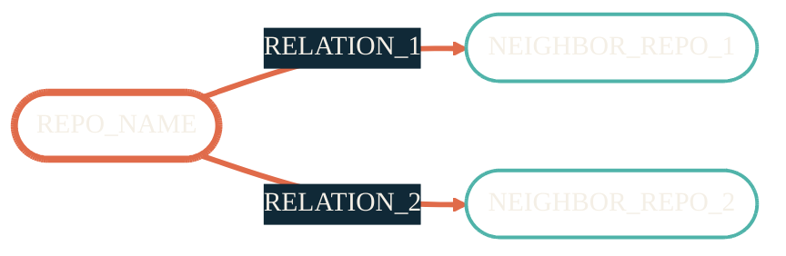

{/* Template: replace every TOKEN below. See SKILL.md for the mapping. */}

import { RepoMeta, RepoFit } from "/snippets/repo-summary.mdx";

> REPO_TAGLINE

<RepoMeta language="REPO_LANGUAGE" status="REPO_STATUS" lastActive="REPO_LAST_ACTIVE" repoUrl="REPO_URL" />

REPO_NAME is part of the SIDEBAR_GROUP_NAME surface. ONE_SENTENCE_INTRO.

## What it does

- BULLET_1
- BULLET_2
- BULLET_3
- BULLET_4

## How it fits

<RepoFit>
HOW_IT_FITS_SENTENCE — one line on the boundary of this repo's responsibility versus its neighbors'.
</RepoFit>

## Getting started

<Steps>
  <Step title="STEP_1_TITLE">
    STEP_1_BODY
  </Step>
  <Step title="STEP_2_TITLE">
    STEP_2_BODY
  </Step>
  <Step title="STEP_3_TITLE">
    STEP_3_BODY
  </Step>
</Steps>

## Related repos

<CardGroup cols={2}>
  <Card title="RELATED_TITLE_1" icon="RELATED_ICON_1" href="RELATED_HREF_1">
    RELATED_DESC_1
  </Card>
  <Card title="RELATED_TITLE_2" icon="RELATED_ICON_2" href="RELATED_HREF_2">
    RELATED_DESC_2
  </Card>
  <Card title="RELATED_TITLE_3" icon="RELATED_ICON_3" href="RELATED_HREF_3">
    RELATED_DESC_3
  </Card>
  <Card title="Source on GitHub" icon="github" href="REPO_URL">
    Issues, releases, full README.
  </Card>
</CardGroup>
