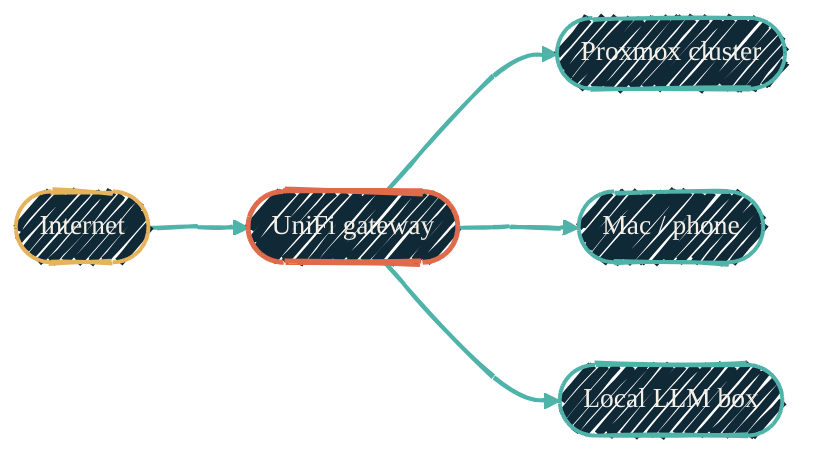
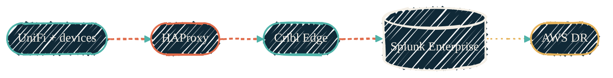

> The goal: fault-tolerant infrastructure I can rebuild from a single `nix build`.

The homelab is a real production environment, just for one person. Proxmox cluster on bare metal, UniFi networking, Splunk indexers, Cribl Edge collectors, Home Assistant, a docker-host VM for the necessary evil of vendor-locked containers.

## Hardware footprint

| Layer | What's there | Notes |
| --- | --- | --- |
| Compute | 3-node Proxmox cluster: `pve1` (custom AMD desktop), `pve2` (Dell PowerEdge R410), `pve3` (Dell PowerEdge R710) | Heterogeneous mix — single-engineer homelab, parts opportunistically combined; 3 nodes give natural majority quorum |
| Local LLM | Dedicated bare-metal NixOS box (Ryzen 9 + ROCm-capable GPU, ~12 TB RAIDZ1 model library) | Outside the Proxmox cluster — GPU-bound workload kept off hypervisor to avoid passthrough overhead |
| Storage | ZFS on Proxmox hosts; SAS backplane on R710 for cluster bulk storage; NVMe for hot tiers | Mixed-tier by accident, kept by design — bulk on SAS, working sets on NVMe |
| Networking | UniFi end-to-end: gateway, switches (with 10G SFP+ uplinks), APs | Single-pane management; 10G fiber backbone where it matters |
| Power | Rack UPS (Eaton 5P750R) for servers; separate UPS for the Home Assistant Pi | Active NUT monitoring planned once the LLM box is built |
| Rack management | Raspberry Pi running Home Assistant; iDRAC vKVM jump VM in cluster for Java Web Start console access | Old BMC firmware needs a Java Web Start client; the jump VM keeps Java off the laptop |

## Network topology

{/* Shape: hub-and-spokes. UniFi is the hub. 5 nodes. Boundary crossings: 0. */}

Solid green edges are physical / network. WireGuard tunnels traverse the Internet → UniFi edge. The UniFi gateway is the centre of the LAN; Proxmox, personal devices, and the bare-metal LLM box all hang off it.

## Data flow

{/* Shape: linear chain (UniFi gear → HAProxy → Cribl → Splunk → AWS DR). */}
{/* 5 nodes. Boundary crossings: 0. Telemetry edges dashed coral. */}

Coral dashed edges are telemetry; the amber dotted edge to AWS is the disaster-recovery replication path. Same nodes as the network diagram, different concern — split per Rule 1.

## Container philosophy

LXC by default. Native packages where possible. Docker is the exception — high-volume network traffic must never cross Docker's virtualized networking. The decision tree:

1. Vendor ships Docker-only image with no native path → Docker on the dedicated `docker-host` VM. Documented exception at the top of the repo's `CLAUDE.md`.
2. Single binary or native package → LXC + Ansible role.
3. CI/automation → Docker on the docker-host VM, isolated `ci_runners` network.
4. Dev / test → Docker on the docker-host VM, Swarm overlay.

## What runs where

| Workload | Where | Why |
| --- | --- | --- |
| Proxmox host | Bare metal | Hypervisor |
| HAProxy | LXC | Lightweight, native systemd unit |
| Cribl Edge | LXC | Native package, network-heavy |
| Splunk Enterprise | Bare-metal-ish VM | Vendor-only Docker option ruled out for network volume |
| Home Assistant | LXC | Native install via supervised path |
| Media stack (`download-vpn` + `sonarr`/`radarr` + `plex`) | LXC chain on a dedicated VLAN | VPN-locked download tier; netfilter killswitch enforces that any non-VPN egress drops |
| docker-host | VM | Isolated landing pad for vendor Docker images |
| GitHub Actions runners | Docker on docker-host VM + dedicated runner on LLM box | Ephemeral container-per-job, isolated `ci_runners` network; the LLM-box runner handles workflows that need live access to homelab infrastructure |
| Qdrant (vector DB) | LXC (nesting) | Vendor Docker image, lightweight, RAG workload |
| Local LLM inference | Bare-metal NixOS | GPU-bound; kept off Proxmox to avoid passthrough overhead and to run whatever OS gives the fastest ROCm path |

## Provisioning + configuration

[terraform-proxmox](https://github.com/JacobPEvans/terraform-proxmox) builds the VMs and LXCs. [ansible-proxmox](https://github.com/JacobPEvans/ansible-proxmox) configures the host. [ansible-proxmox-apps](https://github.com/JacobPEvans/ansible-proxmox-apps) configures everything on top. For the rationale on LXC defaults vs the Docker exception, see [LXC vs Docker](/infrastructure/lxc-vs-docker); for the macOS counterpart that runs the monitoring stack as Kubernetes, see [Kubernetes overview](/infrastructure/kubernetes-overview) and [`orbstack-kubernetes`](/infrastructure/orbstack-kubernetes).

## DR plan

[terraform-aws](https://github.com/JacobPEvans/terraform-aws) defines a cold AWS footprint sized to take a Splunk failover. Cribl Edge routes can be flipped to the AWS HEC endpoint via config change; the AI-observability dashboards keep working because they target the same indexes. The full cross-stack map of every collector and where it runs lives at [Monitoring agents](/observability/monitoring-agents).
