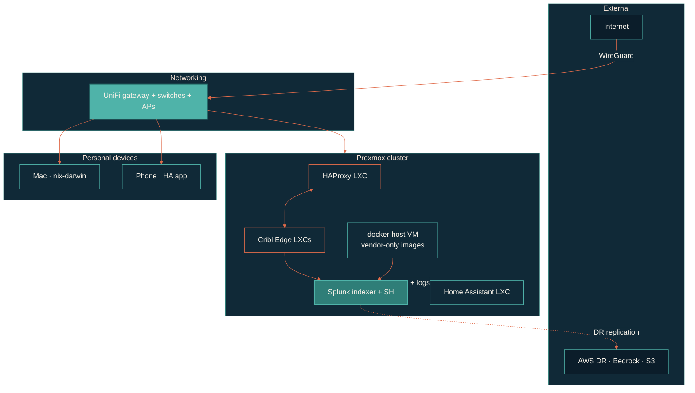

> The goal: fault-tolerant infrastructure I can rebuild from a single `nix build`.

The homelab is a real production environment, just for one person. Proxmox cluster on bare metal, UniFi networking, Splunk indexers, Cribl Edge collectors, Home Assistant, a docker-host VM for the necessary evil of vendor-locked containers.

## Topology

## Container philosophy

LXC by default. Native packages where possible. Docker is the exception — high-volume network traffic must never cross Docker's virtualized networking. The decision tree:

1. Vendor ships Docker-only image with no native path → Docker on the dedicated `docker-host` VM. Documented exception at the top of the repo's `CLAUDE.md`.
2. Single binary or native package → LXC + Ansible role.
3. CI/automation → Docker on the docker-host VM, isolated `ci_runners` network.
4. Dev / test → Docker on the docker-host VM, Swarm overlay.

## What runs where

| Workload | Where | Why |
| --- | --- | --- |
| Proxmox host | Bare metal | Hypervisor |
| HAProxy | LXC | Lightweight, native systemd unit |
| Cribl Edge | LXC | Native package, network-heavy |
| Splunk Enterprise | Bare-metal-ish VM | Vendor-only Docker option ruled out for network volume |
| Home Assistant | LXC | Native install via supervised path |
| docker-host | VM | Isolated landing pad for vendor Docker images |
| GitHub Actions runners | Docker on docker-host | Ephemeral container-per-job, isolated `ci_runners` network |
| Qdrant (vector DB) | LXC (nesting) | Vendor Docker image, lightweight, RAG workload |

## Provisioning + configuration

[terraform-proxmox](https://github.com/JacobPEvans/terraform-proxmox) builds the VMs and LXCs. [ansible-proxmox](https://github.com/JacobPEvans/ansible-proxmox) configures the host. [ansible-proxmox-apps](https://github.com/JacobPEvans/ansible-proxmox-apps) configures everything on top.

## DR plan

[terraform-aws](https://github.com/JacobPEvans/terraform-aws) defines a cold AWS footprint sized to take a Splunk failover. Cribl Edge routes can be flipped to the AWS HEC endpoint via config change; the dashboards in [VisiCore_App_for_AI_Observability](https://github.com/JacobPEvans/VisiCore_App_for_AI_Observability) keep working because they target the same indexes.
