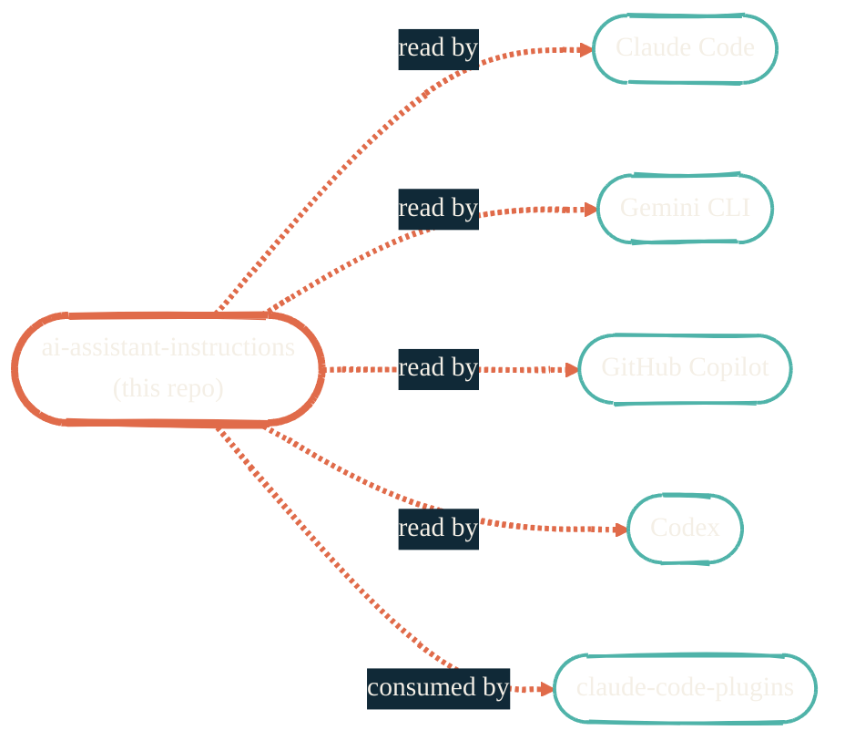

import { RepoMeta, RepoFit } from "/snippets/repo-summary.mdx";

> Configure once, every model behaves the same way.

<RepoMeta language="Shell" status="active" lastActive="this week" repoUrl="https://github.com/JacobPEvans/ai-assistant-instructions" />

`ai-assistant-instructions` is the rules and conventions layer for every AI coding tool in the portfolio. The same files (`CLAUDE.md`, `AGENTS.md`, `.cursorrules`, etc.) are sourced from this repo so Claude Code, Gemini CLI, GitHub Copilot, and Codex all behave consistently.

## What it does

- Defines the canonical `CLAUDE.md` and `AGENTS.md` files used by every project
- Owns the **model-routing policy** — when to reach for Claude vs Gemini vs Copilot vs local MLX
- Owns the **tool-use rules** — Read over `cat`, Edit over `sed`, Bash for shell-only
- Owns the **branching, commit, and PR conventions** — Conventional Commits, no emoji in subjects
- Symlinks the canonical files into every consuming repo via Nix or a `direnv` hook

## How it fits

<RepoFit>
The "rules of engagement." Every AI workflow elsewhere in the portfolio assumes this repo's content is in scope.
</RepoFit>

## Getting started

<Steps>
  <Step title="Clone or symlink">
    `git clone https://github.com/JacobPEvans/ai-assistant-instructions ~/.ai-assistant-instructions` and symlink the project files into the relevant repo, or import via the Nix module the README points to.
  </Step>
  <Step title="Pick a profile">
    Profiles cover personal, work, and learning contexts. The README enumerates which rules each one activates.
  </Step>
  <Step title="Update from upstream regularly">
    The rules evolve. Pull weekly or set up a routine in [`claude-code-routines`](https://github.com/JacobPEvans/claude-code-routines).
  </Step>
</Steps>

## Related repos

<CardGroup cols={2}>
  <Card title="claude-code-plugins" icon="plug" href="/ai-development/claude-code-plugins">
    Extends Claude Code with custom skills, hooks, and commands that respect these rules.
  </Card>
  <Card title="nix-ai" icon="bot" href="/nix/nix-ai">
    Packages the AI tools that read these rules.
  </Card>
  <Card title="AI pipeline" icon="diagram-project" href="/architecture/ai-pipeline">
    How rules + tools + automation become an actual development loop.
  </Card>
  <Card title="Source on GitHub" icon="github" href="https://github.com/JacobPEvans/ai-assistant-instructions">
    Rules, profiles, full README.
  </Card>
</CardGroup>
