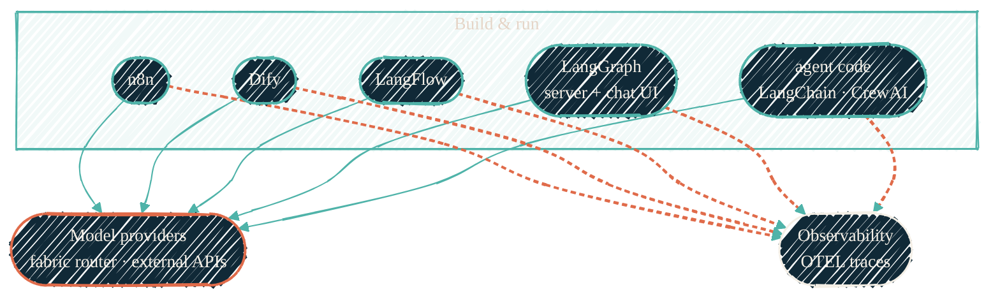

> Three of these draw boxes and arrows. Two are Python libraries. Knowing which
> is which is most of the decision.

The homelab runs a self-hosted layer for building LLM workflows and agents on top
of its [private model serving](/local-llm/overview). Six tools cover the
range from "connect an LLM to 400 other apps" to "write a multi-agent crew in
Python." They overlap on purpose at the edges; the trick is not deploying all
six and using none of them.

## The six, at a glance

| Tool | What it is | Shape | Reach for it when |
| --- | --- | --- | --- |
| **n8n** | General workflow automation, 400+ integrations | Visual builder (service) | You need to wire an LLM into other systems — email, calendars, webhooks, databases, SaaS APIs |
| **Dify** | Full LLMOps platform — RAG, prompts, evals, agents, model routing | Visual builder (service) | You want a production AI app with retrieval, prompt versioning, and evaluation, low-code |
| **LangFlow** | Visual node editor for LangChain graphs | Visual builder (service) | You want to prototype a chain by dragging nodes, then export it to Python |
| **LangGraph** | Stateful, graph-structured agents; self-hosted here as a server + chat UI | Python library (+ self-hosted server) | You're building a durable, multi-step agent as a graph and want to run it behind a UI — with no cloud (LangSmith-free) |
| **LangChain** | Library of composable LLM building blocks | Python library | You're writing code and want chains, tools, memory, and retrievers as primitives |
| **CrewAI** | Framework for role-playing multi-agent "crews" | Python library | You're writing code and want agents with roles collaborating on a task |

## Services vs libraries

The single most useful distinction:

- **n8n, Dify, and LangFlow are services.** They run as containers, expose a web
  UI, and you build inside them. They are deployed and have an HTTPS front door.
- **LangChain and CrewAI are libraries.** You do not "deploy" them — you `pip
  install` them into application code. In this homelab they live together in one
  Python execution box that runs the agent code people write against them.
- **LangGraph is a library too — but it straddles the line.** You write graphs in
  Python against it, yet the homelab also runs its open-source server
  (`langgraph dev`, in-memory) with a self-hosted chat UI, so it gets an HTTPS
  front door like the visual builders. Crucially, **no LangSmith cloud account is
  required** — the server is fully self-hosted and traces to the homelab pipeline.

A common misread is treating LangChain/CrewAI as servers to stand up, or treating
the visual builders as interchangeable. They are not. LangGraph is the deliberate
exception: a library the homelab has chosen to also run as a service.

## How they fit together

{/* Shape: layered. Builders + libs sit on serving, all trace to observability. */}

Solid edges are model calls; coral dashed edges are telemetry. Every tool is
configured to its **own** model provider per its standard install — the local
OpenAI-compatible endpoint, an external API, or both — never forced onto a shared
backend that belongs to another stack. Each tool's call is instrumented, and the
traces fan out to the [LLM observability](/observability/llm-observability)
pipeline.

## Picking one — the blunt version

- One tool only, and it has to be one → **Dify**. It covers RAG, prompts, evals,
  and agents without a separate automation tool.
- Already automating with workflows → keep **n8n** and add **Dify** as the AI
  layer beside it.
- Want to sketch a chain visually and walk away with Python → **LangFlow**.
- Building a durable, stateful agent as a graph and want it self-hosted behind a
  UI with no cloud → **LangGraph** (its open-source server plus a self-hosted chat
  UI; no LangSmith account, in-memory state — a playground, not durable storage).
- Writing application code → **LangChain** for primitives, **CrewAI** for
  role-based agent teams. Both are imports, not installs-as-a-service.

LangFlow overlaps Dify's visual builder; it earns its place only for
lightweight, Python-export prototyping. If that workflow isn't yours, you can run
the other four and never miss it.

## Where to go next

<CardGroup cols={2}>
  <Card title="Local LLM" icon="microchip" href="/local-llm/overview">
    The private GPU model serving these tools call.
  </Card>
  <Card title="LLM observability" icon="chart-line" href="/observability/llm-observability">
    How every LLM call gets traced, costed, and evaluated.
  </Card>
  <Card title="LXC vs Docker" icon="boxes-stacked" href="/infrastructure/lxc-vs-docker">
    Why the compose-based tools run as Docker-in-LXC.
  </Card>
  <Card title="ansible-proxmox-apps" icon="screwdriver-wrench" href="/infrastructure/repos/ansible-proxmox-apps">
    The configuration tier that deploys these app payloads.
  </Card>
</CardGroup>
