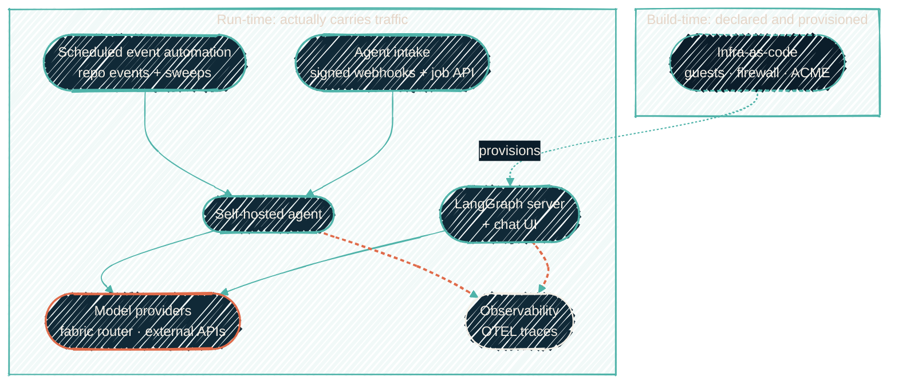

{/* projected from the authoring site; do not edit here */}
> The stack started as five self-hosted tools. Only one still carries
> production work. The other four earned a demotion the hard way: they were
> deployed and never used.

The homelab runs a self-hosted layer for building LLM workflows and agents on top
of its [private model serving](/local-llm/overview). Three pieces carry
production work today:

- **Scheduled event automation** for repository events: a pull request opened or
  updated, a review comment, a merge, or a timed sweep.
- **An agent intake service** for scheduled and agentic work: signed webhooks and
  a job API queue the work, and a self-hosted agent runs it. See
  [the self-hosted agent](/autonomous-agents/hermes-agent).
- **A self-hosted LangGraph server** for a stateful, multi-step agent that needs
  to carry state between steps, behind a self-hosted chat UI. No cloud tracing
  account is required.

<Note>
**What else is deployed but not load-bearing**

Two visual workflow builders are running as platforms, for prototyping only: no
authored production workflow is committed to either. A general workflow
automation tool is declared in infrastructure but has no deployment role
configured, so nothing runs on it. A separate execution host still runs a small
multi-agent Python framework as a seed script; it is not the primary agent
runtime. None of the four carry production traffic today.
</Note>

## How they fit together

{/*Shape: build-time vs run-time. TB, two subgraphs.*/}

```mermaid
%%{init:
  {'theme':'base','look':'handDrawn','themeVariables':{'fontFamily':'Geist','fontSize':'14px','primaryColor':'#102937','primaryTextColor':'#F4EFE6','primaryBorderColor':'#4FB3A9','lineColor':'#4FB3A9','secondaryColor':'#0B1D2A','tertiaryColor':'#1A2A38','clusterBkg':'rgba(79,179,169,0.08)','clusterBorder':'#4FB3A9'}}}%%
  flowchart TB
  subgraph buildtime [Build-time: declared and provisioned]
  IAC([Infra-as-code<br/>guests · firewall · ACME])
  end
  subgraph runtime [Run-time: actually carries traffic]
  EVT([Scheduled event automation<br/>repo events + sweeps])
  INTAKE([Agent intake<br/>signed webhooks + job API])
  AGENT([Self-hosted agent])
  LG([LangGraph server<br/>+ chat UI])
  MODELS([Model providers<br/>fabric router · external APIs])
  OBS([Observability<br/>OTEL traces])
  end

  IAC -.provisions.-> LG

  EVT --> AGENT
  INTAKE --> AGENT
  AGENT --> MODELS
  LG --> MODELS
  AGENT -.-> OBS
  LG -.-> OBS

  classDef svc fill:#102937,stroke:#4FB3A9,stroke-width:2px,color:#F4EFE6;
  classDef core fill:#102937,stroke:#E06B4A,stroke-width:2px,color:#F4EFE6;
  classDef obs fill:#102937,stroke:#F4EFE6,stroke-width:1.5px,color:#F4EFE6;
  classDef build fill:#0B1D2A,stroke:#4FB3A9,stroke-width:1.5px,color:#F4EFE6,stroke-dasharray: 4 3;

  class EVT,INTAKE,AGENT,LG svc
  class MODELS core
  class OBS obs
  class IAC build

  linkStyle 5,6 stroke:#E06B4A,stroke-width:2px,stroke-dasharray:4 3;
```

Build-time is infrastructure-as-code declaring and provisioning the guest, its
firewall rules, and its ACME certificate. Run-time is the actual request path:
an event or a signed webhook lands, the agent runs, and its model calls and
traces flow to the shared fabric and the observability pipeline the same way
every other tool's do.

Every piece is configured to its **own** model provider per its standard
install: the local OpenAI-compatible endpoint, an external API, or both. It is
never forced onto a shared backend that belongs to another stack. Each call is
instrumented, and traces fan out to the
[LLM observability](/observability/llm-observability) pipeline.

## Picking one — the blunt version

- Repository events (a PR opened, a review comment, a merge) → scheduled event
  automation. That is what it exists for.
- Scheduled or externally triggered agent work → the agent intake service. Send
  it a signed webhook or a job, and the self-hosted agent runs it.
- A durable, stateful, multi-step agent that needs to carry state between
  steps, behind a UI, with no cloud tracing account → the self-hosted LangGraph
  server.
- A visual workflow builder for prototyping only → either of the two deployed
  platforms. Neither carries a committed production workflow today, so treat
  time spent there as throwaway.

## Where to go next

<CardGroup cols={2}>
<Card
  title="Local LLM"
  icon="microchip"
  href="/local-llm/overview">
  The private GPU model serving these tools call.
</Card>
<Card
  title="LLM observability"
  icon="chart-line"
  href="/observability/llm-observability">
  How every LLM call gets traced, costed, and evaluated.
</Card>
<Card
  title="LXC vs Docker"
  icon="boxes-stacked"
  href="/infrastructure/lxc-vs-docker">
  Why the compose-based tools run as Docker-in-LXC.
</Card>
<Card
  title="ansible-proxmox-ai"
  icon="screwdriver-wrench"
  href="/infrastructure/repos/ansible-proxmox-ai">
  Deploys Dify, LangFlow, and LangGraph. n8n stays in ansible-proxmox-apps as a general app payload.
</Card>
</CardGroup>
