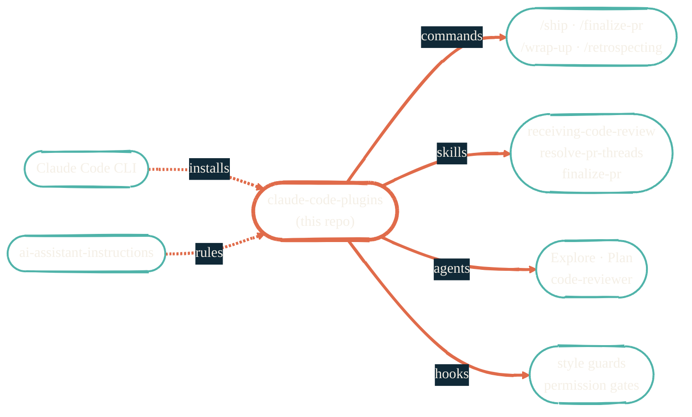

import { RepoMeta, RepoFit } from "/snippets/repo-summary.mdx";

> Drop-in plugins for Claude Code. The pieces that make a generic agent useful for a specific stack.

<RepoMeta language="Python" status="active" lastActive="today" repoUrl="https://github.com/JacobPEvans/claude-code-plugins" />

`claude-code-plugins` packages the extension points Claude Code supports — commands, skills, agents, hooks — into reusable plugins. Each plugin lives in its own directory and is installable via the Claude Code plugin API.

## What it does

- Ships plugins for git workflows (`ship`, `finalize-pr`, `wrap-up`), retrospectives, CodeQL resolution, and more
- Houses **skills** that progressively load only when their triggers fire — minimal token cost when idle
- Houses **agents** with focused tool allowlists for delegated work (Explore, Plan, code-reviewer)
- Houses **hooks** that enforce conventions automatically (style, permissions, no-skip patterns)
- Composes with [`ai-assistant-instructions`](/ai-development/ai-assistant-instructions) for the rules layer

## How it fits

<RepoFit>
Workflow logic. Anything that's "how Claude Code should approach a task" lives here. Anything that's "what the rules are" lives in `ai-assistant-instructions`.
</RepoFit>

## Getting started

<Steps>
  <Step title="Browse the plugins">
    Each plugin is its own directory. The repo README enumerates installed plugins and their entry points.
  </Step>
  <Step title="Install a plugin">
    Claude Code's plugin install path varies by version — see the README for the current command. Plugins typically live under `~/.claude/plugins/`.
  </Step>
  <Step title="Invoke a command">
    From any Claude Code session, type the slash command (e.g. `/ship`) to use a plugin's command. Skills auto-activate on matching triggers.
  </Step>
</Steps>

## Related repos

<CardGroup cols={2}>
  <Card title="ai-assistant-instructions" icon="book" href="/ai-development/ai-assistant-instructions">
    The rules layer these plugins operate within.
  </Card>
  <Card title="claude-code-routines" icon="clock" href="https://github.com/JacobPEvans/claude-code-routines">
    Scheduled Claude.ai routines — the cron side of the same ecosystem.
  </Card>
  <Card title="ai-workflows" icon="github" href="https://github.com/JacobPEvans/ai-workflows">
    The Copilot equivalent — reusable agentic workflows.
  </Card>
  <Card title="Source on GitHub" icon="github" href="https://github.com/JacobPEvans/claude-code-plugins">
    Plugins, hooks, full README.
  </Card>
</CardGroup>
