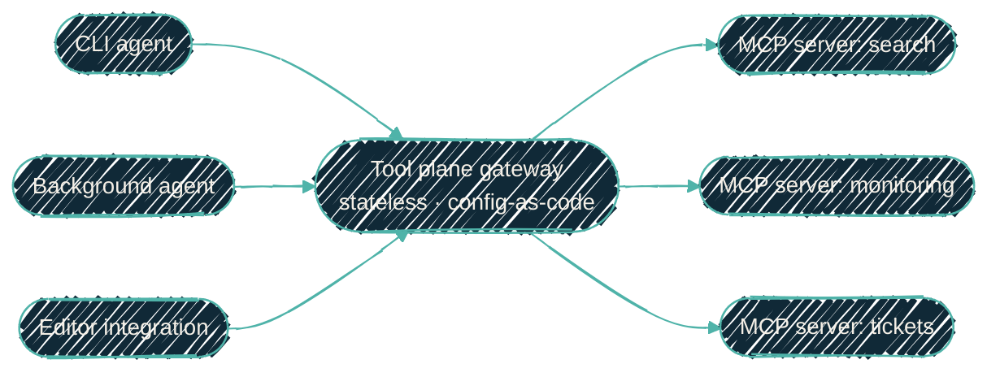

{/* projected from the authoring site; do not edit here */}
> Every agent needs the same tools. Configuring them once beats configuring them five times, and it is the only version you can actually govern.

{/*Shape: fan-in then fan-out. Agents share one gateway to many servers.*/}

**MCP**, the Model Context Protocol, is the open standard by which an AI agent
discovers and calls tools. Examples include searching an index, querying a
monitoring system, reading a ticket, or listing files. An **MCP server** exposes
one such capability; an agent that speaks the protocol can use any server without
bespoke integration code.

That is the piece that makes agents useful rather than merely conversational. It
creates a distribution problem the moment there is more than one agent.

## The problem with per-agent tool config

The obvious way to give an agent a tool is to configure the MCP server in that
agent's own settings. With one agent this is fine. With several (a coding
command-line tool, a background automation agent, an editor integration), the
same server ends up configured several times.

Every copy is a place to drift. One agent gets a new tool the others do not. A
credential rotates and four configs update while the fifth does not. The version
each agent pins diverges. And there is no single answer to a question that should
be easy: *what can the agents actually reach?*

This is the same shape as the model problem. The fix is the same shape too.

## Register once, reach from everywhere

A **tool plane** is a gateway that sits between agents and MCP servers. A server
is registered against the gateway once; every agent runtime dials the gateway.
Adding a tool becomes one change that all agents inherit, rather than one change
per agent.

Two design choices make this pay off.

**Keep the gateway config-as-code and stateless.** The gateway's whole
configuration should regenerate from version control on every deploy, holding no
state worth backing up. Recovery becomes re-deploy rather than restore, and
statelessness is what later allows several interchangeable instances.

**Keep the planes separate.** Tool traffic and model traffic are different
concerns. It is reasonable, and simpler, for a tool gateway to handle only
tools while inference continues to go straight to the model endpoint. Routing
both through one component is a deliberate later choice, not a default. Consolidate
what benefits from consolidation; do not consolidate for symmetry.

## A shared plane is a shared blast radius

The consolidation has a cost that is easy to underrate. **One gateway in front of
every tool means one failure removes every tool from every agent at once.**

That is not hypothetical. A single-instance tool gateway going down takes an
agent from "degraded" to "has no capabilities at all" instantly. And because the
agent can still talk, the failure can look like the agent behaving strangely
rather than infrastructure being down.

The mitigation is the property the design already has. A stateless,
config-as-code gateway can run as several identical instances behind a health
check. It needs no leader, no shared store, and no session affinity to preserve.
The work is deploying them, not redesigning anything.

Worth stating plainly: **being architecturally ready to pool is not the same as
being pooled.** Until the additional instances are actually running, the single
point of failure is still a single point of failure. Documentation should say
so rather than describing the intended state in the present tense.

## What this does not solve

A tool plane consolidates *distribution*, not *authorization*. Every agent
reaching the same gateway does not mean every agent should reach every tool
behind it. Scoping which agent may call which tool, and with whose credentials,
is a separate problem. Putting a gateway in the path does not answer it. It
does, however, give you one place to answer it.

## Related

- [Model routing](/ai-development/model-routing): the same consolidation applied to inference.
- [Agent instruction stack](/ai-development/agent-instruction-stack): how instructions reach the agents that use these tools.
- [Hermes agent](/autonomous-agents/hermes-agent): an autonomous agent that depends on this plane for its tools.
