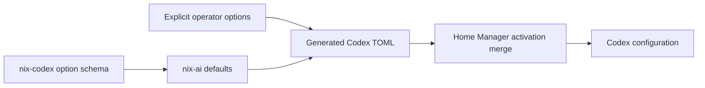

{/* projected from the authoring site; do not edit here */}
[oh-my-openagent](https://github.com/code-yeongyu/oh-my-openagent) (omo) is an
agent harness that loads into an existing command-line host. Three editions ship from
the same project:

| Edition | Host | Installed by | Lands on disk |
| --- | --- | --- | --- |
| **Ultimate** | OpenCode | `bunx oh-my-openagent install` | `opencode.json` plugin entry + `~/.omo/omo.jsonc` |
| **Light** | Codex CLI | `bunx lazycodex-ai install` | `~/.codex/plugins/cache/sisyphuslabs/`, `~/.codex/agents/`, `~/.local/bin` command-line tools, `config.toml` blocks |
| **Senpi** | standalone | `omo-senpi` wrapper | nothing persistent |

## Division of ownership

The line between Nix and runtime state is deliberate:

- **Nix owns** the `opencode.json` plugin entry
  (`programs.opencode.extraSettings.plugin` in nix-ai's root module) and the
  `omo-senpi` bunx wrapper (`modules/ai-tools.nix`, version pinned in
  `lib/versions.nix`). The pin carries no Renovate annotation: every `omo-ai`
  release is a prerelease and the `latest` dist-tag points at a placeholder,
  so bump manually against `npm view omo-ai@beta version`.
- **Runtime state owns** everything else: `~/.omo/omo.jsonc` (agent→model
  mappings), provider auth (`~/.local/share/opencode/auth.json`,
  `~/.codex/auth.json`), the Light edition's plugin cache and hook trust
  hashes. The installers are idempotent. Rerun them after an omo upgrade.
- The bin named `omo` belongs to the **Light** toolkit (`~/.local/bin`, first
  on PATH). The standalone Senpi command is therefore exposed as
  `omo-senpi`.

## Why the plugin entry is declarative

OpenCode's global config is a home-manager-owned store symlink. The Ultimate
installer writes its plugin registration through that symlink unconditionally.
That fails against the read-only store and would be clobbered by the next
switch anyway. Declaring `"oh-my-openagent@latest"` (the tagged form the
installer itself writes) means the only thing left for the installer to manage
is `~/.omo` runtime state.

Codex is the mirror image: nix-ai renders `config.toml` defaults through a
deep-merge activation that preserves every key Nix does not manage (only
`mcp_servers` is stripped). The installer's `[marketplaces.sisyphuslabs]`,
`[plugins."omo@sisyphuslabs"]`, `[features.multi_agent_v2]`, and
`[hooks.state]` blocks therefore survive every `darwin-rebuild switch`,
verified by switching after install and grepping the merged file.

## Upgrading

1. Bump `omoSenpi` in nix-ai's `lib/versions.nix` (manual, beta channel).
2. Rerun both installers:

   ```bash
   bunx oh-my-openagent install --no-tui --platform=opencode --claude=no --openai=yes --gemini=yes --copilot=no
   bunx lazycodex-ai install --no-tui --no-codex-autonomous
   ```

3. Restart each host once. Codex shows a hooks review after plugin upgrades;
   re-approve. The hashes changed because the files did.

Autonomous mode (`--codex-autonomous`) is deliberately not used. nix-ai pins
`approval_policy = "never"` with a `workspace-write` sandbox and no network.
The next rebuild would revert the installer's danger-full-access keys into
a mixed posture.

## Codex approval defaults

<Note>
**Source configuration**


The Nix modules provide these defaults. A host receives them through its
input update and normal rebuild. A session's permission selection is separate
from the generated file.

</Note>

The default selects **Approve for me** through Codex's native
`approval_policy = "on-request"` and `approvals_reviewer = "auto_review"`.
The sandbox stays `workspace-write`. Operators can override either value
through `programs.codex.approvalPolicy` and
`programs.codex.approvalsReviewer`.

The option schema lives in
[nix-codex's approval module](https://github.com/dryvist/nix-codex/blob/main/modules/approvals.nix).
The consumer defaults and TOML renderer live in
[nix-ai](https://github.com/dryvist/nix-ai/blob/main/docs/architecture/config-lifecycle.md).
Nix uses defaults that yield to explicit operator settings.



Local checks verify default and overridden TOML and repeated module imports.
The upstream Nix CI workflow calls the shared validator on Linux and macOS,
with each platform building its own checks before a release promotion.
The upstream export and consumer defaults are published on `main`.
The existing bot workflow owns dependency updates. A host uses the defaults
after its input update and normal rebuild.

## Verification

```bash
bunx oh-my-openagent doctor        # exit 0; deprecation notices expected
bunx lazycodex-ai doctor           # exit 0
codex plugin list                  # omo@sisyphuslabs installed, enabled
opencode run -m openai/gpt-5.6-luna-fast "say ok"   # header shows Sisyphus
```

A real `opencode run` prints `Sisyphus - ultraworker · <model>` when the
plugin is live; a plain answer with no header means it is not loaded.

## Known upstream skew

The latest published release disagrees with itself about agent model config.
Its `doctor` command flags the installer-generated `models[]` arrays as
invalid, while calling the documented `model`/`fallback_models` shape
deprecated. Its own `config migrate` is a no-op. Either shape loads (exit 0); the normalized shape
avoids the startup-blocking warnings. Model IDs in generated chains can also
drift behind the live provider catalog (for example `gpt-5-nano`). Fallback
chains absorb it at runtime.
