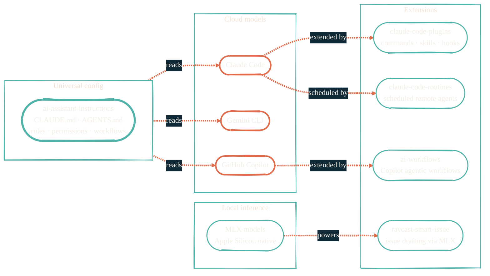

> File an issue, grab coffee, come back to a PR. Not quite there yet — but close enough to be dangerous.

The AI development surface is opinionated, not magical. Each model has a sweet spot. Each tool has a role. Universal configuration lives in one place so every IDE, every agent, every CLI reads the same rules.

## The tools landscape

## Model routing

- **Claude** — multi-file refactors, deep reasoning, agentic loops. Default for non-trivial work.
- **Gemini** — second opinions, code review, broad context.
- **GitHub Copilot** — line-level completions inside the editor. Cheap for high-volume routine work.
- **Local MLX** — typo fixes, quick edits, anything where burning cloud tokens makes no sense.

Routing rules live in `~/CLAUDE.md` and `AGENTS.md`, sourced from [ai-assistant-instructions](https://github.com/JacobPEvans/ai-assistant-instructions).

## Repos in this section

| Repo | What it does |
| --- | --- |
| [ai-assistant-instructions](https://github.com/JacobPEvans/ai-assistant-instructions) | Universal AI configuration layer. Rules, permissions, workflows, agents. Loaded by every AI tool. |
| [claude-code-plugins](https://github.com/JacobPEvans/claude-code-plugins) | Commands, skills, hooks, agents for Claude Code. Extends the base CLI with project-specific automation. |
| [claude-code-routines](https://github.com/JacobPEvans/claude-code-routines) | Scheduled remote-agent routines on Claude.ai. Cron-driven Claude tasks for GitHub ops. |
| [ai-workflows](https://github.com/JacobPEvans/ai-workflows) | Reusable GitHub Copilot agentic workflows. Repo-level Copilot agent recipes. |
| [raycast-smart-issue](https://github.com/JacobPEvans/raycast-smart-issue) | Raycast extension. AI-drafted GitHub issues via a local MLX model. |

See [AI development pipeline](/architecture/ai-pipeline) for how these fit into the issue → PR → ship flow.
