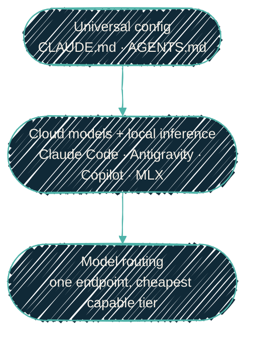

{/* projected from the authoring site; do not edit here */}
> File an issue, grab coffee, come back to a PR. Not quite there yet, but close enough to be dangerous.

The AI development surface is opinionated, not magical. Each model has a sweet spot. Each tool has a
role. Universal configuration lives in one place so every IDE, every agent, every command-line tool
reads the same rules.

{/*Shape: layered. Config feeds tools, tools route to models. TB, small.*/}

```mermaid
%%{init:
  {'theme':'base','look':'handDrawn','themeVariables':{'fontFamily':'Geist','fontSize':'14px','primaryColor':'#102937','primaryTextColor':'#F4EFE6','primaryBorderColor':'#4FB3A9','lineColor':'#4FB3A9'}}}%%
  flowchart TB
  CFG([Universal config<br/>CLAUDE.md · AGENTS.md])
  TOOLS([Cloud models + local inference<br/>Claude Code · Antigravity · Copilot · MLX])
  ROUTE([Model routing<br/>one endpoint, cheapest capable tier])
  CFG --> TOOLS --> ROUTE
```

## The tools landscape

| Layer | Repo / tool | What it owns |
| --- | --- | --- |
| **Universal config** | [Assistant rules](/ai-development/ai-assistant-instructions) | `CLAUDE.md`, `AGENTS.md`, rules, permissions, workflows: read by every AI tool |
| **Cloud models** | Claude Code, Antigravity (`agy`), GitHub Copilot | The IDEs and CLIs that do the work |
| **Local inference** | MLX | Apple Silicon-native model inference for typo fixes, quick edits, no cloud tokens |
| **Extensions** | [Claude Code plugins](/ai-development/claude-code-plugins), `claude-code-routines`, `ai-workflows`, `raycast-smart-issue` | Commands, scheduled agents, Copilot workflows, Raycast UI on top of MLX |

## Model routing

Each model has a sweet spot, and work is routed to the cheapest one that can
actually do it. Deep reasoning and multi-file refactors go to the strongest
model. Line-level completions go to the cheap high-volume one, and anything
trivial goes to local inference rather than burning cloud tokens.

[Model routing](/ai-development/model-routing) covers how that choice is
made and governed. One endpoint sits in front of every backend, and callers ask
for a role instead of a model name. It also covers the difference between a
spend control that is enforced and one that is merely advised.

Routing rules live in `~/CLAUDE.md` and `AGENTS.md`, sourced from
[ai-assistant-instructions](https://github.com/JacobPEvans/ai-assistant-instructions). See [Repo
boundaries](/ai-development/repo-boundaries) for how rules, plugins, and docs are split across
three repositories.

## Repos in this section

<CardGroup cols={2}>
<Card
  title="Repo boundaries"
  icon="border-all"
  href="/ai-development/repo-boundaries">
  How rules, plugins, and docs are split across three repositories.
</Card>
<Card
  title="ai-assistant-instructions"
  icon="book"
  href="/ai-development/ai-assistant-instructions">
  Universal AI configuration layer. Rules, permissions, workflows, agents. Loaded by every AI tool.
</Card>
<Card
  title="claude-code-plugins"
  icon="plug"
  href="/ai-development/claude-code-plugins">
  Commands, skills, hooks, agents for Claude Code. Project-specific automation.
</Card>
<Card
  title="claude-code-routines"
  icon="clock"
  href="https://github.com/JacobPEvans/claude-code-routines">
  Scheduled remote-agent routines on Claude.ai. Cron-driven Claude tasks for GitHub ops.
</Card>
<Card
  title="ai-workflows"
  icon="github"
  href="https://github.com/JacobPEvans/ai-workflows">
  Reusable GitHub Copilot agentic workflows. Repo-level agent recipes.
</Card>
<Card
  title="raycast-smart-issue"
  icon="bolt"
  href="https://github.com/JacobPEvans/raycast-smart-issue">
  Raycast extension. AI-drafted GitHub issues via a local MLX model.
</Card>
<Card
  title="nix-ai"
  icon="snowflake"
  href="/nix/nix-ai">
  The Nix package layer that ships every AI CLI to your shell.
</Card>
</CardGroup>

See [AI development pipeline](/architecture/ai-pipeline) for how these fit into the issue → PR → ship flow.
