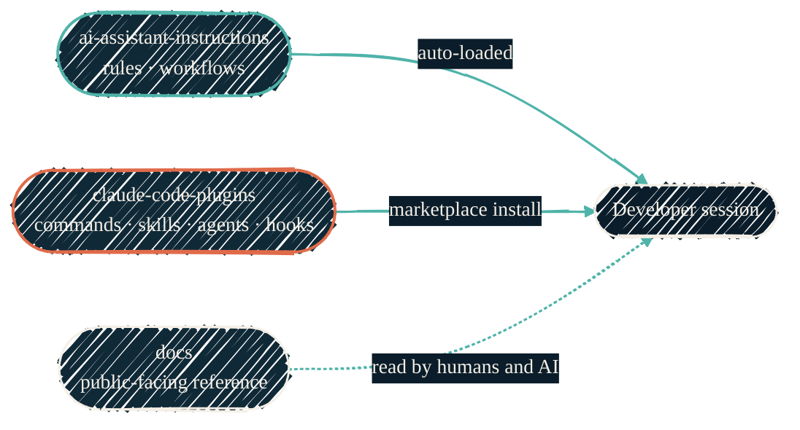

import { RepoFit } from "/snippets/repo-summary.mdx";

> Three repositories. Each one owns a different layer of the AI development stack. No overlap, no duplication.

The AI coding setup behind this site is split across three repositories on purpose. One holds the *rules* that every AI tool reads. One holds the *plugins* that extend Claude Code specifically. One holds the *documentation* you are reading right now. Keeping them separate means each layer can evolve at its own pace and any AI tool — not just Claude — can consume the rules.

## What each repo owns

| Repository | Layer | Owns |
| --- | --- | --- |
| [`ai-assistant-instructions`](/ai-development/ai-assistant-instructions) | Rules | `AGENTS.md`, `CLAUDE.md`, `GEMINI.md`, auto-loaded rules, the 5-step workflow |
| [`claude-code-plugins`](/ai-development/claude-code-plugins) | Plugins | Slash commands, skills, agents, hooks, the plugin marketplace |
| [`docs`](/introduction) | Documentation | This site — architecture, narrative, public-facing diagrams |

The rules repo is vendor-agnostic — Claude Code, Gemini CLI, GitHub Copilot, and Codex all read the same files. The plugins repo is Claude-Code-specific because plugins are a Claude Code concept. The docs repo is for humans (and any AI that wants to understand the system).

Tool *permissions* (the allow / ask / deny lists) are not in any of these repos — they live in the Nix layer at [`nix-claude-code`](/nix/nix-claude-code) and are rendered into each tool's settings by `nix-ai`.

## How the layers compose

Green is rules, coral is plugins, ivory is documentation. Solid arrows are runtime composition — both rules and plugins load into a session and behave as one configuration surface. The dashed arrow is asynchronous: docs are reference material, not loaded at runtime.

<RepoFit>
The rule of thumb: anything an AI tool needs at runtime lives in one of the first two repos. Anything a person needs to *understand* the system lives in the docs repo.
</RepoFit>

## How updates flow

Each repo releases on its own clock and notifies the others through plain GitHub mechanisms — no shared tooling required.

- **`ai-assistant-instructions`** uses [release-please](https://github.com/googleapis/release-please) for semantic versioning. A merge to `main` triggers a webhook into [`nix-ai`](/nix/nix-ai), which rebuilds the Nix package that ships the rules to every consumer.
- **`claude-code-plugins`** also uses release-please. Published versions appear in the Claude Code plugin marketplace and are installed per-project on demand.
- **`docs`** auto-deploys on push to `main` via the Mintlify GitHub app. No release tags — the site is always the current state of `main`.

A change that affects the public picture — a new plugin, a renamed rule, a shifted boundary — gets mirrored into the docs repo in the same change set. The reverse is never true: docs do not push back into the source repos.

## Related repos

<CardGroup cols={2}>
  <Card title="How it fits together" icon="layer-group" href="/how-it-fits-together">
    The portfolio-level view. AI development is one of six surfaces.
  </Card>
  <Card title="AI pipeline" icon="diagram-project" href="/architecture/ai-pipeline">
    How the rules + plugins + automation compose into an actual development loop.
  </Card>
  <Card title="ai-assistant-instructions" icon="book" href="/ai-development/ai-assistant-instructions">
    The rules layer. AGENTS.md, auto-loaded rules, workflows.
  </Card>
  <Card title="claude-code-plugins" icon="plug" href="/ai-development/claude-code-plugins">
    The plugins layer. Commands, skills, agents, and hooks for Claude Code.
  </Card>
</CardGroup>
