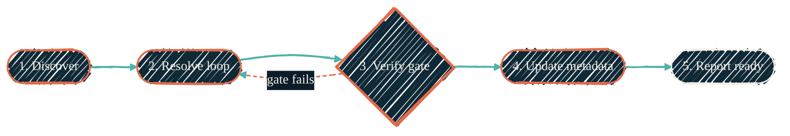

> One command. Commit, push, open the PR, fix CodeQL, resolve threads, fix CI, verify everything is green. Never merges. That's a human decision.

`/ship` is the local escape hatch for the cloud pipeline. The cloud pipeline ([ai-workflows](/automation/repos/ai-workflows), [claude-code-routines](/automation/repos/claude-code-routines)) gets a PR opened and reviewed without you. `/ship` is what you run from a Claude Code session when **you** are the one iterating on a PR and want it driven to a ready-to-merge state in one command.

## What `/ship` does

`/ship` is a thin orchestrator. It detects uncommitted changes (commits them), discovers recently-created PRs, then for each PR invokes `/finalize-pr` — which is where the real work happens.

```text
/ship
  ├─ Step 0: verify git repo
  ├─ Step 1: commit any uncommitted changes; discover PRs in scope
  ├─ Step 1.5: build a context brief from the conversation
  ├─ Step 2: invoke /finalize-pr per PR, sequentially
  └─ Step 3: re-verify each PR with live GitHub state before reporting
```

## What `/finalize-pr` does

`/finalize-pr` is the loop. Five phases per PR:

{/* Shape: linear chain. Boundary crossings: 0. Ranks: 5×1. */}
{/* Aspect: ~3:1 (LR). Pass. */}



| Phase | What it owns |
| --- | --- |
| 1. Discover | Resolve which PR(s) to act on (current branch, all, or org-wide) |
| 2. Resolve loop | Start CI monitor in background; in parallel: invoke `/resolve-codeql fix`, `/resolve-pr-threads`, merge-conflict resolution; once CI completes, run `/simplify` once on the cumulative changes |
| 3. Verify gate | Re-query live GitHub state — `state`, `mergeable`, `mergeStateStatus`, `reviewDecision`, `statusCheckRollup.state`, all `reviewThreads.isResolved`, CodeQL alert count |
| 4. Update metadata | A subagent updates PR title, description, linked issues |
| 5. Report ready | Emit the canonical PR status block; wait for human merge |

## What it never does

- **Never merges.** Merge is always a human decision.
- **Never approves.** No auto-approval of PRs.
- **Never crosses org boundaries** in org-wide mode.
- **Never bypasses branch protection.**

## Subagents in the call chain

```text
/ship → /finalize-pr → /resolve-codeql fix
                     → /resolve-pr-threads → superpowers:receiving-code-review
                     → /simplify
                     → haiku subagent (PR metadata update)
                     → background CI monitor (Task tool)
```

Each subagent runs scoped to its task and reports back. The orchestrator re-verifies live state — never trusts a subagent's self-report as ground truth.

## Known reliability gaps

`/ship` has been ending prematurely without leaving PRs fully mergeable. Root causes traced to the current `SKILL.md` files:

| Failure mode | Why it happens |
| --- | --- |
| Exits "blocked" when a fix could have continued | Phase 3 → Phase 2 loop is prose with no enforced iteration counter — subagents treat it as advisory |
| Treats async-pending checks as failures | Phase 3 aborts on `statusCheckRollup.state ≠ SUCCESS`, but Phase 2 can't fix a pending check |
| Silent subagent failure passes through | After `/resolve-codeql` and `/resolve-pr-threads`, skill advances without re-querying state to confirm fixes landed |
| CI monitor dies silently | Background Task agent can fail without propagating |
| All Phase 3 aborts treated identically | Some failures are agent-fixable, some are wait, some require humans (`REVIEW_REQUIRED`) |

Fix in flight: explicit iteration counter (cap 5), wait-for-async-checks phase, post-fix verification of subagent work, CI-monitor failure fallback, and a failure-mode taxonomy that maps each `mergeStateStatus`/`reviewDecision` to a handler. After the fix, every `/ship` invocation reports one of three categories with a specific reason — never silent half-finalization:

- **Ready to merge** — all gates clean
- **Ready except human gate** — only `REVIEW_REQUIRED` remaining
- **Ship aborted** — specific gate stuck with manual-action suggestion

Tracked as a PR against [`claude-code-plugins`](https://github.com/JacobPEvans/claude-code-plugins).

## When to use `/ship` vs the cloud pipeline

| Situation | Use |
| --- | --- |
| Issue is filed, you want a PR drafted without thinking | [`ai-workflows`](/automation/repos/ai-workflows) (the cloud pipeline triggered on issue open) |
| You're editing a PR locally and want CI/threads/CodeQL handled in one command | `/ship` from your Claude Code session |
| You want a daily org-wide sweep | [`claude-code-routines`](/automation/repos/claude-code-routines) (cron-scheduled) |
| You want to know if a PR is *really* ready to merge | `/finalize-pr <N>` directly — gives you the canonical gate output without re-running fixes |

## Where to go next

<CardGroup cols={2}>
  <Card title="CodeQL resolution" icon="shield-check" href="/ai-development/skills/codeql-resolution">
    Why CodeQL is fixed separately from CI checks, and what `/resolve-codeql` does.
  </Card>
  <Card title="claude-code-plugins" icon="plug" href="/ai-development/claude-code-plugins">
    The plugin home for `/ship`, `/finalize-pr`, and all the supporting skills.
  </Card>
  <Card title="Source: ship/SKILL.md" icon="github" href="https://github.com/JacobPEvans/claude-code-plugins/blob/main/github-workflows/skills/ship/SKILL.md">
    The full skill definition.
  </Card>
  <Card title="Source: finalize-pr/SKILL.md" icon="github" href="https://github.com/JacobPEvans/claude-code-plugins/blob/main/github-workflows/skills/finalize-pr/SKILL.md">
    Phases, gates, and the merge prohibition.
  </Card>
</CardGroup>
