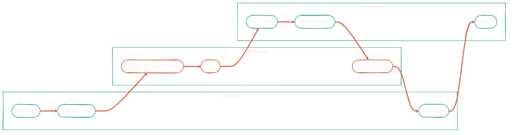

The goal: file a GitHub Issue, grab coffee, come back to a PR that's been implemented, tested, and reviewed by multiple AI models — just waiting for a thumbs up. Not fully there yet, but close enough to be dangerous.

Humans decide *what* to build. AI agents handle the *how*. Automation runs the boring parts. A human gives the final sign-off. Claude, Gemini, Copilot, and local MLX models each do what they're best at — the right model for the right job instead of throwing everything at one.

## The pipeline

## The model-routing philosophy

Every model has a sweet spot:

- **Claude** — best at multi-file refactors, deep reasoning, agentic loops. The default for non-trivial implementation work.
- **Gemini** — great for second opinions, code review, broad context understanding.
- **GitHub Copilot** — fastest for line-level completions inside the editor. Cheap for high-volume routine work.
- **Local MLX** — Apple Silicon native inference for typo fixes, quick edits, and "I don't want to burn cloud tokens on this" tasks.

The routing is opinionated, not magic: clear rules in `~/CLAUDE.md` and `AGENTS.md` say *which* model to use *when*.

## Repos that power this pipeline

<CardGroup cols={2}>
  <Card title="ai-assistant-instructions" icon="book" href="/ai-development/ai-assistant-instructions">
    Universal AI configuration layer — rules, permissions, workflows, agents.
  </Card>
  <Card title="claude-code-plugins" icon="plug" href="/ai-development/claude-code-plugins">
    Commands, skills, hooks, agents for Claude Code.
  </Card>
  <Card title="nix-ai" icon="bot" href="/nix/nix-ai">
    Nix package and config layer for every AI coding tool.
  </Card>
  <Card title="claude-code-routines" icon="clock" href="https://github.com/JacobPEvans/claude-code-routines">
    Scheduled remote-agent routines on Claude.ai.
  </Card>
  <Card title="ai-workflows" icon="github" href="https://github.com/JacobPEvans/ai-workflows">
    Reusable GitHub Copilot agentic workflows.
  </Card>
  <Card title="raycast-smart-issue" icon="bolt" href="https://github.com/JacobPEvans/raycast-smart-issue">
    Raycast extension for AI-drafted GitHub issues via local MLX.
  </Card>
</CardGroup>

See [AI Development · Overview](/ai-development/overview) for what each one does in detail.

## Observability layer

Every interaction in this pipeline emits OpenTelemetry. The data flows through Cribl Edge, Cribl Stream, and Splunk; the [VisiCore apps](/observability/overview) visualize it. If an AI agent touched code, there's a trace.
