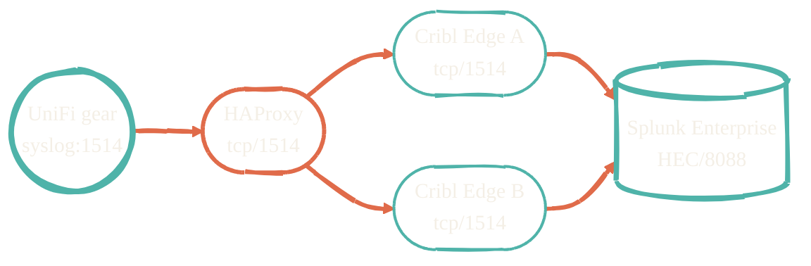
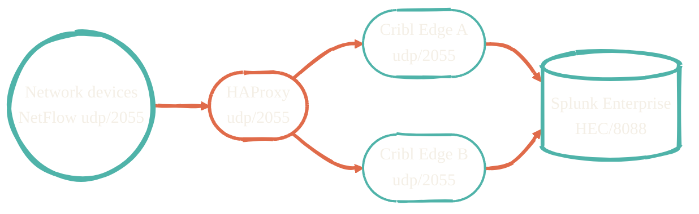

Two pipelines move data from the homelab edge to Splunk. The architecture is intentional: HAProxy load-balances toward Cribl Edge, which routes, transforms, and reduces volume before forwarding to Splunk over HEC.

The goal: 30–50% ingest reduction without losing security signal.

## Log pipeline

UniFi network gear and application logs land in Splunk via Cribl Edge. HAProxy fronts the Cribl Edge cluster for high availability.

The Cribl pipeline at the Edge tier does the heavy lifting — drop verbose metric fields, route by event_type, enrich, mask. The Splunk indexers receive a smaller, cleaner stream.

## NetFlow pipeline

NetFlow v9 / IPFIX from network devices follows the same shape, on a different port.

UDP NetFlow is loss-tolerant by design, so the HAProxy layer is more about distribution than failover. The Cribl pipelines de-duplicate, parse the flow records, and aggregate by tuple before forwarding.

## What lives where

| Layer | Provisioned by | Configured by | Source repo |
| --- | --- | --- | --- |
| Proxmox host / VMs / LXCs | [terraform-proxmox](https://github.com/JacobPEvans/terraform-proxmox) | [ansible-proxmox](https://github.com/JacobPEvans/ansible-proxmox) | both |
| HAProxy | (Ansible role) | [ansible-proxmox-apps](https://github.com/JacobPEvans/ansible-proxmox-apps) | apps repo |
| Cribl Edge | (Ansible role) | [ansible-proxmox-apps](https://github.com/JacobPEvans/ansible-proxmox-apps) | apps repo |
| Splunk Enterprise | (manual / Ansible) | [ansible-splunk](https://github.com/JacobPEvans/ansible-splunk) | splunk repo |
| Cribl pipelines | (manual / Cribl pack) | [cc-edge-* packs](https://github.com/JacobPEvans?tab=repositories&q=cc-edge) | pack repos |
| Splunk knowledge objects | n/a | [VisiCore TA](https://github.com/JacobPEvans/VisiCore_TA_AI_Observability) | TA repo |

## DR posture

Splunk Cloud failover is provisioned via [terraform-aws](https://github.com/JacobPEvans/terraform-aws) — AWS resources (EC2, S3, Route 53) that come up cold and accept the same HEC traffic if the home cluster is offline. Cribl Edge routes can be flipped to point at the AWS endpoint with a single config change.
