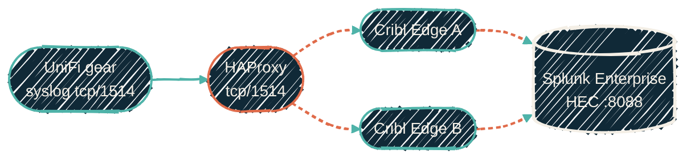
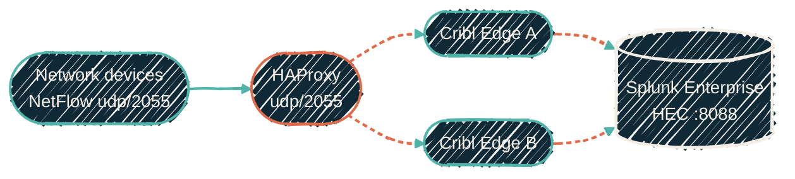

{/* projected from the authoring site; do not edit here */}
Two pipelines move data from the homelab edge to Splunk. The architecture is intentional. HAProxy
load-balances toward Cribl Edge, which routes, transforms, and reduces volume before forwarding to
Splunk over HEC.

The goal: 30–50% ingest reduction without losing security signal.

## Cribl is the hub, native first

Every new data need is met from what already flows into Cribl Stream or Edge first: a native
transform (Aggregations, Publish Metrics, Lookup, Eval), then a route. A data need never gets its
own exporter, poller, proxy, or credential; a native flag on an agent that already runs is the
preferred fix (for example a `node_exporter` collector flag, or loading a kernel module).

When the data genuinely is not in Cribl yet, it's added by the path with the least new software, in
order:

1. A native Cribl source — REST Collector (e.g. Redfish), SNMP, NetFlow/IPFIX, or a Prometheus scrape.
2. Cribl Edge system metrics.
3. A single tool Cribl scrapes, only when the vendor offers no stream of its own. [unpoller](/observability/monitoring-agents)
   is the approved case, because UniFi controller stats are API-only.

Producers emit once, to Cribl. A producer wired straight to a single sink is the pattern this
architecture exists to replace.

## Fan-out: every source to every destination

The default is that every source goes to every destination whose format fits, especially for
low-volume data — a source never gets its own one-off destination:

| Signal | Destinations |
| --- | --- |
| Metrics | the metrics store **and** the Splunk metrics index |
| Events / logs | Splunk, plus any other event store that applies |
| Traces | Langfuse and [Phoenix](/observability/phoenix) — never Splunk; a trace does not fit Splunk's event model |

A route to a single destination needs a stated reason in its pull request. Data is duplicated
across these systems on purpose, so the same signal can be compared between them. A feed is never
removed because another sink already carries the same data — a failing feed gets fixed, not
dropped. See [LLM observability](/observability/llm-observability) and
[Pipeline flows](/observability/pipeline-flows) for the live OTLP fan-out and its current
Langfuse/Phoenix legs.

## Consumers read their entity set from config

A dashboard or other consumer draws its entity set (nodes, VLANs, apps) from configuration, never
from whichever series happen to come back from a query. A missing series shows as stale data with
its age, then "no data since …" — it never silently disappears from the view. An entity is removed
from a dashboard only by removing it from config, never by a query that stops returning it.

## Versions: Renovate only

Every dependency and pipeline-component version bump comes from Renovate; see
Dependency automation coverage for the manager-by-pin-shape
table, the annotation contract, and the gate a version needs when a hash rides beside it. No
hand-written bump, no hand-pinned hash, and no hand `nix flake update` of a Renovate-managed input in
this pipeline's repos.

## Log pipeline

UniFi network gear and app logs land in Splunk via Cribl Edge. HAProxy fronts the Cribl Edge cluster for high availability.

{/*Shape: parallel convergence (HAProxy fans to A+B, both converge on Splunk). */}
{/* Boundary crossings: 0. Ranks: 4. Aspect: ~3:1 LR. Pass.*/}

```mermaid
%%{init:
  {'theme':'base','look':'handDrawn','themeVariables':{'fontFamily':'Geist','fontSize':'14px','primaryColor':'#102937','primaryTextColor':'#F4EFE6','primaryBorderColor':'#4FB3A9','lineColor':'#4FB3A9','secondaryColor':'#0B1D2A','tertiaryColor':'#1A2A38','clusterBkg':'rgba(79,179,169,0.08)','clusterBorder':'#4FB3A9'}}}%%
  flowchart LR
  Net([UniFi gear<br/>syslog tcp/1514])
  HA([HAProxy<br/>tcp/1514])
  EA([Cribl Edge A])
  EB([Cribl Edge B])
  SP[(Splunk Enterprise<br/>HEC :8088)]

  Net --> HA
  HA --> EA --> SP
  HA --> EB --> SP

  classDef edge fill:#102937,stroke:#4FB3A9,stroke-width:2px,color:#F4EFE6;
  classDef proxy fill:#102937,stroke:#E06B4A,stroke-width:2px,color:#F4EFE6;
  classDef store fill:#102937,stroke:#F4EFE6,stroke-width:2px,color:#F4EFE6;

  class Net,EA,EB edge
  class HA proxy
  class SP store

  linkStyle 0 stroke:#4FB3A9,stroke-width:2px;
  linkStyle 1,2,3,4 stroke:#E06B4A,stroke-width:2px,stroke-dasharray:4 3;
```

Coral dashed edges carry the data; the solid green edge is the physical syslog hop. Cribl Edge drops
verbose fields, routes by `event_type`, and enriches and masks the rest. The indexer takes a smaller,
cleaner payload.

## NetFlow pipeline

NetFlow v9 / IPFIX from network devices follows the same shape on a different port. UDP is loss-tolerant by design, so HAProxy distributes rather than fails over.

{/*Shape: parallel convergence. Identical topology to log pipeline, udp/2055.*/}

```mermaid
%%{init:
  {'theme':'base','look':'handDrawn','themeVariables':{'fontFamily':'Geist','fontSize':'14px','primaryColor':'#102937','primaryTextColor':'#F4EFE6','primaryBorderColor':'#4FB3A9','lineColor':'#4FB3A9','secondaryColor':'#0B1D2A','tertiaryColor':'#1A2A38','clusterBkg':'rgba(79,179,169,0.08)','clusterBorder':'#4FB3A9'}}}%%
  flowchart LR
  Net([Network devices<br/>NetFlow udp/2055])
  HA([HAProxy<br/>udp/2055])
  EA([Cribl Edge A])
  EB([Cribl Edge B])
  SP[(Splunk Enterprise<br/>HEC :8088)]

  Net --> HA
  HA --> EA --> SP
  HA --> EB --> SP

  classDef edge fill:#102937,stroke:#4FB3A9,stroke-width:2px,color:#F4EFE6;
  classDef proxy fill:#102937,stroke:#E06B4A,stroke-width:2px,color:#F4EFE6;
  classDef store fill:#102937,stroke:#F4EFE6,stroke-width:2px,color:#F4EFE6;

  class Net,EA,EB edge
  class HA proxy
  class SP store

  linkStyle 0 stroke:#4FB3A9,stroke-width:2px;
  linkStyle 1,2,3,4 stroke:#E06B4A,stroke-width:2px,stroke-dasharray:4 3;
```

Cribl pipelines de-duplicate, parse flow records, and aggregate by tuple before forwarding.

## What lives where

| Layer | Provisioned by | Configured by | Source repo |
| --- | --- | --- | --- |
| Proxmox host / VMs / LXCs | [tofu-proxmox](https://github.com/dryvist/tofu-proxmox) | [ansible-proxmox](https://github.com/JacobPEvans/ansible-proxmox) | both |
| HAProxy | (Ansible role) | [ansible-proxmox-apps](https://github.com/JacobPEvans/ansible-proxmox-apps) | apps repo |
| Cribl Edge | (Ansible role) | [ansible-proxmox-apps](https://github.com/JacobPEvans/ansible-proxmox-apps) | apps repo |
| Splunk Enterprise | (manual / Ansible) | [ansible-splunk](https://github.com/JacobPEvans/ansible-splunk) | splunk repo |
| Cribl pipelines | (manual / Cribl pack) | [cc-edge-* packs](https://github.com/JacobPEvans?tab=repositories&q=cc-edge) | pack repos |
| Splunk knowledge objects | n/a | Splunk TA (AI observability) | TA repo |

## DR posture

`tf-splunk-aws` provisions an on-demand Splunk and/or Cribl environment on AWS with plain OpenTofu,
started or stopped on demand, that accepts the same HEC traffic if the home cluster is offline.
Cribl Stream's output can be flipped from the homelab HEC to the AWS HEC by a routing-rule change.
See Observability stack for the
current toggle and schedule.
