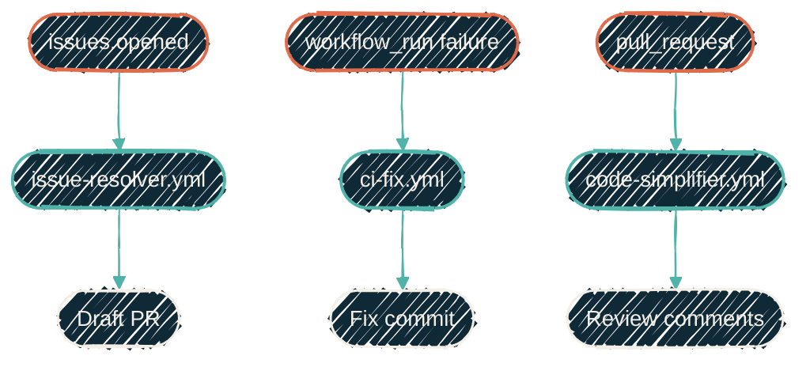

{/* projected from the authoring site; do not edit here */}
> Event in (`issues.opened`, `workflow_run`, `pull_request`). PR out. Every step runs on GitHub-hosted runners or RunsOn spot, attributable to the AI-bot App identity.

Cloud pipelines are the **event-driven** half of the automation surface. Something happens in GitHub:
an issue is filed, a CI run fails, or a PR is opened. The reusable workflows in
[`JacobPEvans/ai-workflows`](/automation/repos/ai-workflows) react. The result lands as a
draft PR or a commit on an existing PR, signed by
[`JacobPEvans-claude[bot]`](/infrastructure/cicd/git-signing) and ready for review.

The cron-driven sibling (work that runs on a schedule rather than in response to an event) is documented under [Scheduled routines](/automation/scheduled-routines/overview).

{/*Shape: 3 parallel event->workflow->outcome lanes. Nodes: 9. Aspect: ~2:1 TB. Pass.*/}

## How they fit

| Trigger | Reusable workflow | Outcome |
| --- | --- | --- |
| `issues.opened` (label: `agentic-implement`) | `issue-resolver.yml` | Draft PR implementing the issue |
| `workflow_run` on `CI`, `conclusion: failure` | `ci-fix.yml` | Fix commit pushed back to the failing PR |
| `pull_request` opened or `synchronize` | `code-simplifier.yml` | Review comments when ready |

The full caller catalog and the post-merge dispatch chain live on the [ai-workflows page](/automation/repos/ai-workflows).

## Where to go next

<CardGroup cols={2}>
<Card
  title="ai-workflows"
  icon="github"
  href="/automation/repos/ai-workflows">
  Reusable workflows, pinned prompts, the consumer-caller shape, auth + signing.
</Card>
<Card
  title="Scheduled routines"
  icon="clock"
  href="/automation/scheduled-routines/overview">
  The cron-driven sibling. Org-wide, no per-repo wiring.
</Card>
<Card
  title="Issue to PR pipeline"
  icon="diagram-project"
  href="/automation/issue-to-pr-pipeline">
  The end-to-end flow on `JacobPEvans/docs`, step by step.
</Card>
<Card
  title="Git signing"
  icon="signature"
  href="/infrastructure/cicd/git-signing">
  How AI-authored commits land verified under the `JacobPEvans-claude[bot]` identity.
</Card>
</CardGroup>
