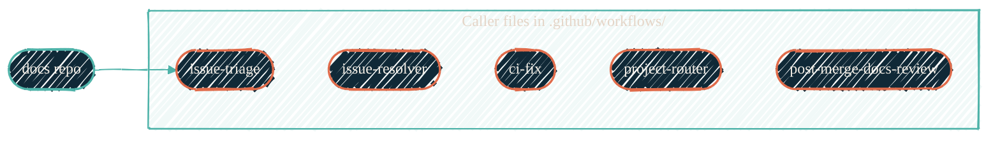

> Open issue. Don't open the dashboard. Come back in five minutes to a draft PR ready for your eyes.

The pipeline on this repo, [`JacobPEvans/docs`](https://github.com/JacobPEvans/docs), uses six thin caller files in `.github/workflows/` that delegate to reusable workflows in [`JacobPEvans/ai-workflows`](https://github.com/JacobPEvans/ai-workflows). Each caller is 10–30 lines; the AI work all lives in the upstream reusable workflow.

## What runs, in order

| Step | Trigger | Caller file | Reusable workflow | What it does |
| --- | --- | --- | --- | --- |
| 1 | `issues: [opened]` | `issue-triage.yml` | `ai-workflows/.github/workflows/issue-triage.yml@main` | Categorizes, deduplicates, labels |
| 2 | `issues: [opened]` | `issue-resolver.yml` | `ai-workflows/.github/workflows/issue-resolver.yml@main` | Creates a **draft PR** if the issue is well-scoped and not on the excluded-labels list |
| 3 | `pull_request: opened/synchronize/ready_for_review` | (no caller — handled by upstream reviewers) | external Gemini + Copilot reviews | Posts inline review comments |
| 4 | `workflow_run` on `CI`, `conclusion: failure` | `ci-fix.yml` | `ai-workflows/.github/workflows/ci-fix.yml@main` | Reads the failed CI log, pushes a fix commit (up to 2 attempts per PR, 5 per day) |
| 5 | `issues: [opened, labeled]`, `pull_request: [opened, ready_for_review]` | `project-router.yml` | `ai-workflows/.github/workflows/project-router.yml@main` | Routes the item to the right GitHub Project with smart field assignment |
| 6 | `push: [main]` → re-dispatched as `workflow_dispatch` | `post-merge-docs-review.yml` | `ai-workflows/.github/workflows/post-merge-docs-review.yml@main` | After merge, audits docs touched by the commit and creates fix PRs if needed |
| 7 | Human clicks **Merge** | n/a | n/a | The only manual step |

## How the six callers connect

{/* Shape: hub-and-spokes. 1 hub, 6 leaves stacked via invisible links. */}
{/* Aspect: ~4:3 (LR). Pass. */}



The hub is the consumer repo; each caller is a one-shot wrapper around an upstream reusable workflow. They run independently when their trigger fires.

## What each caller actually contains

A caller is the minimum YAML to declare a trigger, set permissions, and call the upstream:

```yaml
name: Issue Triage
on:
  issues:
    types: [opened]
permissions:
  contents: read
  id-token: write
  issues: write
jobs:
  run:
    uses: JacobPEvans/ai-workflows/.github/workflows/issue-triage.yml@main
    secrets: inherit
```

Two patterns are slightly larger:

- **`ci-fix.yml`** passes a `repo_context` and `ci_structure` describing what the repo is and what CI runs, so the AI knows what to fix.
- **`post-merge-docs-review.yml`** uses the [Post-Merge Dispatch Pattern](https://github.com/JacobPEvans/ai-workflows/blob/main/docs/PATTERNS.md#post-merge-dispatch-pattern) — a two-job file because `push` events aren't supported by `claude-code-action@v1`, so the caller re-dispatches as `workflow_dispatch`.

## Secrets the pipeline needs

Distributed automatically by [`secrets-sync`](/security/secrets-sync) when a repo is added to the `_github_app_repos` and `_all_repos` anchors in `secrets-config.yml`:

| Secret / variable | Source | Purpose |
| --- | --- | --- |
| `AI_TOKEN` (secret) | `_all_repos` | Provider credential for `claude-code-action`; defaults to Claude OAuth when `AI_PROVIDER` is unset |
| `AI_PROVIDER` (variable) | `_all_repos` | Optional provider route; set `openrouter` or `anthropic_api` to switch without code changes |
| `AI_BASE_URL` (variable or secret) | `_all_repos` | Optional Anthropic-compatible router URL |
| `GH_APP_CLAUDE_BOT_PRIVATE_KEY` (secret) | `_github_app_repos` | Mints App tokens for signed commits attributed to `JacobPEvans-claude[bot]` |
| `GH_APP_CLAUDE_BOT_ID` (variable) | `_github_app_repos` | App identifier |

Per [Git signing](/infrastructure/cicd/git-signing), every AI workflow mints a `JacobPEvans-claude` installation token immediately before calling `claude-code-action@v1`, then hands it in as `github_token` with `use_commit_signing: true`. Commits land web-flow-signed and attributed to the bot.

## Rate and safety guards

The reusable workflows enforce conservative defaults so a runaway loop can't burn cloud spend:

- **`issue-resolver.yml`** — `max_attempts: 1` per issue, `daily_limit: 5` per repo, `excluded_labels: "type:security,type:feature,type:breaking,size:l,size:xl"` won't touch
- **`ci-fix.yml`** — `daily_run_limit: 5` per repo, max 2 fix attempts per PR
- **All workflows** — fork PRs blocked by `if:` guards, branch protection enforces the final merge gate

## The pieces this doesn't include

The cloud pipeline gets a PR to **draft + reviewed**. It does NOT:

- Mark the PR ready for merge — that's a human decision
- Click the merge button — never automated
- Override branch protection or required reviewers
- Touch repos outside the current org boundary

For the local iteration loop on a PR you're editing yourself, see [`/ship` and `/finalize-pr`](/ai-development/skills/ship-and-finalize).

## Where to go next

<CardGroup cols={2}>
  <Card title="ai-workflows" icon="github" href="/automation/cloud-pipelines/ai-workflows">
    Reusable workflows, GH-AW imports, event-triggered and scheduled.
  </Card>
  <Card title="claude-code-routines" icon="clock" href="/automation/scheduled-routines/claude-code-routines">
    The cron half — six routines that scan the org and pick up loose ends.
  </Card>
  <Card title="ai-workflows getting started" icon="book" href="https://github.com/JacobPEvans/ai-workflows/blob/main/docs/GETTING_STARTED.md">
    Caller templates and the live workflow catalog.
  </Card>
  <Card title="Authentication" icon="key" href="https://github.com/JacobPEvans/ai-workflows/blob/main/docs/AUTHENTICATION.md">
    `AI_TOKEN`, provider routing, model variables, and GH-AW engine caveats.
  </Card>
</CardGroup>
