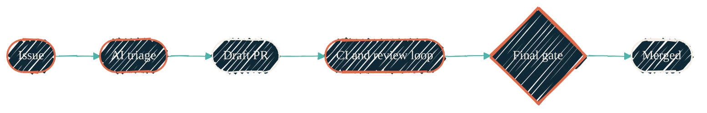

> File an issue. Walk away. Come back to a draft PR with green CI, AI review, and one human merge click left.

This is the **issue → mergeable PR** pipeline. Three repos collaborate: `ai-workflows` runs on GitHub Actions per consumer repo, `claude-code-routines` runs on Anthropic's cloud cron, `claude-code-plugins` is the local Claude Code escape hatch.

## The end-to-end shape

{/* Shape: linear chain. Boundary crossings: 0. Ranks: 6×1. */}
{/* Aspect: ~2.5:1 (LR). Pass. */}

A human files the issue and clicks merge. Everything in between runs without supervision.

## The three layers

| Layer | Where it lives | When it runs | What it owns |
| --- | --- | --- | --- |
| [ai-workflows](/automation/ai-workflows) | GitHub Actions (per consumer repo) | Event-triggered (issues, PRs, CI failures) | Triage, draft PR creation, CI auto-fix, final review gate, project routing |
| [claude-code-routines](/automation/claude-code-routines) | Anthropic cloud cron | Scheduled (cron 2×/day to weekly) | Org-wide maintenance: daily polish, issue solver, sentinel audit, weekly scorecard |
| [claude-code-plugins](/ai-development/claude-code-plugins) | Your laptop | Interactive (`/ship` from any Claude Code session) | The local escape hatch — finalize a PR you're iterating on |

## The six moving parts

<CardGroup cols={2}>
  <Card title="Issue → PR pipeline" icon="route" href="/automation/issue-to-pr-pipeline">
    The eight-step cloud flow on a target repo. Which trigger fires which file, who reviews, what gates merge.
  </Card>
  <Card title="ai-workflows" icon="github" href="/automation/ai-workflows">
    The 16 reusable workflows behind the cloud pipeline. Event-triggered and scheduled.
  </Card>
  <Card title="claude-code-routines" icon="clock" href="/automation/claude-code-routines">
    Six cron-scheduled Claude routines. Org-wide maintenance, no per-repo wiring.
  </Card>
  <Card title="/ship + /finalize-pr" icon="ship" href="/automation/ship-and-finalize">
    The local skill that closes the loop on a PR you're iterating on. Phases, exit modes, the known reliability gaps.
  </Card>
  <Card title="CodeQL resolution" icon="shield-check" href="/automation/codeql-resolution">
    Why CodeQL is fixed separately from CI checks, and how `/resolve-codeql` plugs in.
  </Card>
  <Card title="Shaping issues" icon="hammer" href="/automation/shape-issues">
    The `/shape-issues` skill that turns rough ideas into well-scoped issues the resolver can act on.
  </Card>
</CardGroup>

## Source repos

[`ai-workflows`](https://github.com/JacobPEvans/ai-workflows) · [`claude-code-routines`](https://github.com/JacobPEvans/claude-code-routines) · [`claude-code-plugins`](https://github.com/JacobPEvans/claude-code-plugins). The 30-second pitch lives at [AI pipeline](/architecture/ai-pipeline); this Automation section is the mechanics.
