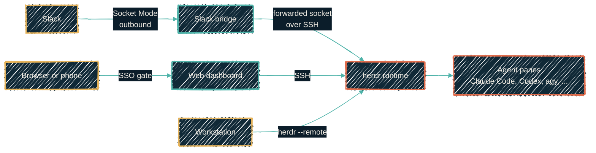

{/* projected from the authoring site; do not edit here */}
Running three to ten AI coding agents at once is hard in plain tmux. You cannot
see which agent is blocked, you cannot drive them from a script, and closing the
laptop ends the work.

**[herdr](https://github.com/herdrdev/herdr)** fixes that. It is a background
server that owns the terminals the agents run in. Sessions survive a reboot.
Panes are marked *working*, *blocked* or *idle*. Agents drive it themselves
through a command-line tool and a local socket API.

The homelab runs it as a service, on the fleet, so the work does not live on a
laptop.

## Three containers, on purpose

Each part runs in its own LXC. A crash in the Slack bridge must not affect the
runtime holding live agent panes.

| Container | What it does | Reachable from outside? |
| --- | --- | --- |
| Runtime | Holds the agent panes and every coding command-line tool | No: SSH only |
| Slack bridge | Alerts when an agent blocks; sends your reply back to that pane | No: Slack Socket Mode dials out |
| Dashboard | Live timelines, one-tap approvals, terminal access | Yes: behind the SSO gate |

Only the runtime keeps state. Agent credentials, git worktrees and session
state live on one backed-up volume. The other two rebuild from code, so they
need no backup and no failover.

## Talking to it from Slack

This mirrors how the [self-hosted agent](/autonomous-agents/hermes-agent) is
driven. When an agent blocks (it wants a decision, or approval to run
something), the bridge posts to Slack. You reply in the thread, and the reply
lands in that agent's terminal.

herdr gets its **own** Slack app, not a shared one. Two Socket Mode connections
on one bot token split events between them, so each side would miss half the
alerts.

Replies run in a live terminal, so an allowlist controls who may send one.

## One config, two places

The whole stack is defined once, as Nix. The same flake produces:

- the **workstation** config, so a laptop and the server agree on settings and
  on which agents herdr knows how to watch, and
- the **server** config, as a systemd service on the container.

Both take their binaries from the same source, so a pane on the server runs the
same build as a pane on the laptop. From the workstation, one command attaches
to the server's herd. The laptop becomes a window onto the work, not the place
it lives.

## Why the CLIs moved to Nix

The agent command-line tools used to come from Homebrew. Homebrew is
macOS-only, so the stack could not leave one laptop, which is the whole
problem this solves.

They now come from Nix, which builds for macOS and Linux alike. Two sources
cover everything: the main package set, and
**[llm-agents.nix](https://github.com/numtide/llm-agents.nix)** for the agent
tools the main set does not carry. Homebrew is kept only for desktop apps,
which have no Nix equivalent.

## Exposure

The dashboard is the only part reachable from a browser. It sits behind the
same SSO gate as every other internal service, on an internal name.

The upstream project offers a free hosted tunnel. The homelab does not use it.
That dashboard can approve a running agent's actions, so it goes through the
estate's own ingress rather than a third party.

## Two sharp edges

**Do not run herdr's `integration install` command.** It writes hooks into each
agent's own config file. Those files are generated from Nix and are read-only,
so the write fails, or the next rebuild undoes it. Declare the hooks in Nix
instead.

**herdr fetches agent-detection updates from the internet at runtime** and
applies them without restarting. On a machine whose whole configuration is
declared in code, that is state arriving from outside.

Treat the fetch as something to override, not to rely on. Local definitions
take precedence, so declare every agent you care about in Nix. The container's
egress policy decides whether herdr can reach the update endpoint at all. Both
levers are enforceable from code, which the fetch itself is not.

Related: [self-hosted AI agent](/autonomous-agents/hermes-agent) ·
[agent runtime](/autonomous-agents/runtime) ·
[secrets](/autonomous-agents/secrets)
