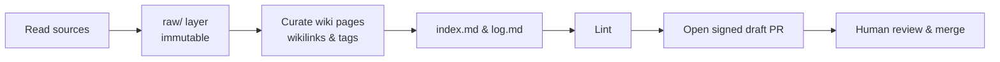
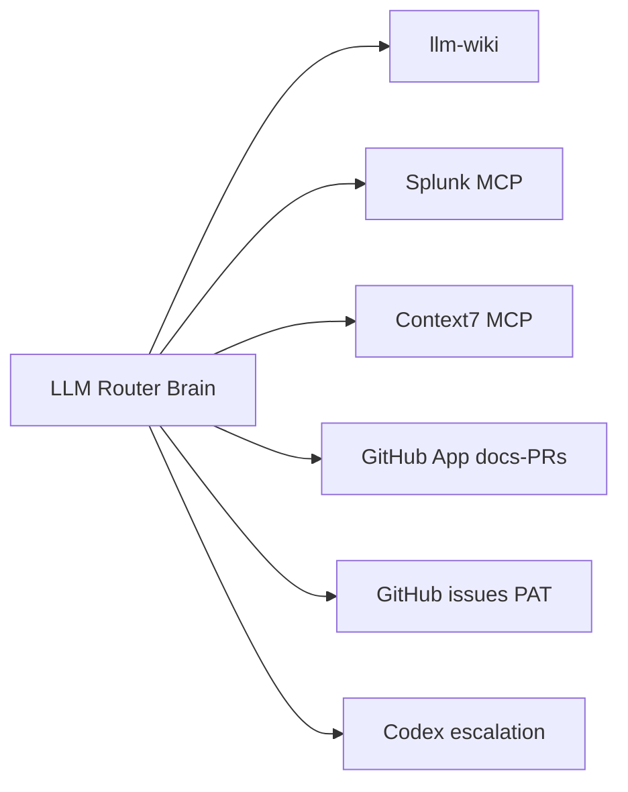

The homelab runs the **[NousResearch Hermes Agent](https://github.com/nousresearch/hermes-agent)**
as a standing, autonomous service: a self-improving agent that creates skills from
experience, keeps persistent memory across sessions, and runs scheduled work on its own.

This is **not** the [Self-hosted ChatGPT](/local-llm/overview) serving stack — that
serves a model for chat. This *is* an agent, and it *uses* a local model as its brain.

## How it runs

A dedicated LXC on the AI VLAN runs the `hermes gateway` daemon under systemd
(`Restart=on-failure`). The gateway drives the built-in **cron** scheduler and the
**Kanban** task board, so the agent keeps working unattended — no laptop, no cloud.

- **Brain:** an always-on local GPU model (OpenAI-compatible), so the agent never
  depends on an external API or a sleeping laptop. The brain is a **stable router
  alias** (`ai-default`) whose backing model **rotates daily** on a fixed UTC
  schedule — a larger reasoning model at 00:00 UTC and a benchmark-selected
  optimized tool-calling model at 12:00 UTC — so the agent and the chat box always
  share one default that alternates twice a day. Only the router's alias-to-model
  mapping flips (via systemd timers); the agent never restarts. Both phases run
  with **thinking ON**, and both carry sampling guardrails for quantized brains.
  See the mechanism doc,
  [`docs/BRAIN_ROTATION.md`](https://github.com/dryvist/ansible-proxmox-apps/blob/main/docs/BRAIN_ROTATION.md).
- **Memory:** the built-in `MEMORY.md` / `USER.md` plus the local **Hindsight**
  provider (knowledge-graph recall, fully self-hosted). Everything lives under
  `$HERMES_HOME` on a dedicated volume that is snapshotted and replicated off-node.
- **Containment:** the LXC is the blast-radius boundary — Hermes *profiles* isolate
  agent state, not OS access — with deliberately narrow egress.

## Reaching it

Headless: SSH in and run `hermes` for the terminal UI, drive it through its gateway,
or talk to it in **Slack** — the wired-in messaging gateway (Socket Mode), and the
sole chat platform in front of it today. Multi-agent *profiles* + *Kanban* teams can
be layered on later — the agent home is already provisioned for them.

## Configuring it

Everything is in `$HERMES_HOME/config.yaml` (secrets in `.env`), set non-interactively
with `hermes config set <key> <value>`:

```yaml
model:
  provider: custom            # OpenAI-compatible local endpoint
  default: <model>
  base_url: 'http://<gpu-host>:11434/v1'
  api_mode: chat_completions
memory:
  provider: hindsight         # local, no external service
agent:
  max_turns: 90               # budget — caps a runaway loop
```

Switch models anytime with `hermes model`; check memory with `hermes memory status`.
Deployment is fully IaC — a Terraform-managed container plus an Ansible `hermes_agent`
role install and configure it, with updates managed declaratively through Ansible to prevent configuration drift.

## Reliability: long-generation timeouts

Agentic tool calls can generate for many minutes. A timeout anywhere in the
request path that fires *before* the model finishes kills the stream mid-tool-call,
and the truncated response surfaces as an "invalid tool call" with empty content —
a transport failure that masquerades as a model bug. The fix is a **nested timeout
chain where the client is the sole decider**: each outer layer is configured to
outlive the inner one, so only the innermost (the agent client) ever decides to
give up.

```text
serving-model timeout  >  router per-attempt timeout  >  agent client stream timeout
        (largest)                                              (smallest — decides)
```

The design principle: guards exist to reap *genuinely orphaned* work — a
disconnected client, a wedged request — never to cap legitimate long generations.
If a server- or router-side guard is the shortest link, it will abort real work.
Set the serving disconnect/idle guard generously and let the client own the
deadline.

## LLM knowledge base (second brain)

The Hermes agent runs the bundled `llm-wiki` skill to build and maintain an interlinked Markdown knowledge base from raw sources. It ingests URLs, PDFs, and notes into an immutable `raw/` layer, then synthesizes curated `entities`, `concepts`, `comparisons`, and `queries` pages. These pages use YAML frontmatter, `[[wikilinks]]`, and a tag taxonomy for structure.

The system keeps an `index.md` catalog and an append-only `log.md`, and lints for orphans, broken links, stale content, and source drift (tracked via SHA256 hashes). The wiki lives on the agent's persistent, snapshotted storage, with a nightly job running lint and health checks. "Compile knowledge once, reuse often" — providing inspectable Markdown instead of opaque memory.



## Autonomous documentation contributor

The agent can read public repositories and open documentation pull requests on its own as a dedicated GitHub App bot identity. Key properties of this workflow include:

- Commits are cryptographically **verified/signed**, authored via the GitHub API's commit-on-branch flow as the App, satisfying a "require signed commits" branch protection rule.
- PRs are opened as **drafts** and the bot has **no merge authority**. A human always reviews and merges; organization rulesets block the bot from self-merging.
- **Guardrails:** The workflow enforces one focused change per PR, source attribution, per-repo daily caps, duplicate detection, secret redaction, and a strict public/private routing rule so sensitive material never lands in a public PR.

## Tool integrations (MCP + skills)

The Hermes agent fan-out connects its LLM routing brain to multiple internal and external capabilities:



- **Splunk MCP**: The `mcp_servers.splunk` entry connects to the Splunk MCP Server app (Splunkbase 7931) at `${SPLUNK_MCP_URL}` (which MUST be the management base plus the `/services/mcp` path) using `Authorization: Bearer ${SPLUNK_MCP_TOKEN}`. Tokens are not generic Splunk JWTs; the app strictly accepts tokens minted by its own `GET /services/mcp_token?username=<user>&expires_on=+90d` endpoint. These minted tokens have an `mcp` audience, are RSA-encrypted, and enforce encryption by default (`require_encrypted_token`). OpenBao is the sole machine-secret source for this shared connection. Hermes and Nix-managed workstation harnesses currently use the same Splunk service identity.
- **Context7 MCP**: A hosted MCP connection at `https://mcp.context7.com/mcp` for up-to-date library/framework documentation. An API key (raising rate limits) is now supplied from the shared secrets engine on the generic AI credential path, so every harness that reads that path gets the same keyed access; the auth header is only rendered when a key is present.
- **GitHub issues/projects**: The agent interacts with GitHub via a custom skill (REST for issues, GraphQL for Projects v2, with guardrails). This is powered by a scoped Personal Access Token granting read/write access to issues across all repos and read/write access to projects, delivered securely via the shared secrets engine.
- **Codex escalation**: For tasks beyond the local brain's reach, the agent can escalate to an external frontier coding model (Codex). Its credential is bootstrapped once from the shared secrets engine into the agent home on first converge (create-only — an existing session is never overwritten), so the capability materializes without hand-placing secrets on the host.
