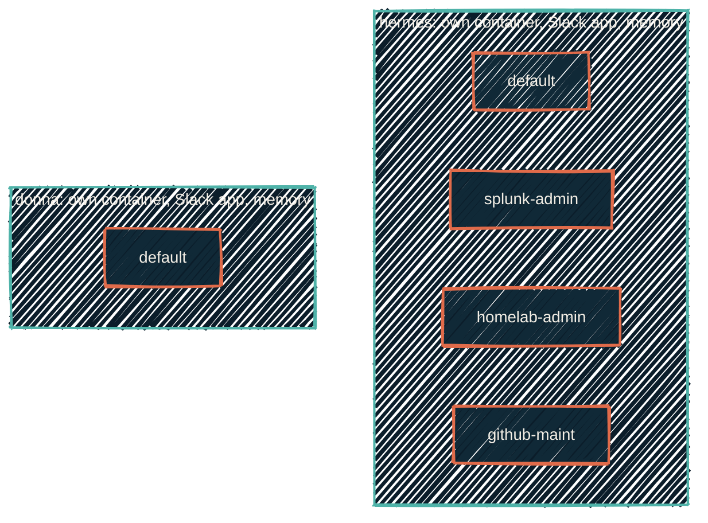
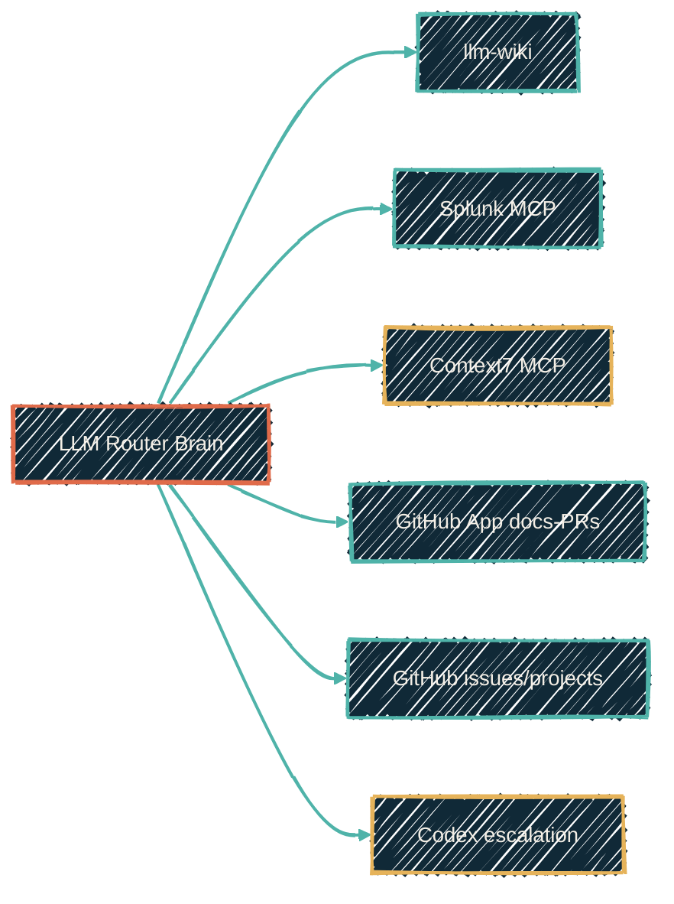

{/* projected from the authoring site; do not edit here */}
The homelab runs the **[NousResearch Hermes Agent](https://github.com/nousresearch/hermes-agent)**
as a standing, autonomous service. It is a self-improving agent that creates skills
from experience, keeps persistent memory across sessions, and runs scheduled work
on its own.

This is **not** the [Self-hosted ChatGPT](/local-llm/overview) serving stack. That
serves a model for chat. This *is* an agent, and it *uses* a local model as its brain.

## How it runs

A dedicated LXC on the AI VLAN runs the `hermes gateway` daemon under systemd
(`Restart=on-failure`). The gateway drives the built-in **cron** scheduler and the
**Kanban** task board, so the agent keeps working unattended: no laptop, no cloud.

- **Brain:** an always-on local GPU model (OpenAI-compatible), so the agent never
  depends on an external API or a sleeping laptop. The brain is a **single
  resident model** served behind the router and selected at runtime from an
  OpenBao value, so re-pointing it needs no rebuild and no agent restart. It
  runs with **thinking ON** and carries sampling guardrails for quantized brains.
- **Memory:** the built-in `MEMORY.md` / `USER.md`, stored under `$HERMES_HOME`
  on a dedicated volume that is snapshotted and replicated off-node, plus the
  **Hindsight** provider (knowledge-graph recall): a separate self-hosted
  service the agent reaches over the network rather than an in-process store.
- **Containment:** the LXC is the blast-radius boundary, with deliberately narrow
  egress. Within one agent, named *profiles* scope which tools and credentials a
  job gets. It is a tool/credential boundary, not an OS sandbox: every profile runs as
  the same user in the same container, and all profiles of one agent share the
  same memory. See [Operating profiles](/autonomous-agents/hermes-operating-profiles).

## More than one agent

The homelab runs more than one independent Hermes agent identity side by side.
Each has its own container, Slack app, OpenBao credential domain, and memory
bank, so one agent's state never leaks into another's. The primary identity is
`hermes`; a second, purpose-built identity (`donna`) runs the same way. New
identities are declared, not layered on top of an existing one. See
[Operating profiles](/autonomous-agents/hermes-operating-profiles) for how a single
agent's tools/credentials are further scoped by profile underneath that.


```mermaid
%%{init:
  {'theme':'base','look':'handDrawn','themeVariables':{'fontFamily':'Geist','fontSize':'14px','primaryColor':'#102937','primaryTextColor':'#F4EFE6','primaryBorderColor':'#4FB3A9','lineColor':'#4FB3A9','secondaryColor':'#0B1D2A','tertiaryColor':'#1A2A38','clusterBkg':'rgba(79,179,169,0.08)','clusterBorder':'#4FB3A9'}}}%%
  flowchart TB
  subgraph HermesC["hermes: own container, Slack app, memory"]
  HD[default]
  HS[splunk-admin]
  HH[homelab-admin]
  HG[github-maint]
  end
  subgraph DonnaC["donna: own container, Slack app, memory"]
  DD[default]
  end

  classDef container fill:#0B1D2A,stroke:#4FB3A9,stroke-width:2px,color:#F4EFE6;
  classDef profile fill:#102937,stroke:#E06B4A,stroke-width:2px,color:#F4EFE6;

  class HermesC,DonnaC container
  class HD,HS,HH,HG,DD profile
```

No arrow connects the two containers in the preceding diagram, and that is the
point. Separate agents share no memory, credentials, or Slack channel.

## Reaching it

You can reach it headless. SSH in and run `hermes` for the terminal UI, or drive
it through its gateway. You can also talk to it in **Slack**, the wired-in
messaging gateway (Socket Mode) and the sole chat platform in front of it today.

The optional Web Dashboard runs as a separate service. It is published only through
the homelab's TLS reverse proxy and uses the same single sign-on provider as the
other browser UIs. Keep webhook and API paths separate from the interactive route:
those machine clients use their own signed or bearer credentials.

## Configuring it

Everything is in `$HERMES_HOME/config.yaml` (secrets in `.env`), set non-interactively
with `hermes config set <key> <value>`:

```yaml
model:
  provider: custom            # OpenAI-compatible local endpoint
  default: <model>
  base_url: 'http://<gpu-host>:11434/v1'
  api_mode: chat_completions
memory:
  provider: hindsight         # separate self-hosted service, reached over the network
agent:
  max_turns: 90               # budget: caps a runaway loop
```

Switch models anytime with `hermes model`; check memory with `hermes memory status`.
Deployment is fully IaC: a Terraform-managed container plus an Ansible `hermes_agent`
role install and configure it. Updates are managed declaratively through Ansible to
prevent configuration drift.

## Reliability: long-generation timeouts

Agentic tool calls can generate for many minutes. A timeout anywhere in the
request path can fire *before* the model finishes. That kills the stream
mid-tool-call. The truncated response then surfaces as an "invalid tool call"
with empty content, a transport failure that masquerades as a model bug. The
fix is a **nested timeout chain where the client is the sole decider**: each
outer layer is configured to outlive the inner one. Only the innermost (the
agent client) ever decides to give up.

```text
serving-model timeout  >  router per-attempt timeout  >  agent client stream timeout
        (largest)                                              (smallest: decides)
```

The design principle: guards exist to reap *genuinely orphaned* work, such as
a disconnected client or a wedged request, never to cap legitimate long
generations. If a server- or router-side guard is the shortest link, it
cancels real work. Set the serving disconnect/idle guard generously and let
the client own the deadline.

## Queue recovery

Hermes keeps scheduled work on its Kanban board. If the scheduler queue wedges,
the recovery path archives active incident cards, rebuilds enabled schedules,
and verifies the gateway and watchdog services. Archiving preserves the task
history for review while giving the scheduler a clean queue. Recovery never
deletes the board or runs garbage collection.

After recovery, operators verify the rebuilt schedule count and service state.
They then wait for a normal scheduled delivery before declaring the incident
resolved. This last check proves the complete scheduler-to-messaging path rather
than only proving that configuration rendered successfully.

## LLM knowledge base (second brain)

The Hermes agent runs the bundled `llm-wiki` skill to build and maintain an interlinked Markdown
knowledge base from raw sources. It ingests URLs, PDFs, and notes into an immutable `raw/` layer,
then synthesizes curated `entities`, `concepts`, `comparisons`, and `queries` pages. These pages use
YAML frontmatter, `[[wikilinks]]`, and a tag taxonomy for structure.

The system keeps an `index.md` catalog and an append-only `log.md`, and lints for orphans, broken
links, stale content, and source drift (tracked via SHA256 hashes). The wiki lives on the agent's
persistent, snapshotted storage, with a nightly job running lint and health checks. "Compile
knowledge once, reuse often": it provides inspectable Markdown instead of opaque memory.


```mermaid
%%{init:
  {'theme':'base','look':'handDrawn','themeVariables':{'fontFamily':'Geist','fontSize':'14px','primaryColor':'#102937','primaryTextColor':'#F4EFE6','primaryBorderColor':'#4FB3A9','lineColor':'#4FB3A9','secondaryColor':'#0B1D2A','tertiaryColor':'#1A2A38','clusterBkg':'rgba(79,179,169,0.08)','clusterBorder':'#4FB3A9'}}}%%
  flowchart LR
  Sources[Read sources] --> Raw[raw/ layer<br>immutable]
  Raw --> Curate[Curate wiki pages<br>wikilinks & tags]
  Curate --> Index[index.md & log.md]
  Index --> Lint[Lint]
  Lint --> PR[Open signed draft PR]
  PR --> Review[Human review & merge]

  classDef src  fill:#102937,stroke:#E06B4A,stroke-width:2px,color:#F4EFE6;
  classDef hop  fill:#102937,stroke:#4FB3A9,stroke-width:2px,color:#F4EFE6;
  classDef sink fill:#102937,stroke:#F4EFE6,stroke-width:2px,color:#F4EFE6;

  class Sources src
  class Raw,Curate,Index,Lint,PR hop
  class Review sink

  linkStyle 0,1,2,3,4,5 stroke:#E06B4A,stroke-width:2px,stroke-dasharray:4 3;
```

## Autonomous documentation contributor

The agent can read public repositories and open documentation pull requests on its own as a dedicated GitHub App bot identity. Key properties of this workflow include:

- Commits are cryptographically **verified/signed**, authored via the GitHub API's commit-on-branch flow as the App, satisfying a "require signed commits" branch protection rule.
- PRs are opened as **drafts** and the bot has **no merge authority**. A human always reviews and merges; organization rulesets block the bot from self-merging.
- **Guardrails:** The workflow enforces one focused change per PR, source attribution, per-repo
  daily caps, duplicate detection, secret redaction, and a strict public/private routing rule so
  sensitive material never lands in a public PR.

## Tool integrations (MCP + skills)

The Hermes agent fan-out connects its LLM routing brain to multiple internal and external capabilities:


```mermaid
%%{init:
  {'theme':'base','look':'handDrawn','themeVariables':{'fontFamily':'Geist','fontSize':'14px','primaryColor':'#102937','primaryTextColor':'#F4EFE6','primaryBorderColor':'#4FB3A9','lineColor':'#4FB3A9','secondaryColor':'#0B1D2A','tertiaryColor':'#1A2A38','clusterBkg':'rgba(79,179,169,0.08)','clusterBorder':'#4FB3A9'}}}%%
  flowchart LR
  Brain[LLM Router Brain] --> LLMWiki[llm-wiki]
  Brain --> SplunkMCP[Splunk MCP]
  Brain --> Context7[Context7 MCP]
  Brain --> GitHubApp[GitHub App docs-PRs]
  Brain --> GitHubIssues[GitHub issues/projects]
  Brain --> Codex[Codex escalation]

  classDef ai       fill:#102937,stroke:#E06B4A,stroke-width:2px,color:#F4EFE6;
  classDef hop      fill:#102937,stroke:#4FB3A9,stroke-width:2px,color:#F4EFE6;
  classDef external fill:#102937,stroke:#E6B35A,stroke-width:2px,color:#F4EFE6;

  class Brain ai
  class LLMWiki,SplunkMCP,GitHubApp,GitHubIssues hop
  class Context7,Codex external

  linkStyle 0,1,2,3,4,5 stroke:#4FB3A9,stroke-width:2px;
```

- **Splunk MCP**: The `mcp_servers.splunk` entry connects to the Splunk MCP Server app (Splunkbase
  7931) at `${SPLUNK_MCP_URL}` (which MUST be the management base plus the `/services/mcp` path)
  using `Authorization: Bearer ${SPLUNK_MCP_TOKEN}`. Tokens are not generic Splunk JWTs; the app
  strictly accepts tokens minted by its own `GET
  /services/mcp_token?username=<user>&expires_on=+90d` endpoint. These minted tokens have an `mcp`
  audience, are RSA-encrypted, and enforce encryption by default (`require_encrypted_token`).
  OpenBao is the sole machine-secret source for this shared connection. Hermes and Nix-managed
  workstation harnesses use the same Splunk service identity.
- **Context7 MCP**: A hosted MCP connection at `https://mcp.context7.com/mcp` for up-to-date
  library/framework documentation. An API key (raising rate limits) is now supplied from the shared
  secrets engine on the generic AI credential path, so every harness that reads that path gets the
  same keyed access; the auth header is only rendered when a key is present.
- **GitHub issues/projects**: The agent interacts with GitHub via a custom skill (REST for issues,
  GraphQL for Projects v2, with guardrails). This is powered by a scoped, short-lived GitHub App
  installation token for issues and Projects v2. No personal access token remains anywhere in this
  system; the token is minted from the shared [OpenBao GitHub service
  engine](/autonomous-agents/github-access).
- **Codex escalation**: For tasks beyond the local brain's reach, the agent can escalate to an
  external frontier coding model (Codex). Its credential is bootstrapped once from the shared
  secrets engine into the agent home on first converge (create-only: an existing session is never
  overwritten), so the capability materializes without hand-placing secrets on the host.
