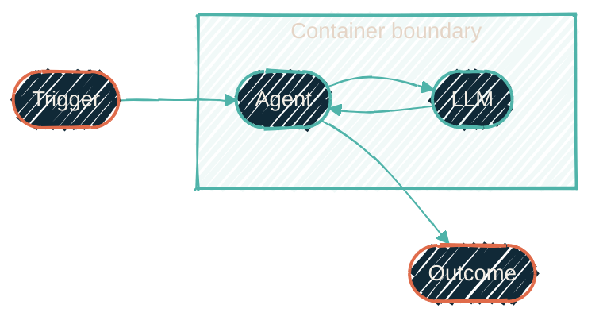

{/* projected from the authoring site; do not edit here */}
<Note>
Status: **partly live.** The profiles, the Mac container path, and the GitHub
secrets engine are in use. The Proxmox agent pool and its egress proxy are
declared in infrastructure code with the converge role written, pending a first
canary run. The [roadmap](/autonomous-agents/roadmap) tracks each workstream.
</Note>

> Stop asking the agent for permission. Put it somewhere it can't hurt anything,
> then let it run.

Today's safety model is fine-grained permission lists. There are roughly 640
allow/ask/deny entries rendered into Claude Code, the Codex command-line tool,
and the Antigravity (`agy`) command-line tool. It runs on a trusted Mac with the user's
full credentials a keychain prompt away. That model assumes a
human is watching. Autonomous agents invert it: **safety becomes the container
boundary**, and tool permissions inside it become maximally lenient. The agent gets
`--dangerously-skip-permissions` precisely because there is nothing dangerous left
to skip into.

## The agent loop

{/*Shape: linear loop. Boundary crossings: 1 (container). Nodes: 5. Aspect: ~3:1 LR. Pass.*/}

An event fires the agent (an issue, a schedule, an alert). Inside the
container, the agent calls the LLM and acts on its own tools. It loops until
it reaches an outcome: a PR, a commit, a report. Nothing in that loop needs a
human, because the boundary, not a human, is the safety control.

## The vendors all converged on this

All three command-line tool vendors publish the same guidance. Bypass flags belong
only inside an isolated environment. The real controls are credentials, network
egress, and git.

| Vendor | Bypass mechanism | Isolation guidance |
| --- | --- | --- |
| **Anthropic** | `--dangerously-skip-permissions` | Only inside a [devcontainer](https://code.claude.com/docs/en/devcontainer) or [sandbox](https://code.claude.com/docs/en/sandbox-environments); hard-rejected when running as root. Agent SDK secure deployment: never mount host secrets, inject credentials from outside, credential-injecting proxy as the end-state. |
| **OpenAI Codex** | `approval_policy` + `sandbox_mode` axes | [`--yolo`](https://developers.openai.com/codex/) (`danger-full-access` + `never`) only inside a container; network is off by default even in `workspace-write`. |
| **Antigravity (`agy`)** | `--dangerously-skip-permissions` | Its own sandbox is turned off and the posture is not coupled to it: the weakest pairing of the three, and the only tool that cannot carry the posture as a settings key at all, so the coupling is enforced by the launcher and the sandbox around it. |

The convergent model:

- The container is the boundary.
- Bypass flags work only inside it.
- Default-deny egress.
- Short-lived, scoped credentials injected from outside.
- Git is the safety net.

## Three profiles

Profiles are defined once in `nix-ai` and rendered to all three tools by the
existing formatter layer. See [nix-ai](/nix/nix-ai) for the rendering pipeline.

| Profile | Where | Claude | Codex | Antigravity |
| --- | --- | --- | --- | --- |
| `interactive` | Mac host (unchanged) | current allow/ask/deny + auto mode | `workspace-write` + approvals | `auto_edit` |
| `autonomous` | inside containers ONLY | `bypassPermissions` + ~10-entry residual deny; `claude -p --bare --dangerously-skip-permissions` | `approval_policy="never"`, `sandbox_mode="danger-full-access"` (the container IS the sandbox; bwrap can't nest) | `--dangerously-skip-permissions`, its own sandbox off |
| `ci` | Actions runners | `autonomous` + JSON output overlay | same | same |

One exception breaks the "configs only, no flags" shape. Antigravity has no
settings key that can carry the posture. Its predecessor hard-errors on the
equivalent key and refuses to start. So every autonomous `agy` run must pass
`--dangerously-skip-permissions` on the command line, and the launcher asserts
the flag is present. The rendered settings block for it exists for parity, not
effect.

## What happens to the 640 entries

They survive only in `interactive`. The autonomous profile keeps a residual deny of
roughly ten entries (`gh repo delete`, `gh secret`, force-push, registry publish)
as a tripwire, not a wall. In `autonomous`, the real protection is:

- **Credential scoping**: the agent holds only short-lived, narrowly scoped tokens.
  See [Secrets](/autonomous-agents/secrets).
- **Network boundary**: an allowlisting egress proxy is the only way out.
  See [Runtime](/autonomous-agents/runtime).

A permission list cannot protect an unattended agent anyway. Anything the config
allows, a confused or compromised agent does. Anything it asks about blocks
forever with no human present. Boundaries that hold without a human are the ones
made of credentials and packets.

## Structural guarantees

Two invariants are enforced in code, not convention:

1. **Autonomous configs exist only inside a boundary**: baked into the
   container image, or rendered by the converge role onto a pool guest. No code
   path writes a bypass-mode settings file onto a workstation filesystem. You
   cannot accidentally run yolo on the Mac host because the config to do so does
   not exist there.
2. **The entrypoint refuses to start** unless `AGENT_SANDBOX=1` is set and the uid
   is not 0. Claude Code independently hard-rejects bypass as root; the image runs
   as `agent` (uid 1000) with no sudo.

<Warning>
The container boundary is only as strong as what crosses it. Never mount host
secrets, the Docker socket, or writable host paths into an agent container. The
[runtime page](/autonomous-agents/runtime) defines exactly what an agent container
may see.
</Warning>

## In this section

<CardGroup cols={2}>
<Card
  title="Runtime"
  icon="box"
  href="/autonomous-agents/runtime">
  The Mac container path, the static LXC pool, the egress proxy, and the run lifecycle.
</Card>
<Card
  title="Secrets"
  icon="key"
  href="/autonomous-agents/secrets">
  OpenBao as the single machine-secrets backbone (headless reads, short-TTL credentials) and the four-tier model behind it.
</Card>
<Card
  title="GitHub access"
  icon="github"
  href="/autonomous-agents/github-access">
  A separate OpenBao service engine issues short-lived GitHub App installation tokens.
</Card>
<Card
  title="Roadmap"
  icon="map"
  href="/autonomous-agents/roadmap">
  Phases 1–7 and the repo ownership map.
</Card>
</CardGroup>
