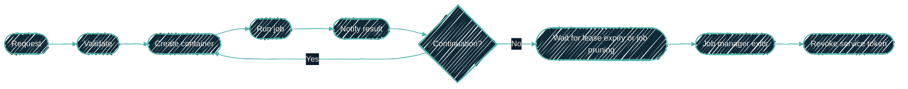

{/* projected from the authoring site; do not edit here */}
<Note>
Status: **partly live.** The Mac path (`agent-image`, `agent-cli`) is in use.
The pool's firewall profile and its egress proxy guest are declared in
infrastructure code. The Ansible role that converges a pool guest is
written. The first end-to-end canary run has not happened yet.
</Note>

> Build the sandbox once, with Nix. Declare the pool once, in infrastructure
> code. Then stop provisioning anything per task.

This repo provides a local entry path and a remote job dispatcher:

| Where | Boundary | What it is for |
| --- | --- | --- |
| **Mac** | Apple `container`, one container per run | Local, interactive-adjacent runs the operator starts by hand |
| **Remote dispatch** | `agent-dispatch`, one Docker container per run | Unattended repository work |
| **Proxmox pool** | A static pool of LXC guests, one systemd unit per job | The separately declared pool runtime |

The local and remote paths use the same image and agent command-line tools.
They differ in how a job starts and how its workspace persists.

## The local image path: one container per run

The `nix-agent-sandbox` repo owns this surface:

| Package / artifact | What it is |
| --- | --- |
| `packages.agent-image` | The OCI image: `dockerTools.streamLayeredImage` |
| `packages.agent-cli` | `agent run\|sweep\|shell`: the single entry point that replaced the per-credential launcher wrappers in [nix-darwin](/nix/nix-darwin) |

Image contents:

- ZCode, OpenCode, and Cursor Agent, plus `git`, `gh`, `nix`, `cacert`, `jq`,
  and `ripgrep`. OpenCode comes from Nixpkgs; Cursor Agent comes from the
  pinned `llm-agents.nix` input. The image's [package list](https://github.com/dryvist/nix-agent-sandbox/blob/main/nix/agent-image.nix)
  and [`flake.lock`](https://github.com/dryvist/nix-agent-sandbox/blob/main/flake.lock)
  own the selected packages and their versions.
- The `autonomous` profile configs rendered by [nix-ai](/nix/nix-ai). The
  image excludes the generated OpenCode provider config; routed access comes
  from its task profile.
- A non-root `agent` user (uid 1000), no sudo.
- An entrypoint that refuses uid 0 or a missing `AGENT_SANDBOX=1`, then runs the
  lifecycle: clone → `nix develop -c <agent>` → push branch → `gh pr create` → exit.

Per-repo toolchains are **not** baked in. Each target repo's own flake devShell
provides its compilers, linters, and tools via `nix develop`. The image stays
generic, and the repo stays the source of truth for its own environment.

## The remote dispatcher path: one container per run

The repo also packages [`agent-dispatch`](https://github.com/dryvist/nix-agent-sandbox/blob/main/nix/agent-dispatch.nix)
and its forced-command adapter. The dispatcher validates a request before
creating a disposable container and a named workspace volume. A continuation
starts a fresh container on that job's workspace.

Each job uses one host-side service token. The waiter keeps it in memory while
the job runs and remains available for continuations. It reuses the token for
result notifications and continuation runs. When the token lease expires or
the job is pruned, the manager exits and revokes the token. The token is never
written to disk or sent to a container. A refused login aborts before container
creation. A configured alert endpoint receives the role and refusal reason.

The container receives a scoped repository token, selected task-profile
values, and optional router settings in a mode-0600 `.agent-env` file. Routed
CLIs use their matching task profile and receive `AGENT_ROUTER_BASE_URL` and
`AGENT_ROUTER_KEY`, not provider-specific API keys. The prompt is copied
separately in `.agent-prompt`. The entrypoint imports only approved names and
removes `.agent-env` before running the agent command-line tool. Optional
router keys are named by the profile's
[`routerKeyField`](https://github.com/dryvist/nix-agent-sandbox/blob/main/nix/task-profiles.nix).

{/*Shape: linear chain. Nodes: 6. Aspect: ~2:1 LR. Pass.*/}



## The Proxmox path: a static pool, pull dispatch

The pool is **N identical long-lived LXC guests, declared once in infrastructure
code**. Growing the pool is one more entry with the next id. The guests are
interchangeable, so pool size is a capacity knob and not a design change.

Guests do not receive work. They **pull** it. A poller on each guest claims a
job from the shared task queue, and one job runs as one instance of a systemd
**template unit**: `agent-task@<job-id>`. The unit carries the isolation:

- `RuntimeMaxSec`: a per-job wall clock. A wedged command-line tool dies with
  its whole control group instead of holding its queue claim forever.
- `PrivateTmp`: the unit gets its own memory-backed `/tmp`. The job's checkout
  lives there and cannot outlive the unit.
- `NoNewPrivileges`, `ProtectSystem`, and a narrow set of writable paths.

A guest is converged by one Ansible role (`agent_guest`, in the
`ansible-proxmox-ai` repo) on a stock Debian template. Nothing about the guest is hand-built, and rebuilding one is a
converge, not a restore.

### Why a pool and not a guest per run

The earlier design provisioned a fresh sandbox for each task. Two costs made
that the wrong shape here:

**Provisioning is not free, and it is paid on every task.** Creating a guest,
waiting for it to boot, and converging it costs minutes of wall clock before
any work starts, on every job, forever. A static pool pays that cost once. The
guest is the slow thing; the job is the fast thing, and only the job should be
per-task.

**Per-run provisioning puts the queue inside the state file.** If a task creates
and destroys a guest, then infrastructure state churns at task rate. An
ordinary run of the infrastructure plan then has to reason about resources that
exist only because something is briefly busy. Pull dispatch keeps the two separate:
infrastructure state describes the pool, which changes rarely, and the queue
describes the work, which changes constantly. The plan stays quiet, and starting
a task needs no infrastructure change at all.

The isolation lost by not rebuilding the guest is bought back at the job
level, by the template unit. That means private tmpfs, a wall clock, and a
cgroup termination: where the untrusted thing actually lives.

The prior generation of this path ran agents in Docker on a shared VM. It still
exists and still runs its legacy guests. Retiring it is gated on the LXC pool
carrying real load through its canary. Two runtimes must never converge the
same guest, so the swap happens after the canary, not before it.

## Run lifecycle

{/*Shape: linear chain. Nodes: 4. Aspect: ~3:1 LR. Pass.*/}


<Steps>
<Step title="Claim">
Mac: `agent run <repo> <prompt>` wraps `container run --rm` with a tmpfs
workspace. Pool: the poller claims a queue job and starts
`agent-task@<job-id>`.
</Step>
<Step title="Clone">
The job clones the target repo into its private tmpfs using a short-lived
scoped token.
</Step>
<Step title="Work">
`nix develop -c <agent>` enters the repo's own devShell and runs the agent
headless with the autonomous profile. Zero prompts by construction.
</Step>
<Step title="Ship">
Push a branch, scan for leaked secrets, `gh pr create`, exit. Nothing
persists. The PR is the only output, and PR review is the human gate.
</Step>
</Steps>

## Operator interface

A Mac run is launched by the `agent` command-line tool:

```bash
agent run [--tool claude|codex|gemini] [--profile <name>] \
          [--repo <owner/name>] [--host <fqdn>] [--no-oauth] <prompt...>
```

Two flags carry two **independent** credential axes. Read-secret scope and
repository-write scope are orthogonal, and a run gets only the axes it names:

| Flag | Grants |
| --- | --- |
| `--profile <name>` | Read access to one task profile's secret group |
| `--repo <owner/name>` | Write to exactly one repository, this run only |

The split is the point. A `--profile` run with no `--repo` can read its secrets
but can never push. A `--repo` run's write reach is exactly one repository,
never an account.

Remote jobs enter through `dispatch-ssh`, which accepts the dispatcher's
validated `start`, `continue`, `status`, `cancel`, and `refresh` commands.

Host targets, egress network names, and the apply tier grant procedure are
operational detail. That detail lives in the internal ops runbooks, not in
this public overview.

## Network boundary

The Proxmox firewall filters addresses and ports. It cannot filter hostnames, so
it cannot express "this agent may reach the model API and nothing else." The
allowlist therefore lives one layer up, in a **forward proxy** that terminates
`CONNECT` and matches on domain.

The pool's firewall profile is built around that split. A pool guest gets
outbound access to internal services only, such as DNS, NTP, the secrets API,
and the log receivers, plus the proxy. It has **no rule permitting 443 to
anywhere**. Every outbound web request the agent makes has exactly one path
off the guest. That path is the proxy, where the domain allowlist is
enforced. Per-agent variations are allowlist groups keyed off the client
address, not separate firewall profiles. At the address-and-port layer they
would be identical rule sets, so duplicating them there would buy nothing and
drift.

The proxy guest itself is the one member of the plane holding general
outbound web access. Its inbound reach is scoped to the agent network alone,
so nothing else on the estate can borrow it as an open relay.

A representative allowlist:

| Destination | Why |
| --- | --- |
| Model API endpoints | the agent CLIs |
| `github.com`, `api.github.com`, `objects.githubusercontent.com` | clone, push, PR |
| `ghcr.io` | image and package pulls |
| `cache.nixos.org` | `nix develop` substitutes |
| Named internal services | per-profile, explicit, never a CIDR |

<Warning>
On the **Mac**, Apple `container` cannot fully null-route a container's
network yet. So the proxy is enforced by environment (`HTTPS_PROXY` plus the
baked configs): policy, not physics. A misbehaving process inside the
container could ignore the env and reach the LAN. This asymmetry is accepted
deliberately. Local Mac runs are for development convenience. **The Proxmox
pool is the high-assurance path** for anything sensitive or scheduled,
because there the missing route is the control.
</Warning>

## Rejected alternatives

| Alternative | Why not |
| --- | --- |
| microvm.nix | No macOS support; the Mac is half the use case. |
| NixOS containers | Neither host runs NixOS. |
| Hostname filtering in the guest firewall | Not expressible at the address-and-port layer; this is what the forward proxy exists for. |

## See also

<CardGroup cols={2}>
<Card
  title="Overview"
  icon="shield"
  href="/autonomous-agents/overview">
  Why the boundary inverted and what the profiles are.
</Card>
<Card
  title="LXC vs Docker"
  icon="boxes-stacked"
  href="/infrastructure/lxc-vs-docker">
  The decision tree this runtime slots into.
</Card>
</CardGroup>
