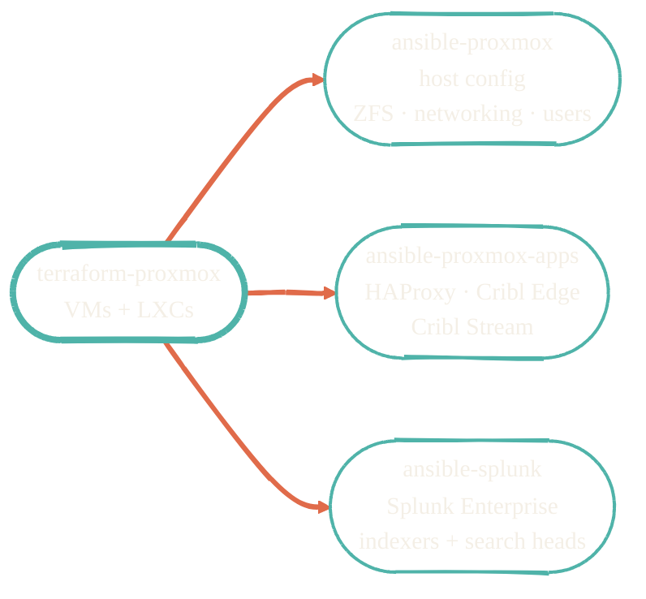

> Terraform builds the box. Ansible makes it useful.

Three Ansible repos cover everything that runs on the provisioned infrastructure: the Proxmox host itself, the application stack on top, and Splunk Enterprise as a separate concern because of its scale and uptime requirements.

## Role map

## Repos in this section

| Repo | What it does |
| --- | --- |
| [ansible-proxmox](https://github.com/JacobPEvans/ansible-proxmox) | Configures the Proxmox host: ZFS, swap, networking, users, hardening. Run once per host. |
| [ansible-proxmox-apps](https://github.com/JacobPEvans/ansible-proxmox-apps) | Configures the application stack on VMs and LXCs: HAProxy, Cribl Edge, Cribl Stream, supporting services. |
| [ansible-splunk](https://github.com/JacobPEvans/ansible-splunk) | Deploys and configures Splunk Enterprise on its own dedicated nodes. Indexers, search heads, license. |

## Secrets

Doppler is the secrets backend for the Ansible inventories. `DOPPLER_TOKEN` resolves project-specific secrets at run time; nothing sensitive lands in git.

## What's next

Phase B will expand each playbook into its own page with the role list, variables, and a "first run" runbook. For now, each repo's `README.md` covers inventory and execution.
