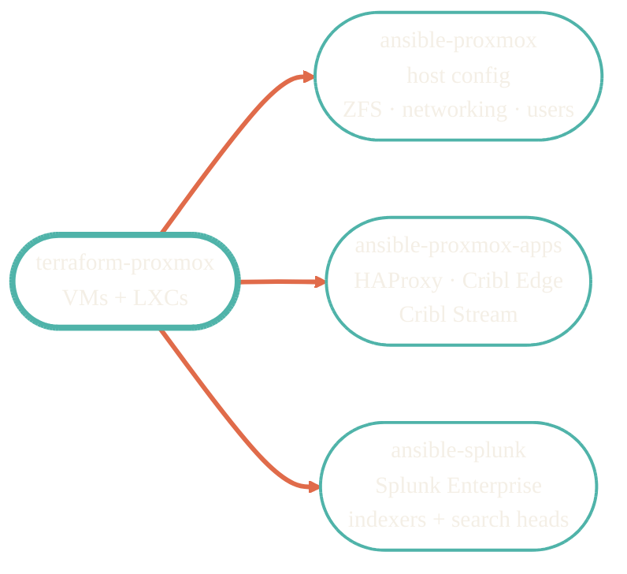

> Terraform builds the box. Ansible makes it useful.

Three Ansible repos cover everything that runs on the provisioned infrastructure: the Proxmox host, the application stack on top, and Splunk Enterprise as a separate concern because of its scale and uptime requirements.

## Role map

## Repos in this section

<CardGroup cols={3}>
  <Card title="ansible-proxmox" icon="server" href="/infrastructure/ansible-proxmox">
    Proxmox host config — ZFS, networking, users, hardening.
  </Card>
  <Card title="ansible-proxmox-apps" icon="boxes-stacked" href="/infrastructure/ansible-proxmox-apps">
    HAProxy, Cribl Edge, Cribl Stream on VMs and LXCs.
  </Card>
  <Card title="ansible-splunk" icon="chart-line" href="/observability/ansible-splunk">
    Splunk Enterprise — indexers, search heads, license.
  </Card>
</CardGroup>

## Secrets

<Info>
Doppler is the secrets backend for the Ansible inventories. `DOPPLER_TOKEN` resolves project-specific secrets at run time; nothing sensitive lands in git.
</Info>

## Where to go next

<CardGroup cols={2}>
  <Card title="Infrastructure overview" icon="server" href="/infrastructure/overview">
    The Terraform side that provisions everything Ansible configures.
  </Card>
  <Card title="terraform-proxmox" icon="vault" href="/infrastructure/terraform-proxmox">
    How VMs and LXCs are provisioned before Ansible touches them.
  </Card>
</CardGroup>
