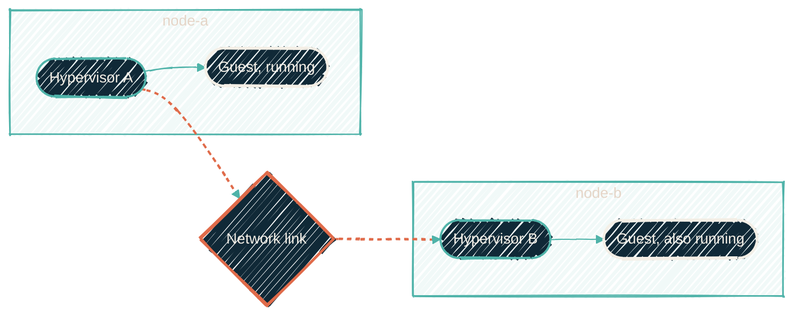

{/* projected from the authoring site; do not edit here */}
> Two machines that disagree about who is in charge each confidently do the wrong thing. Quorum is how you stop that.

A **cluster** is several hypervisor hosts managed as one system. You get one place to see
everything, guests can move between hosts, and, best of all, the cluster can react
automatically when a host disappears.

Joining machines together creates a problem that does not exist with one machine. They now have to agree on things, and the network between them can fail.

## The split-brain problem

Picture two hosts and a network cable between them. The cable is cut. Neither host is broken; each simply cannot reach the other.

From inside each host, that is indistinguishable from *the other one died*. So each concludes it is
the survivor and starts the guests it thinks were lost. Now the same guest is running twice, on two
hosts, both writing to what they believe is the same disk.

That is **split-brain**, and it corrupts data rather than merely causing downtime. It is the failure that cluster design exists to prevent.

{/*Shape: parallel convergence. The severed link forces two independent verdicts. 5 nodes. */}
{/* Subgraphs are physical machines — a real co-location, not a role grouping.*/}

## Quorum is the fix

Each host gets a vote. A host may only run guests if it can see **more than half** of all votes. Not half. *More than* half.

With four hosts, four votes, a majority is three. Split them two-and-two and neither side has three,
so **both sides stop**. That sounds like a worse outcome than split-brain until you remember the
alternative was silent data corruption. Downtime is recoverable; two writers on one disk often
isn't.

| Hosts | Votes needed | Can survive losing |
| --- | --- | --- |
| 2 | 2 | nothing: losing either stops the cluster |
| 3 | 2 | one host |
| 4 | 3 | one host |
| 5 | 3 | two hosts |

<Warning>
Read the two-host row carefully. Adding a second machine for redundancy, with no other change, makes
things **worse**. You go from one machine that can fail to two machines that each can take the
cluster down. This surprises nearly everyone.
</Warning>

## Why odd numbers

Four hosts survive exactly as many failures as three do, and cost you an extra machine to reach that
identical result. Five survive two. So the useful counts are odd, and the sizes that actually buy
something are 3 and 5.

An even count is not wrong. It is simply paying for a machine that adds no fault tolerance. Where
an even count exists, it is usually because the extra host was added for capacity rather than
resilience, which is a perfectly good reason.

<Note>
Some clusters solve the two-host case with a **witness**: a tiny third voter that holds no guests
and exists only to break ties. It can be something as small as a Raspberry Pi. Three votes, two
machines' worth of hardware.
</Note>

## Where to go next

<CardGroup cols={2}>
<Card
  title="Staying up when a machine dies"
  icon="heart-pulse"
  href="/explainers/staying-up-when-a-machine-dies">
  Quorum decides who may act. This is what they actually do.
</Card>
<Card
  title="What a hypervisor is"
  icon="layer-group"
  href="/explainers/what-is-a-hypervisor">
  The layer underneath, if clusters are getting ahead of you.
</Card>
</CardGroup>
