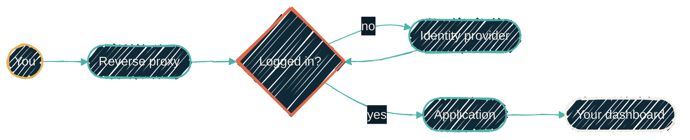

{/* projected from the authoring site; do not edit here */}
> Twenty self-hosted apps means twenty login screens, twenty password policies, and twenty chances for one of them to store your password badly.

Single sign-on replaces all of that with one identity that every app trusts. You log in once. Every service afterwards recognises you without ever seeing a password.

The instinctive objection (*isn't one login a single point of failure?*) is worth taking seriously, and the answer is the opposite of what it looks like.

## Why one login is safer than twenty

Twenty applications each storing your password means twenty implementations of password hashing and
twenty databases that could leak. It also means twenty places where a reused password becomes a
breach everywhere else. Self-hosted software varies enormously in how carefully it does this, and you
generally cannot tell which is which from outside.

With SSO, only one system ever handles the password. That one system can afford strong protections:
hardware-backed second factors, passkeys, rate limiting, real audit logging. You configure it once,
rather than twenty times. The applications never see the password at all, so they cannot
leak it.

## What happens when you click

There are two mechanisms doing different jobs, and both are usually present.

**A gate at the front door.** A reverse proxy sits in front of every service. Before passing a
request through, it asks the identity provider: is this person logged in? If not, the request never
reaches the app. It gets redirected to a login page instead. The app isn't merely
unauthenticated at that point; it is unreachable.

**An identity handshake.** Once past the gate, the app often wants to know *who* you are, to
show your own dashboard. It bounces you to the identity provider, which hands back a signed
statement: you are this person, in these groups. Because it is signed, the app can verify
it without trusting the browser.

{/*Shape: linear chain with a gate. 6 nodes covering both mechanisms in one pass. */}
{/* Boundary crossings: 0. The identity provider is reached from the gate, not the app.*/}

## The header trap

The gate tells the app who you are by adding a header to the request, something like `Remote-User: you`. The app trusts it completely.

Which means: if a browser could *send* that header itself, anyone could claim to be anyone.

So the proxy must **strip those headers from every incoming request before doing anything else**,
then re-add the real values only after authenticating. Order matters absolutely here.
Strip-then-authenticate is secure. Authenticate-then-strip erases the real identity and leaves the
forged one. The two configurations look nearly identical and behave completely differently.

<Warning>
This is worth testing rather than assuming. Send a request with a forged identity header to a gated
path and confirm you are challenged rather than logged in. It is a one-line check that catches a
total authentication bypass.
</Warning>

## Machines don't use this

API clients, scripts, and integrations do not log in through a browser, so making them traverse a
login page breaks them. They authenticate with their own credential (a token scoped to what that
client may do) and bypass the browser gate entirely.

That bypass is exactly why the header strip has to be unconditional. If an API path skips the gate,
and headers are only stripped on gated paths, then the API path happily accepts a forged
identity.

<Note>
Groups are the other half. The identity provider states which groups you belong to, and applications
use those for permissions. The trap is that applications disagree about the *shape* they expect:
some want a bare group name, some want it qualified with an organisation. Emit the wrong shape and
login succeeds while permissions silently do not, which reads as a broken app rather than a config
error.
</Note>

## Where to go next

<CardGroup cols={2}>
<Card
  title="Secrets that expire"
  icon="clock-rotate-left"
  href="/explainers/secrets-that-expire">
  How the machine credentials mentioned above are issued.
</Card>
<Card
  title="Security overview"
  icon="shield-halved"
  href="/security/overview">
  The technical view of secrets handling across the stack.
</Card>
</CardGroup>
