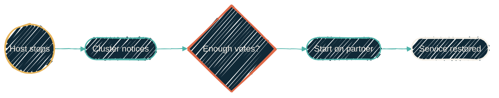

{/* projected from the authoring site; do not edit here */}
> "It's replicated" and "it recovers" are not the same sentence. The gap between them is where outages live.

Three mechanisms get discussed as though they were one. They are not, and the difference matters at exactly the moment you cannot afford to be confused.

| | Protects against | Recovery time | Data lost |
| --- | --- | --- | --- |
| **Backup** | Deletion, corruption, ransomware, "last Tuesday" | Hours | Since the last backup |
| **Replication** | Losing the disk or the machine | Minutes, and manual | Since the last sync |
| **Failover** | Losing the machine | Automatic, minutes | Same as replication |

The column that catches people is the last one. None of these gets you to zero data loss. That needs synchronous writes to two places at once, which costs latency on every single write forever.

## Backup: a copy from the past

A backup is a point-in-time copy kept somewhere separate. Its defining feature is that it is **old
on purpose**. That is what lets you recover from a mistake that replication would have faithfully
copied.

If a bad deploy wipes a database at 3 PM, replication has already dutifully wiped the copy. Only the backup still has the data.

<Warning>
A backup you have never restored is a hypothesis, not a backup. The failure mode is discovering
during a real incident that the archive was empty, the credentials expired months ago, or nobody
knows the procedure. Rehearse restores on a schedule, from the archive, to a scratch target.
</Warning>

## Replication: a copy from moments ago

Replication continuously copies a guest's disk to another host. Set to sync every few minutes, the second copy is never more than a few minutes behind.

This protects against losing hardware. It does **not** protect against a mistake, because it copies mistakes perfectly and immediately.

Critically: replication on its own is **passive**. If the host dies, a healthy, current copy sits on another machine and does absolutely nothing. Someone has to notice, decide, and start it by hand.

## Failover: the part that acts

Failover is the piece that turns a copy into a recovery. The cluster notices a host has stopped answering, confirms it holds enough votes to act, and starts the affected guests elsewhere.

{/*Shape: linear chain. Detection through to service restored. 5 nodes, one gate. */}
{/* Boundary crossings: 0. Aspect ratio ~4:1, acceptable for a pure sequence.*/}

The gate in the middle is the quorum check. Without it, this diagram is the split-brain machine.

## The pin nobody expects

Failover has a constraint that is easy to miss. **A guest can only be restarted on a host that actually holds a copy of its disk.**

If replication sends a guest's disk from `node-a` to `node-b`, then `node-b` is the only viable
destination. Allowing the cluster to start it on `node-c` produces a guest that boots into an
empty disk, or refuses to boot at all. `node-c` has no copy of the data.

So each replicated guest is *pinned* to the pair of hosts that hold its data. Getting this wrong is
worse than having no failover, because the automation confidently does something broken instead of
leaving it for a human.

<Note>
Testing this is the only way to know it works. Deliberately move a guest to its partner and back,
during a planned window, and watch whether the service stays reachable. "Configured for high
availability" and "observed to survive" are different claims, and only the second one is evidence.
</Note>

## What to actually build

<Steps>
<Step title="Backups first, and restore one">
Everything else is optimisation. Backups are the only layer that recovers from mistakes, and an untested backup is not one.
</Step>
<Step title="Replication for what hurts to lose">
A few minutes of drift is fine for most things. Not everything needs it. Replicating a guest you could rebuild from scratch in ten minutes is effort spent for nothing.
</Step>
<Step title="Failover for what must not wait for you">
The services other things depend on, such as DNS, authentication, and the ingress that fronts everything. If those are down, being awake to fix the rest doesn't help.
</Step>
<Step title="Rehearse">
Pick a service, fail it deliberately, time the recovery. Do it again after any change to the setup.
</Step>
</Steps>

## Where to go next

<CardGroup cols={2}>
<Card
  title="Data platform resilience"
  icon="database"
  href="/infrastructure/data-platform-resilience">
  The same three ideas applied concretely to the shared application database.
</Card>
<Card
  title="Backup and replication"
  icon="hard-drive"
  href="/infrastructure/zfs-backup-replication">
  The filesystem-level mechanics that make the snapshots cheap.
</Card>
</CardGroup>
