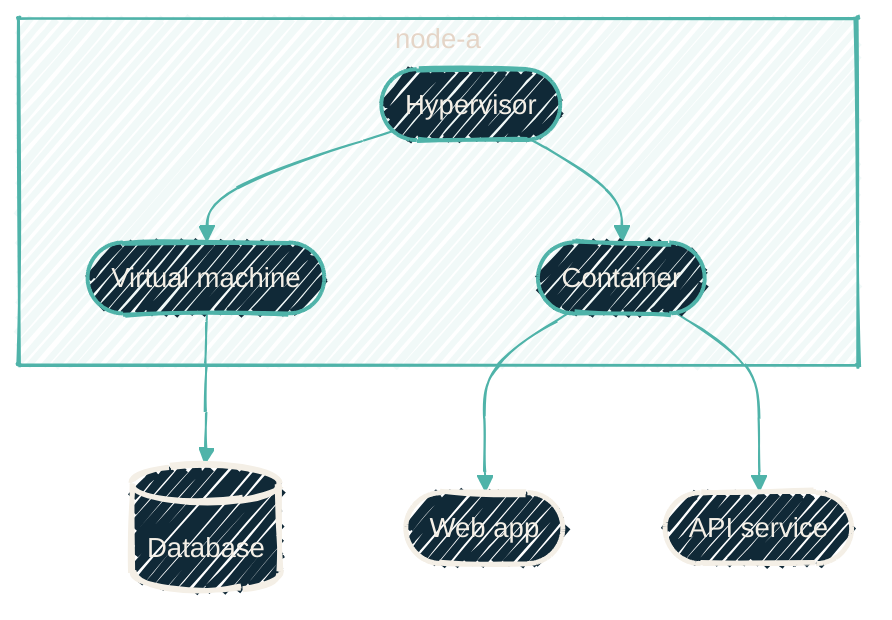

{/* projected from the authoring site; do not edit here */}
> A hypervisor is software whose entire job is convincing other software that it has a computer to itself.

Buy a server and you get one machine. Install a hypervisor on it, and you get as many machines as
its memory allows. Each one has its own operating system, its own network address, and its own
reboot button. They cannot see each other's files. One crashing does not disturb the others.

This is not a trick of naming. The isolation is enforced by the processor itself, which has instructions designed for exactly this.

## Why bother

Because software is territorial. Two applications that each want to own port 443, or each want a
different version of the same library, fight forever on one operating system. They coexist happily
on two.

The alternative, one physical machine per app, wastes almost everything. A typical service
uses a few percent of a modern CPU. Running twenty of them on twenty machines means twenty power
supplies, twenty sets of fans, and nineteen machines' worth of idle capacity.

## Two kinds of guest

The slices are called **guests**, and they come in two flavours that are easy to confuse.

| | Virtual machine | Container |
| --- | --- | --- |
| What it virtualizes | The whole computer, down to fake hardware | Just the operating system's view of itself |
| Runs its own kernel | Yes | No: shares the host's |
| Boot time | Tens of seconds | Under a second |
| Memory overhead | Hundreds of MB before your app starts | Almost none |
| Isolation | Stronger | Strong, but a shared kernel is a shared risk |
| Use when | You need a different OS, or a hard security boundary | You want density and speed, same OS family |

Most guests here are containers, because most of what runs is Linux software on a Linux host. The
overhead of a full virtual machine buys nothing. Virtual machines are used where something genuinely
needs its own kernel, or where a vendor supports nothing else.

{/*Shape: hierarchy. One host, two guest types, three leaf apps. 8 nodes. */}
{/* Subgraph is a physical machine, which is a real co-location. Boundary crossings: 1 per edge max.*/}

## What the hypervisor actually owns

Three things, and knowing which layer owns what saves hours of misdirected debugging:

<Steps>
<Step title="Carving up hardware">
How much memory and how many CPU cores each guest may use. Overcommitting is allowed. Guests can
be promised more memory in total than physically exists, on the bet that they won't all want it
at once. That bet occasionally loses.
</Step>
<Step title="Storage">
Each guest gets a virtual disk. The hypervisor decides where that really lives: local drives, a shared array, or a filesystem that can snapshot it instantly.
</Step>
<Step title="Networking">
A virtual switch inside the host. Guests plug into it and get addresses as though they were
physical machines on a real network. That's why a guest can sit on a different network segment
from its own host.
</Step>
</Steps>

<Tip>
When something breaks, identify the layer first. A guest that won't start is a hypervisor problem. A
guest that starts but serves nothing is an app problem. They look identical from a browser
showing a connection error.
</Tip>

## Where to go next

<CardGroup cols={2}>
<Card
  title="Clusters and quorum"
  icon="circle-nodes"
  href="/explainers/clusters-and-quorum">
  What happens when you join several of these hosts together.
</Card>
<Card
  title="Containers vs virtual machines"
  icon="box"
  href="/infrastructure/lxc-vs-docker">
  The technical version of the comparison above.
</Card>
</CardGroup>
