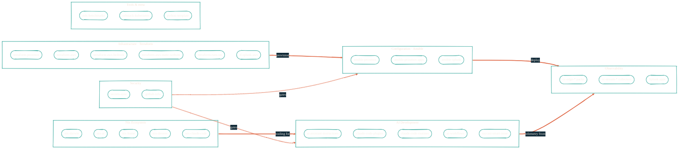

> Forty repositories sound like a lot. They're really six surfaces working as one stack.

## The full picture

## How each surface depends on the others

**Infrastructure → Configuration.** `terraform-proxmox` provisions VMs and LXC containers on the Proxmox cluster. `ansible-proxmox-apps` then configures Cribl, HAProxy, and the application layer on top.

**Configuration → Observability.** `ansible-splunk` deploys Splunk Enterprise. `ansible-proxmox-apps` deploys Cribl Edge and Stream. The Cribl packs (`cc-edge-*`, `cc-stream-*`) and the Splunk apps for AI observability live on this infrastructure.

**Nix → AI Development.** `nix-ai` packages every AI coding tool — Claude, Gemini, Copilot, MLX, MCP servers. `nix-darwin` orchestrates the macOS system. `nix-home` handles the user environment. `nix-devenv` provides reusable per-project dev shells. `nix-claude-code` declares the Claude Code permission model. Together they mean "rebuild my entire dev environment from a single `nix build`."

**AI Development → Observability.** Every AI coding interaction emits OTEL telemetry. The `cc-edge-*` Cribl packs collect it. Cribl Stream routes it. Splunk stores it. Splunk apps visualize it. End-to-end traceability for AI-assisted development — usage, cost, performance, all of it.

**Security → everything.** `secrets-sync` distributes GitHub Actions secrets to ~20 repos from one config file. `.github-tofu` codifies branch protection and rulesets across both organizations. The Nix layer (`nix-darwin`, `nix-claude-code`) enforces the local-AI isolation guarantees. See [Security · How it fits together](/security/how-it-fits-together) for the diagrams.

## Data flows worth knowing

For the actual data pipelines (logs, NetFlow, AI telemetry), see [Architecture · Data pipelines](/architecture/data-pipelines). For the AI development workflow (idea → PR), see [Architecture · AI pipeline](/architecture/ai-pipeline).

## Repository map

Each category has its own section in this site. Per-category pages link out to GitHub for each repo's `README.md`.

<CardGroup cols={3}>
  <Card title="Infrastructure" href="/infrastructure/overview">Terraform modules</Card>
  <Card title="Configuration" href="/configuration/overview">Ansible playbooks</Card>
  <Card title="Nix Ecosystem" href="/nix/overview">Reproducible everything</Card>
  <Card title="AI Development" href="/ai-development/overview">Multi-model AI pipeline</Card>
  <Card title="Observability" href="/observability/overview">OTEL → Cribl → Splunk</Card>
  <Card title="Security" href="/security/overview">Secrets, isolation, golden laws</Card>
  <Card title="Tools" href="/tools/overview">Utilities and meta</Card>
</CardGroup>
