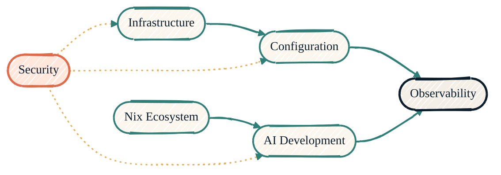

> Forty repositories sound like a lot. They're really six surfaces working as one stack.

## The six surfaces

<CardGroup cols={3}>
  <Card title="Security" icon="shield-halved" href="/security/overview">
    Doppler · SOPS · Keychain · Bitwarden · BWS
  </Card>
  <Card title="Infrastructure" icon="server" href="/infrastructure/overview">
    Terraform · Ansible · Proxmox
  </Card>
  <Card title="Observability" icon="chart-line" href="/observability/overview">
    Cribl · Splunk · OTEL
  </Card>
  <Card title="Nix Ecosystem" icon="snowflake" href="/nix/overview">
    macOS host · user env · AI tooling · dev shells
  </Card>
  <Card title="AI Development" icon="robot" href="/ai-development/overview">
    Claude · Gemini · Copilot · MLX
  </Card>
  <Card title="Dev Tools" icon="screwdriver-wrench" href="/tools/overview">
    Raycast · MLX bench · K8s
  </Card>
</CardGroup>

## How they depend on each other

{/* Shape: parallel convergence. Two chains land on Observability. */}
{/* Security is the gate (dotted control edges). 6 nodes. Boundary crossings: 0. */}

Two chains converge on Observability: the homelab chain (Infrastructure → Configuration) and the dev chain (Nix → AI Development). Security (coral) gates the upstream end of each — credentials, branch protection, isolation. Dotted amber edges are control, not data.

## Going deeper

<CardGroup cols={2}>
  <Card title="Security · cross-tool flows" icon="diagram-project" href="/security/how-it-fits-together">
    CI, local-dev, and AI-session secret flows in detail.
  </Card>
  <Card title="Architecture" icon="sitemap" href="/architecture/overview">
    Data pipelines and AI pipeline narratives.
  </Card>
</CardGroup>
