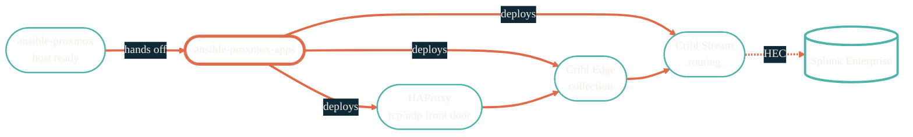

import { RepoMeta, RepoFit } from "/snippets/repo-summary.mdx";

> The third tier. By the time this runs, the host is ready and the apps just need to land on it.

<RepoMeta language="Python" status="active" lastActive="this week" repoUrl="https://github.com/JacobPEvans/ansible-proxmox-apps" />

`ansible-proxmox-apps` deploys the application stack onto VMs and LXC containers that `terraform-proxmox` provisioned and `ansible-proxmox` configured. This is where the data-plane services that move traffic between sources and Splunk actually appear on disk.

## What it does

- Deploys **HAProxy** as the front door for syslog and NetFlow traffic
- Deploys **Cribl Edge** for collection and edge-side reshaping
- Deploys **Cribl Stream** for routing, transformation, and ingest reduction
- Pulls Cribl pack configuration from the [`cc-edge-*`](https://github.com/JacobPEvans?tab=repositories&q=cc-edge) repos at deploy time
- Wires every service so traffic flows from gear → HAProxy → Cribl Edge → Cribl Stream → Splunk

## How it fits

<RepoFit>
This is the deploy tier. Anything that's stateful and long-running on a homelab guest lands here.
</RepoFit>

## Getting started

<Steps>
  <Step title="Confirm the hosts are configured">
    Run `ansible-proxmox` first. Hosts need their ZFS, networking, and monitoring agents in place before apps land on them.
  </Step>
  <Step title="Clone and enter the dev shell">
    `git clone https://github.com/JacobPEvans/ansible-proxmox-apps && cd ansible-proxmox-apps && nix develop`
  </Step>
  <Step title="Provide Doppler credentials">
    Cribl tokens, HAProxy stats password, and Splunk HEC tokens all come from Doppler via `DOPPLER_TOKEN`.
  </Step>
  <Step title="Run the playbook">
    `ansible-playbook -i inventory site.yml`. Re-runs converge drift only — safe to run on a schedule.
  </Step>
</Steps>

## Related repos

<CardGroup cols={2}>
  <Card title="ansible-proxmox" icon="screwdriver-wrench" href="/infrastructure/ansible-proxmox">
    Host config. Must run first.
  </Card>
  <Card title="Observability" icon="chart-line" href="/observability/overview">
    Where the data this stack delivers ends up.
  </Card>
  <Card title="Data pipelines" icon="diagram-project" href="/architecture/data-pipelines">
    End-to-end view of the log and NetFlow paths.
  </Card>
  <Card title="Source on GitHub" icon="github" href="https://github.com/JacobPEvans/ansible-proxmox-apps">
    Roles, packs, full README.
  </Card>
</CardGroup>
