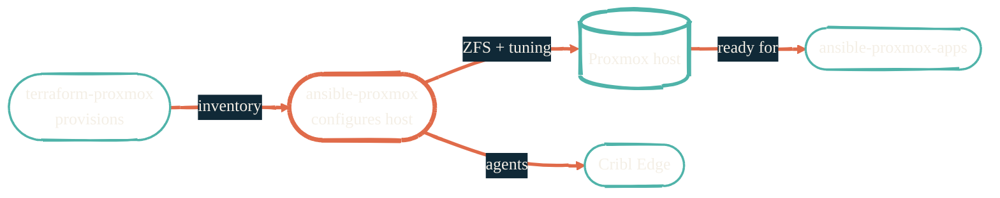

import { RepoMeta, RepoFit } from "/snippets/repo-summary.mdx";

> Terraform made the box. This makes it Proxmox.

<RepoMeta language="Shell" status="active" lastActive="this week" repoUrl="https://github.com/JacobPEvans/ansible-proxmox" />

`ansible-proxmox` is the middle tier of the Proxmox stack. It owns everything that needs to be true about a Proxmox host *before* any workload runs on it: ZFS, networking, swap and CPU tuning, users, hardening, monitoring agents.

## What it does

- Provisions ZFS pools and datasets with sensible defaults for VM and LXC storage
- Sets up network bonding and bridges to match the homelab topology
- Applies performance tuning (CPU governor, swap, sysctl) for VM density
- Installs and configures monitoring agents that feed Splunk via Cribl
- Hardens the host: SSH config, firewall rules, baseline auditd

## How it fits

<RepoFit>
Run once per host after Terraform finishes. Re-running is safe — every role is idempotent.
</RepoFit>

## Getting started

<Steps>
  <Step title="Clone and enter the dev shell">
    `git clone https://github.com/JacobPEvans/ansible-proxmox && cd ansible-proxmox && nix develop`
  </Step>
  <Step title="Point at the Terraform inventory">
    Ansible reads the host list that `terraform-proxmox` wrote out. The README covers the exact path and var precedence.
  </Step>
  <Step title="Resolve secrets via Doppler">
    `DOPPLER_TOKEN` lets the playbook fetch host passwords, SSH keys, and monitoring tokens at run time. No secrets in git.
  </Step>
  <Step title="Run the playbook">
    `ansible-playbook -i inventory site.yml`. The first run is the slow one; subsequent runs only converge what's drifted.
  </Step>
</Steps>

## Related repos

<CardGroup cols={2}>
  <Card title="terraform-proxmox" icon="server" href="/infrastructure/terraform-proxmox">
    The provisioner. Run this first.
  </Card>
  <Card title="ansible-proxmox-apps" icon="boxes-stacked" href="/infrastructure/ansible-proxmox-apps">
    The app deployer. Run this third.
  </Card>
  <Card title="Configuration overview" icon="screwdriver-wrench" href="/configuration/overview">
    How all the Ansible repos fit together.
  </Card>
  <Card title="Source on GitHub" icon="github" href="https://github.com/JacobPEvans/ansible-proxmox">
    Roles, inventory examples, full README.
  </Card>
</CardGroup>
