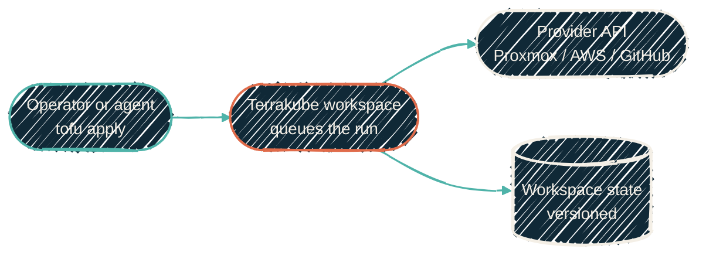

{/* projected from the authoring site; do not edit here */}
> Supersedes older aws-vault and terragrunt apply guidance. Every active
> OpenTofu repo now applies through Terrakube.


{/*Shape: linear pipeline. 5 nodes. Aspect ~3:1 LR.*/}



## How an apply actually works

Every OpenTofu root repo carries a `cloud {}` backend block naming its
Terrakube workspace. Hostname and organization come from
`TF_CLOUD_HOSTNAME` / `TF_CLOUD_ORGANIZATION` environment variables, never
committed to the repo. `tofu apply` does not run locally. It submits the
plan to a Terrakube workspace, which queues and runs it on a Terrakube
executor:

- **State** lives in the platform's object storage, versioned per workspace.
- **Locking** is Terrakube's native one-run-per-workspace queue, with no
  second, repo-specific lock file or mechanism.

## The process for any operator or agent to apply

1. **In any repo with a `cloud {}` block:**

   ```bash
   tofu init
   tofu apply
   ```

   `tofu init` connects to the named workspace; `tofu apply` submits the run
   and streams its remote output back to the terminal.

2. **Review the plan before it applies.** The workspace's plan output is
   visible in the terminal stream and in the Terrakube UI; approve or
   decline the same as any other Terrakube run.

There is no separate "agent path." An AI agent runs the identical two
commands as a human operator, gated by the identical Terrakube RBAC.

## See also

- [IaC tooling](/infrastructure/iac-tooling):
  why the wrapper was removed and the control-plane architecture.
