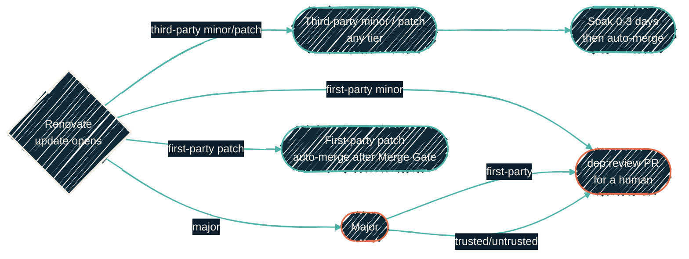

{/* projected from the authoring site; do not edit here */}
> Never ship a stale version. Never auto-merge a major release. Third-party minor and patch updates
> auto-merge for any package, ecosystem, or publisher once they clear a 3-day stabilization window
> and pass CI. First-party patch updates auto-merge once the Merge Gate is green. First-party minor
> and major updates wait for a person. Trust tiers no longer gate third-party minor and patch updates.
> They only decide how reviewers handle a major update and how often Renovate opens PRs.

{/*Shape: decision tree, update kind routes to a lane. 6 nodes. Aspect ~3:1 LR.*/}

Every dryvist and JacobPEvans repo inherits one Renovate policy from [`dryvist/.github` →
`renovate-presets.json`](https://github.com/dryvist/.github/blob/main/renovate-presets.json). This
master preset extends nothing external. The model uses a single global weekly `schedule` (the
untrusted cadence) with per-tier overrides layered on top.
[SECURITY.md](https://github.com/dryvist/.github/blob/main/SECURITY.md) carries the same table from
the security angle.

## Trust tiers gate majors and cadence

| Tier | Scope | PR cadence | Min age | Majors |
| --- | --- | --- | --- | --- |
| **First-party** | `dryvist/**`, `JacobPEvans/**`, `JacobPEvans-personal/**` | immediate (`at any time`) | 0 days | Patch auto-merges once the Merge Gate is green. Minor and major never auto-merge; a person merges them |
| **Trusted** | curated ~50-org allowlist in `renovate-presets.json` | twice-weekly (Mon & Thu) | 3 days | opens a review PR (`dep:review`), never auto-merged |
| **Untrusted** | everything else | weekly (Mon) | 3 days | held 30 days, then opens a review PR |
| **Security / CVE** | any vulnerability alert | immediate (bypasses the schedule via `vulnerabilityAlerts`) | 0 days | Third-party minor/patch auto-merges fast; a security major still opens for review. First-party minor and major wait for a person |

Third-party minor and patch updates auto-merge the same way in every third-party scope in the
preceding table. Any package or ecosystem qualifies, once it clears the scope's minimum age and
passes CI. Trust tier no longer decides whether third-party minor or patch updates auto-merge. For
first-party repos, patch updates auto-merge once the Merge Gate is green, and minor and major updates
wait for a person. Trust tier only decides how reviewers handle a **major** update and how often
Renovate creates PRs.

## Why these tiers

**Freshness first.** The default is to move, not to freeze. Stale dependencies build their own
risk: unpatched CVEs, drifting APIs, and harder upgrades later. Every third-party scope auto-merges
minor and patch updates the same way. The tier only decides how fast a PR opens and how reviewers handle a
major update.

**A compatible-looking version is not always a compatible API for majors.** Semver promises
non-breaking minor and patch releases, and Renovate trusts that promise regardless of publisher. So
third-party minor and patch updates clear a 3-day soak plus green CI. A *major* update is a
deliberate break, regardless of who published it. First-party minor and major updates never
auto-merge, even though dryvist controls both ends of the API. A trusted-org major still opens a
`dep:review` PR for a human. Every other major waits 30 days before a review PR opens. Trust buys
review speed on majors, never a pass on breaking changes.

**The 3-day buffer is a supply chain tripwire.** `minimumReleaseAge: 3 days` is the
compromise-detection window. It applies to every external minor and patch auto-merge and to the
trusted-org major review clock alike. The xz backdoor was caught within about 3 days of the
malicious release. npm allows unpublish under 72 hours. Waiting three days lets Renovate skip a
poisoned release before it lands. Under twice-weekly batching, the wait costs nothing extra.
First-party patch updates and CVE fixes skip it (0 days). First-party patch code needs no soak, and a known-exploited
CVE is more dangerous than an unvetted release.

## First-party changes arrive by pull request

Inside the org, release-please opens a release pull request in the *source* repo. A person merges
it, and release-please never auto-merges a release. On git-flow repos, whose default branch is
`develop`, a release happens only when `develop` is promoted to `main`. After a release is published,
the reusable `promote-major-tag` workflow moves the floating `vN` tag. Consumers pick up a change only
through a pull request that changes their ref or lock. A releasing repo may send a
`repository_dispatch` event carrying its name and tag. The consumer then relocks only the named input
and classifies the bump as patch, minor, or major from the release tags. Producer releases never push
a bump into a consumer.

## AI review is advisory, not the merge gate

Supply chain safety for the publisher-agnostic minor/patch lane comes from a deterministic gate, not
an AI judgment call.
[`actions/dependency-review-action`](https://github.com/actions/dependency-review-action) runs
inside the **Merge Gate**, a required, non-AI check on every public repo. It fails closed on
vulnerable or disallowed transitive dependencies before anything merges.

[`dryvist/ai-workflows` → `cc-dep-review.yml`](https://github.com/dryvist/ai-workflows) runs
separately, under its own **AI Merge Gate**, on every Renovate/Dependabot PR. This is the inverse
of the usual "skip dependency bots" rule. It is advisory only:

- Claude reviews the diff and changelog with an injection-resistant prompt. The review is read-only and uses no secrets. Claude applies a low, medium, or high risk label.
- The label informs human reviewers on majors and review PRs. It does not decide whether the minor/patch lane auto-merges, and it cannot override the deterministic Merge Gate.
- The Merge Gate and the AI Merge Gate are always two distinct required checks on public repos. The AI signal never substitutes for the deterministic one.

## Grouping and scheduling

Related updates batch into ecosystem groups (Terraform, AWS SDK, HuggingFace, OpenTelemetry, pytest,
ESLint/TypeScript) plus a `.nix` version-pins group. One review then covers a coherent set instead
of a PR per package. All trusted updates land in the same Monday/Thursday window, the same day and
time across every repo. Renovate coordinates *schedules*, not cross-repo transactions. It cannot emit one
PR spanning multiple repos, so each repo still gets its own PR in that shared window.

## Nix flake locks are outside Renovate

`flake.lock` is the one file Renovate does not modify. Its `nix` manager is turned off org-wide. Each
nix repo instead calls a shared relock workflow, the only writer of `flake.lock`. The weekly scheduled
run moves every third-party input together, onto one branch, as one pull request, and skips dryvist
inputs. A `repository_dispatch` event, sent when an upstream dryvist repo releases, relocks only the
named input. Manual dispatch also triggers the workflow. All three amend the same pull request rather
than opening a second.

The reason is structural, not a preference. Renovate advances an input when the input's *reference*
changes. Nix repos pin `nixpkgs` to a moving channel branch, and that branch's reference never
changes; new commits simply land on the same branch. So Renovate has nothing to diff, and the
locked revision would freeze permanently. Advancing it needs `nix flake update`, which in Renovate
terms is `lockFileMaintenance`. That setting stays on for every other ecosystem. On nix it resolves
to absolute-latest, ignores `minimumReleaseAge`, and once looped roughly 60 pull requests a week.
Dryvist inputs pinned to a floating `vN` tag have the same blind spot. The reference text never
changes when a new release lands under that major. Only the dispatch path moves them.

Staleness here is expensive, not cosmetic. A pin that drifts off the Hydra-evaluated channel head
loses binary-cache coverage and forces builds from source. The workflow reports that drift by
comparing the locked revision against the published channel revision.

The workflow never auto-merges a pull request in which a `nixpkgs*` input moved, since a channel jump
rebuilds the world on a machine configuration. A third-party release bump of any other input still
merges hands-off on green CI. A dryvist patch bump merges hands-off once the Merge Gate is green. A
dryvist minor or major bump waits for a person.

## Version pinning

| Source | Pin |
| --- | --- |
| dryvist reusable workflows (GitHub Actions `uses:`) | Full 40-character commit SHA, with the release tag as a trailing comment: `uses: dryvist/<repo>/.github/workflows/<file>@<40-hex-sha> # vX.Y.Z` |
| dryvist Nix flake inputs, Ansible git sources, Tofu module sources | Floating major tag: `github:dryvist/<repo>?ref=vN` (Tofu: `?ref=vN`; Ansible: `version: vN`). The lock file holds the exact revision |
| Third-party GitHub Actions (trusted or untrusted) | Full commit SHA, with the released version tag as a trailing comment: `uses: actions/checkout@<sha> # v4.2.2` |

A `uses:` pin resolves its version tag automatically for Renovate and for anyone reading the diff. A
non-`uses:` pin (a container digest, a downloaded binary, anything Renovate can't infer the source
of) needs an explicit hint comment instead: `# renovate: datasource=... depName=... versioning=...`.

`platformAutomerge` stays **false**. GitHub's merge queue has a known bug where a PR passes every
check but the merge never executes, stalling for days. Renovate merges via its own API path with
retry instead. The per-scanner posture for dryvist references lives in [CI/CD
policy → scanner posture](/infrastructure/cicd/policy#scanner-posture-for-self-references).

## Pinning and bump policy

These rules cover dryvist-owned dependencies. Third-party dependencies keep the trust tiers defined earlier on this page.

1. **GitHub Actions refs to dryvist repos** are pinned to a full 40-character commit SHA with the
   release tag in a trailing comment: `uses: dryvist/<repo>/.github/workflows/<file>@<40-hex-sha> # vX.Y.Z`.
   Never `@main`, `@develop`, or a bare `@vN`. Renovate moves the SHA and the comment together.
2. **Nix flake inputs, Ansible git sources, and Tofu module sources** that point at a dryvist repo use the
   floating major tag: `github:dryvist/<repo>?ref=vN` (Tofu: `?ref=vN`; Ansible: `version: vN`). The lock
   file (`flake.lock`, `.terraform.lock.hcl`, the resolved requirements) holds the exact revision. A bump
   is a pull request that changes the ref or relocks, so CI builds the new version.
3. **Bumps are pull requests, never silent.** A bot opens one pull request per consumer that updates the
   ref or SHA and the lock. A **patch** bump, including a digest-only bump, auto-merges after the Merge
   Gate is green. **Minor and major** bumps never auto-merge; a person merges them. `nixpkgs*` moves never
   auto-merge. Nothing tracks `main`, `develop`, or "latest" of a dryvist repo. First-party digest and pin
   PRs carry no human-gate label: Renovate leaves them to the bot-PR auto-merge sweep, which merges each
   once its head commit has soaked and checks are green. `needs-human` is not a label in the organization.
4. **Release PRs (release-please) are never auto-merged.** A person merges the release PR when the batch
   of changes is ready. git-flow repos (default branch `develop`) release only when `develop` is promoted
   to `main`.
5. **Floating major tags.** Every dryvist repo that other repos consume publishes a floating `vN` tag at
   its current major. The reusable `promote-major-tag` workflow moves it after a release is published. A
   major version bump (`feat!` or `BREAKING CHANGE`) needs explicit human intent.
6. **Producer releases do not push bumps.** A releasing repo may send a `repository_dispatch` event
   carrying its name and tag. The consumer relocks only the named input and classifies the bump (patch,
   minor, or major) from the release tags. Scheduled whole-lock relocks skip dryvist inputs.
7. **Deploys build from a pinned lock.** Host builds use the wrapper repo's `flake.lock`, whose dryvist
   inputs use `?ref=vN`. Nothing deploys from `main`.
8. **Enforcement.** zizmor treats `dryvist/*` as `hash-pin`. `scripts/ci-gate-uses-resolve.sh`
   (`PIN_POLICY_MODE`) and `scripts/flake-lock-fresh.sh` (`FLAKE_REF_POLICY`) report refs that break rules 1
   and 2. They warn first and fail once enforcement is on.
9. **Third-party dependencies are unchanged** by this policy.

## Where to go next

<CardGroup cols={2}>
<Card
  title="CI/CD policy"
  icon="scale-balanced"
  href="/infrastructure/cicd/policy">
  Marketplace actions, release-please conventions, the scanner posture for dryvist self-references, the runner-label catalog.
</Card>
<Card
  title="ai-workflows"
  icon="robot"
  href="/automation/repos/ai-workflows">
  The reusable workflows behind the AI dependency reviewer and the App-token signing they use.
</Card>
</CardGroup>
