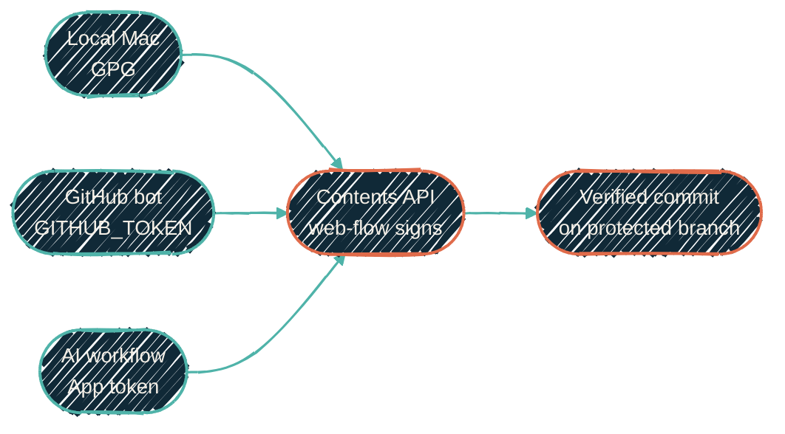

{/* projected from the authoring site; do not edit here */}
{/*TIER-GUARD: reference page — identity matrix and reusable workflow pattern belong together.*/}

> Every commit is signed. The path is always Contents API web-flow; the identity changes with the execution context.


{/*Shape: fan-in, every context signs through one path. 5 nodes. Aspect ~3:1 LR.*/}



`required_signatures` is enforced org-wide by Repository Rulesets on every protected branch. A
commit without a valid web-flow or GPG signature is rejected at the API. The rows below are the
only ways to land a commit that satisfies the ruleset.

## Identity per context

| Context | Identity | Auth | Signing path |
| --- | --- | --- | --- |
| Local Mac | `JacobPEvans` | local user | GPG (key `31652F22BF6AC286`); nix-home reads identity from a gitignored local file |
| GitHub Actions: deterministic (snake, `3d-contrib`, `peter-evans/create-pull-request`, release-please) | `JacobPEvans-github-actions[bot]` | default `GITHUB_TOKEN` | web-flow via the action's Contents API call |
| AI workflows and native cloud routines | App identity | `github_token` | Contents API with `use_commit_signing: true` |
| GitHub bots (Renovate, release-please releases, dependabot) | the bot's GitHub identity | managed by GitHub | web-flow |

Verification for any commit:

```bash
gh api repos/<owner>/<repo>/commits/<sha> \
  --jq '{verified: .commit.verification.verified, reason: .commit.verification.reason, login: .author.login}'
```

Expect `verified: true`, `reason: "valid"`, and the `login` from the preceding table.

## AI workflow App-token pattern

The action's `use_commit_signing: true` sends edits through the Contents API, which
web-flow-signs every commit and attributes it to whichever bot owns the token.

The workflow reads `AI_PROVIDER`, `AI_TOKEN`, `AI_BASE_URL`, `AI_MODEL_CODE`,
`AI_MODEL`, `GH_APP_CLAUDE_BOT_ID`, and `GH_APP_CLAUDE_BOT_PRIVATE_KEY`.

The AI never constructs Contents API payloads itself. It edits files locally inside the workflow.
`claude-code-action@v1` translates those edits into Contents API calls on commit. AI workflows enjoy
normal file-editing ergonomics without losing signed-commit attribution.

## Deterministic GHA pattern

Workflows where no AI generates content use whichever marketplace action fits. They sign
automatically as long as the action makes its commits through the Contents API rather than
runner-side `git commit`.

| Producer | Action | Notes |
| --- | --- | --- |
| `JacobPEvans/JacobPEvans` snake / `3d-contrib` | `peter-evans/create-pull-request@v8` with `sign-commits: true`, then `gh pr merge --squash` | The action wraps the Contents API for arbitrary file updates |
| Release commits (release-please) | `googleapis/release-please-action@v5` | Native web-flow signing |
| Built-in commit modes | for example, `lowlighter/metrics` with `output_action: commit` | Action handles signing itself |

Never build a custom Contents-API or Git-Data-API helper for content the runner can hand off to a trusted action.

## Adding a new context

Pick a real identity, never an anonymous one: a GitHub App, a user, or a bot. Then pick the auth method:

- **App installation token** when commits must be attributed to an App identity.
- **Default `GITHUB_TOKEN`** when commits should be attributed to `JacobPEvans-github-actions[bot]`.
- **GPG / SSH on the runner** only when a workflow truly needs `git commit` on the runner (rebase, cherry-pick, generated patches that do not fit the Contents API). Document the exception inline.

Add a row to the preceding identity table. Document operator setup in the consuming repo.

## Canonical sources

Single source of truth. Link from other repos rather than duplicating prose.

- Architecture: this page
- Operator setup for cloud routines: `docs/CLOUD_ROUTINES_AUTH.md` in [`JacobPEvans/claude-code-routines`](https://github.com/JacobPEvans/claude-code-routines)
- Local Mac identity values: a gitignored local file outside the repo, read by nix-home
- AI-action App-token pattern: the reusable workflows in
  [`JacobPEvans/ai-workflows/.github/workflows/`](https://github.com/JacobPEvans/ai-workflows/tree/main/.github/workflows)
  (issue-resolver, ci-fix, code-simplifier, post-merge-tests, post-merge-docs-review,
  final-pr-review)
- Native cloud-routine pattern:
  [`JacobPEvans/claude-code-routines/.github/workflows/issue-solver.yml`](https://github.com/JacobPEvans/claude-code-routines/blob/main/.github/workflows/issue-solver.yml)

## Where to go next

<CardGroup cols={2}>
<Card
  title="CI/CD policy"
  icon="scale-balanced"
  href="/infrastructure/cicd/policy">
  Marketplace actions, release-please, version pinning, runner choice.
</Card>
<Card
  title="secrets-sync"
  icon="rotate"
  href="/security/secrets-sync">
  Repository configuration.
</Card>
<Card
  title="Golden laws"
  icon="shield-halved"
  href="/security/golden-laws">
  Why every commit is signed, audit-trail rules, MFA on elevated sessions.
</Card>
</CardGroup>
