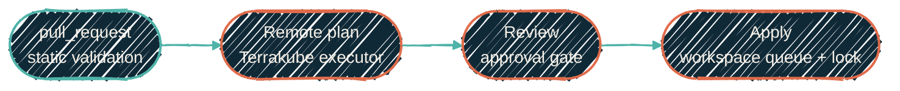

{/* projected from the authoring site; do not edit here */}
> CI validates code. Terrakube plans, locks, and applies OpenTofu inside the homelab.

{/*Shape: linear pipeline, 4 stages. 4 nodes. Aspect ~3:1 LR.*/}

The CI/CD surface spans four runner tiers, with workflows picking a tier by the work they need to do. Credentialed OpenTofu runs are a separate control-plane concern owned by Terrakube.

For how secrets reach a workflow regardless of tier, read [Security](/security/overview). This page does not duplicate that material.

## Runner tiers

Pick by what the workload actually needs:

| Tier | Where | When to use |
| --- | --- | --- |
| **GitHub-hosted** | GitHub Actions cloud (free for public repos) | Public repos. No AWS work, no internal-host access, nothing that needs a private runner. Cheapest path. Includes `macos-latest` for real Darwin (`xcrun`, codesign). |
| **RunsOn AWS spot** | EC2 spot via [`tofu-runs-on`](/infrastructure/cicd/tofu-runs-on) | Private repos. Much cheaper than GitHub-hosted private-repo minutes; same OIDC trust into AWS. Default for IaC apply jobs that authenticate to AWS. |
| **On-prem Mac Studio (mac-fleet)** | Always-on Mac Studio in the homelab. GitHub still names the runner group `llm-runners`. | Linux ARM64 inside an Apple container (labels include `apple-container` and `mlx`). Jobs that need that host or the LAN around it. **Not** a Darwin runner. It cannot run `xcrun` or codesign. **Not** the laptop. |
| **On-prem Proxmox (proxmox-fleet)** | Dedicated Linux x64 runner host in the homelab | Docker-capable Linux x64, Proxmox LAN, jobs that must not leave the homelab boundary. Separate from the Studio. |

The decision tree is workload-first. A Darwin build picks GitHub-hosted `macos-latest`. A job that
needs the always-on Studio picks mac-fleet. An IaC apply picks RunsOn. A public-repo lint picks
GitHub-hosted. A Linux x64 job that must stay on-prem picks proxmox-fleet. The cost ordering is
"free → very cheap → host-cost → host-cost," but cost rarely drives the choice.

## The shape of every IaC pipeline

| Stage | Trigger | Where it runs | What it does |
| --- | --- | --- | --- |
| Static validation | `pull_request` | The repo's CI tier | `tofu fmt -check`, `tofu init -backend=false`, `tofu validate`, and tests without live credentials |
| Remote plan | VCS or operator trigger | Homelab Terrakube executor | Plans with short-lived provider credentials from OpenBao; keeps resolved values in the workspace log |
| Review | Terrakube approval step or explicit saved-plan gate | Terrakube UI / operator command-line tool | Reviews the complete plan and blocks unexpected destroy or replacement |
| Apply | Approved Terrakube run | Same workspace executor | Applies under the workspace's native queue and state lock |

Public PRs never receive raw resolved plans. Terrakube keeps the full plan in the homelab workspace and obtains provider credentials through native OpenBao paths.

## Branch protection and merge rules

A ruleset, not a legacy branch-protection rule, protects the `main` branch on every trunk-flow IaC repo (default branch `main`, no `develop`):

- Required signatures (GPG)
- Required linear history (no merge commits)
- Required review-thread resolution before merge
- Squash or rebase merge methods only (no merge-commit option)
- Copilot Code Review auto-requested on every PR (review-on-open, not review-on-push)

An IaC repo on git-flow (default branch `develop`) instead follows [Branch
conventions](/conventions/branch-conventions#git-flow-branch-types-repos-with-develop): `main`
requires merge commits from `develop` (squash and rebase banned there). The preceding rules apply to
`develop` as its protected integration branch. The exception: `develop` allows merge commits for
back-merges and stacked work. The "no merge commits" and "squash or rebase only" rules stay
`main`-only.

Solo-maintained personal repos intentionally have **no required approving review count**. The gates
that matter are the ruleset checks and the OIDC scope of the apply role. Multi-maintainer org repos
under `dryvist` set the count in their own rulesets.

## Where to go next

<CardGroup cols={2}>
<Card
  title="Dependency automation"
  icon="rotate"
  href="/infrastructure/cicd/dependency-automation">
  Renovate trust tiers, scheduling, automerge policy, and version-pinning across every repo.
</Card>
<Card
  title="CI/CD policy"
  icon="scale-balanced"
  href="/infrastructure/cicd/policy">
  Marketplace actions, release-please conventions, the full runner-label catalog, on-prem runner requirements.
</Card>
<Card
  title="Git signing"
  icon="signature"
  href="/infrastructure/cicd/git-signing">
  Identity per execution context, the App-token pattern, deterministic-GHA signing.
</Card>
<Card
  title="tofu-runs-on"
  icon="play"
  href="/infrastructure/cicd/tofu-runs-on">
  The RunsOn tier — the runner pool itself, OIDC trust, migration guide.
</Card>
<Card
  title="OpenTofu check placement"
  icon="list-check"
  href="/infrastructure/tofu-check-placement">
  Static checks in pre-commit and CI; credentialed operations in Terrakube.
</Card>
<Card
  title="Security overview"
  icon="lock"
  href="/security/overview">
  How secrets reach a workflow, across all four runner tiers.
</Card>
<Card
  title="Infrastructure overview"
  icon="server"
  href="/infrastructure/overview">
  Where CI/CD fits in the broader Proxmox + AWS picture.
</Card>
</CardGroup>
