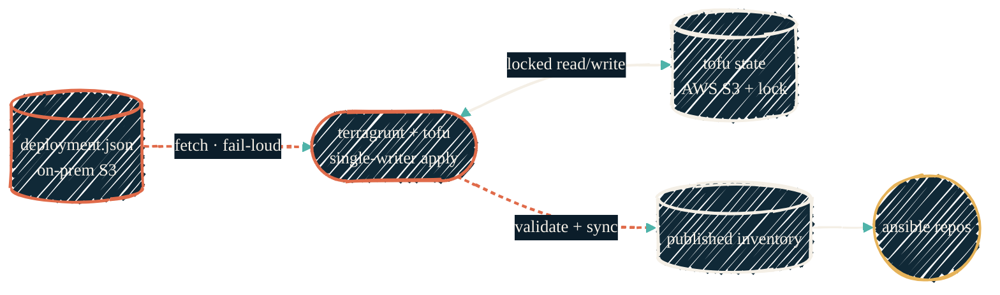

> `deployment.json` is the single desired-state input for `tofu-proxmox`. It lives as one versioned object in a private S3 store, is fetched fail-loud at every plan/apply, and is mutated by exactly one session at a time. This page is the one place that contract is defined — everything else links here.

`deployment.json` declares every Proxmox guest, pool, node, and storage target the homelab should have. It is the *input* to `tofu-proxmox`, not its output. Getting its handling wrong is uniquely dangerous: an earlier model kept it as a gitignored, per-worktree local file, so copies drifted between machines and a missing file let `try(jsondecode(file()), {})` silently decode to `{}` and plan a full **destroy**. That failure mode is why this contract exists and why it is written down exactly once.

The rules below are ACID by design. Read them as the binding contract for any tofu or ansible session that touches deployment state — do not restate them elsewhere; link to this page.

## Two object stores, never confused

Two S3-compatible stores are in play. They share no credentials and serve different jobs. Conflating them is the most common mistake.

| Store | Holds | Reached with |
| --- | --- | --- |
| Private on-prem S3 (`iac-inventory` bucket, `deployment.json` key) | the desired-state **input** object, versioned | Doppler `S3_*` creds + `S3_ENDPOINT`, via `aws s3 cp` in Terragrunt |
| AWS S3 (`tfstate-proxmox-<account>`, `us-east-2`) | the Terraform **state** output | aws-vault `AWS_*` STS creds, the backend `remote_state` block |

The input fetch uses `S3_*` creds and the on-prem endpoint; the state backend uses `AWS_*` STS creds and AWS. They never overlap.

{/* Shape: linear apply pipeline with one side state store. Boundary crossings: 0. Ranks: DJ→TG→{ST,INV}→ANS ≈ 4 wide. Aspect ~2:1 LR. Pass. */}



## The ACID guarantees

| Property | What it means for `deployment.json` | How it is enforced |
| --- | --- | --- |
| **Atomicity** | A plan/apply sees the whole input or none of it — never a partial or empty desired-state. | Terragrunt fetches the single object with `aws s3 cp … -`; a missing or blank object makes the fetch exit non-zero and `run_cmd` raises. There is **no `try()` fallback**, so `{}` can never reach a plan. Writes replace the whole object (S3 `PutObject`), never edit in place. |
| **Consistency** | Only a structurally valid desired-state is ever applied or published. | `deployment.schema.json` requires `containers` (≥1), `nodes`, `pools`, and `proxmox_node`; an empty map fails before any plan. The rendered Ansible inventory is re-validated against the schema before it is distributed, so a partial `-target` apply cannot publish a truncated inventory. Container keys must equal Terraform state keys. |
| **Isolation** | Exactly one session mutates infrastructure at a time; concurrent applies serialize instead of colliding. | The OpenTofu state lock (`use_lockfile`, S3 conditional write) admits one writer. `-lock-timeout=10m` makes a second apply **wait** for the holder rather than fail, so agents, hooks, and parallel sessions queue cleanly. |
| **Durability** | A committed desired-state survives process, worktree, machine, and single-store loss. | The input is a **versioned** object in `iac-inventory` (history retained); the state is durable in AWS S3. The fetch itself now has failover — primary (on-prem) first, then an AWS S3 mirror if on-prem is unreachable — and fail-loud is preserved: only a both-store failure exits non-zero. Nothing depends on a local copy — there is no authoritative file on any laptop. |

## Reading the input

The canonical source is the `iac-inventory` object, fetched fresh on every plan/apply. There is no blessed local copy.

- **Never trust or hand-edit a local `deployment.json`.** Any file on disk is a transient fetch artifact, not the source of truth. Delete stale local copies.
- `DEPLOYMENT_JSON_PATH` exists only for offline or bootstrap work; it points Terragrunt at a local file instead of S3. Do not use it as a normal workflow.
- **Ansible consumers never read `deployment.json` directly.** They read the published inventory that `tofu-proxmox` renders, validates, and distributes after each apply.

## Writing the input

All infrastructure changes — containers, VMs, pools, sizing — are edits to the S3 object, applied through one writer:

1. **Fetch** the current object from `iac-inventory`.
2. **Edit** the desired-state.
3. **Validate** against `deployment.schema.json` before upload.
4. **Upload** the whole object back (replaces the previous version; the bucket keeps history).

Two hard prohibitions:

- **Never `git add deployment.json`.** The repo keeps only `deployment.json.example` as a shape reference; the live file is gitignored by design.
- **Never create `terraform.tfvars`.** It silently overrides `deployment.json` through Terraform variable precedence and is gitignored, so it does not travel between worktrees — the exact drift this contract removes. If one appears in a worktree, delete it.

## The schema

`deployment.schema.json` is the consistency gate. Its job is to reject an empty or structurally broken input before any plan runs.

| Key | Requirement |
| --- | --- |
| `containers` | object, **≥1 entry** (an empty map is the destroy footgun the schema exists to catch) |
| `nodes` | object, ≥1 entry — cluster node identity |
| `pools` | object, ≥1 entry |
| `proxmox_node` | non-empty string |

`additionalProperties` stays `true` so per-environment extras and `_`-prefixed inline-comment keys never false-fail; only the load-bearing shape is enforced. Each container requires `vm_id` (≥100), `hostname`, and `vlan`.

## Authoring containers

Keep container entries compact — the module supplies the defaults:

- **Omit** `root_disk.datastore_id`; it defaults to `local-zfs`.
- **Omit** `network_interfaces` when you want the Proxmox firewall on (the default).
- **Include** `network_interfaces` only to set `firewall: false` (e.g. DNS servers, management tools).

```json
"my-container": {
  "vm_id": 123,
  "hostname": "my-container",
  "description": "What it runs",
  "cpu_cores": 2,
  "memory_dedicated": 2048,
  "vlan": "compute",
  "tags": ["terraform", "container"],
  "pool_id": "infrastructure",
  "root_disk": { "size": 16 }
}
```

**Key-name alignment is load-bearing.** A container's key must match its Terraform state key exactly — a mismatch triggers destroy + recreate. Verify against `terragrunt state list` before adding an entry for a guest that already exists.

## Single-writer locking — the direction

Two locks work together. The **state lock** protects one tofu backend from concurrent writes; a **global flow lease** protects the whole homelab from two mutating flows running at once. They are separate mechanisms with separate scopes.

### The state lock — S3-native conditional writes

The canonical mechanism is S3-native `use_lockfile` (OpenTofu ≥ 1.10), which acquires the lock with a **conditional write**: a `PUT` guarded by `If-None-Match: *` that succeeds only if the lock object does not already exist. No separate lock service is needed. This is the modern default — Terraform has deprecated the `dynamodb_table` argument (removed in OpenTofu 1.11), and OpenTofu recommends native S3 locking for new backends.

The requirement this pushes onto the object store is exact: **it must implement `If-None-Match` conditional writes.** Both AWS S3 and RustFS support conditional writes and hold the `use_lockfile` lock.

<Note>
Lock *waiting* is separate from the lock *mechanism*. `-lock-timeout=10m` (set on every locking command) is what turns "Error acquiring the state lock" into a clean queue when two sessions apply at once — keep it regardless of which lock backend is active.
</Note>

### The global flow lease — one mutating flow at a time

The state lock only serializes writers of *one* backend. A homelab change often spans more than that — a tofu apply followed by an ansible run, or an agent editing infrastructure while a scheduled job also fires. A single **global flow lease** gates all of it: a lease held in the T2 runtime manager's KV store, taken via **compare-and-set** so two claimants cannot both win.

The lease is coupled to credentials — **credential gating: no lease, no creds.** A flow that cannot take the lease cannot obtain the short-lived credentials it would need to mutate anything, so serialization is enforced at the point where secrets are issued, not merely by convention. See the [tools comparison](/security/comparison#the-runtime-manager-is-also-the-lock-authority) for how the runtime manager plays this dual role.

## Variant: tofu-unifi

`tofu-unifi` solves the same single-writer problem with a different input model, and that divergence is intentional. Instead of one S3-fetched object, it keeps **committed per-domain files** under `deployment/*.json` (one top-level domain key per file), shallow-merged at plan time, with `use_lockfile`-only state locking. Its surface is small and public-safe, so committed config is the right call there. Converging it onto the S3-input model is a roadmap item, not a current requirement.

## See also

<CardGroup cols={2}>
  <Card title="IaC tooling" icon="layer-group" href="/infrastructure/iac-tooling">
    Why Terragrunt stays in `tofu-proxmox`/`tofu-unifi` — the three-layer input merge this object feeds.
  </Card>
  <Card title="tofu-proxmox" icon="server" href="/infrastructure/repos/tofu-proxmox">
    The repo that fetches, applies, and publishes from this object.
  </Card>
  <Card title="Terraform on AWS" icon="lock" href="/infrastructure/terraform/overview">
    The state backend, S3 conditional-write locking, and IAM isolation model.
  </Card>
  <Card title="SOPS for IaC" icon="key" href="/infrastructure/secrets-sops">
    The encrypted-at-rest layer merged alongside this object.
  </Card>
</CardGroup>
