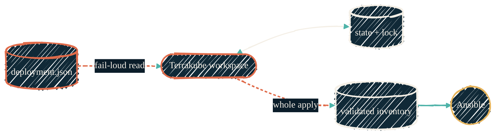

> Keep one desired-state object, reject stale edits, and let the IaC platform own state and locking.

`deployment.json` is the input to `tofu-proxmox`. It is not state and it is not
an Ansible inventory. A versioned object in the homelab S3-compatible store is
authoritative; local files are temporary.

## Stores and ownership

| Store | Holds | Owner |
| --- | --- | --- |
| Homelab object storage | Versioned `deployment.json` input and published Ansible inventory | OpenTofu graph, with OpenBao-scoped credentials |
| Terrakube workspace | OpenTofu state versions, run queue, and lock | Terrakube |

## ACID guarantees

| Property | Enforcement |
| --- | --- |
| Atomicity | Read and replace one whole object. A missing or blank object aborts the plan. |
| Consistency | Validate desired state before planning and validate inventory before publishing. |
| Isolation | Conditional object writes reject stale editors; Terrakube serializes runs per workspace. |
| Durability | Object versioning and Terrakube state versions survive worktrees and operator machines. |

## Rules

- Never commit the live object or create `terraform.tfvars` beside it.
- Never fall back to `{}` when the object cannot be read.
- Compare the object version when writing so concurrent edits fail cleanly.
- Run `tofu state list` before adopting an existing resource; its key must
  match the desired-state key.
- Never use a targeted apply. It can publish inventory that describes only a
  subset of the estate.
- Provider and object-store credentials come from OpenBao through native,
  short-lived Terrakube paths. They are not workspace secret variables.

Independent Terrakube workspaces have independent locks. Cross-workspace
production changes use an explicit reviewed sequence, not a universal mutex.
