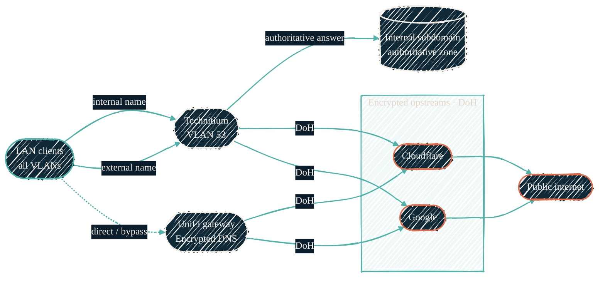

The homelab runs a single internal resolver that answers for its own names and
forwards everything else to the public internet over an encrypted channel. The
goal is plain: internal names resolve locally and authoritatively, external
names resolve privately, and nothing about the internal network leaks upstream.

## How a name resolves

{/* Shape: fan-out then converge. 7 nodes. Two resolver paths reach the same encrypted upstreams. Aspect ~3:1 LR. */}

Teal is the client, ink is the resolver edge (Technitium and the gateway),
coral is everything beyond the network boundary. Both resolver paths terminate
at the same encrypted upstreams — Cloudflare and Google over DNS-over-HTTPS.

## Split-horizon resolution

Technitium is **authoritative for the internal subdomain only** — a child zone
that holds every infrastructure A-record and service alias. A query for a name
under that subdomain is answered locally and never leaves the network. That is
what makes the [DNS-first addressing model](/infrastructure/vmid-network-tiers#dhcp-and-dns-first-addressing)
work: guests are referenced by `{hostname}.{subdomain}` and DNS owns the actual
DHCP-leased address.

Everything else — the public apex and the open internet — is **forwarded
upstream**. Technitium is not authoritative for those names; it caches and
relays them. DNS sits on its own dedicated network (VLAN 53), so resolution is
isolated from the trust-ordered service tiers it serves.

## Encrypted upstream forwarding

External forwarding is hardened along two axes:

- **DNS-over-HTTPS (DoH).** The resolver-to-upstream hop is encrypted, so
  forwarded queries are not sent in plaintext. The upstreams are Cloudflare
  (`1.1.1.1`) and Google (`8.8.8.8`), matching what the UniFi gateway already
  uses for its own Encrypted-DNS path. Each DoH endpoint carries a bootstrap IP
  so the resolver connects to it directly instead of resolving the DoH hostname
  through itself, while still validating the TLS certificate against the
  hostname.
- **Client subnet withheld.** EDNS Client Subnet is disabled, so the resolver
  does not attach any client-network information to forwarded queries. Upstream
  resolvers see the query, not who or where it came from.

DNSSEC validation stays enabled throughout, so forwarded answers are still
authenticated.

Clients that query the **UniFi gateway directly** (rather than Technitium) take
the dashed path: the gateway resolves them over its own Encrypted-DNS (DoH) to
the same upstreams. That path is managed on the gateway itself — see the
[tofu-unifi repo](/infrastructure/repos/tofu-unifi) for how the gateway-side
intent is tracked.

## What this connects to

- [VMID & network tier model](/infrastructure/vmid-network-tiers) — DNS-first
  addressing and where the DNS network (VLAN 53) sits among the tiers.
- [Self-hosted ChatGPT](/local-llm/homelab-gpu) — an example of a service
  name that resolves through Technitium and is fronted by Traefik over TLS.
- [tofu-unifi](/infrastructure/repos/tofu-unifi) — the gateway, WAN, and zone
  configuration that surrounds the resolver.
