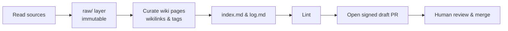

The homelab runs the **[NousResearch Hermes Agent](https://github.com/nousresearch/hermes-agent)**
as a standing, autonomous service: a self-improving agent that creates skills from
experience, keeps persistent memory across sessions, and runs scheduled work on its own.

This is **not** the [Self-hosted ChatGPT](/local-llm/overview) serving stack — that
serves a model for chat. This *is* an agent, and it *uses* a local model as its brain.

## How it runs

A dedicated LXC on the AI VLAN runs the `hermes gateway` daemon under systemd
(`Restart=on-failure`). The gateway drives the built-in **cron** scheduler and the
**Kanban** task board, so the agent keeps working unattended — no laptop, no cloud.

- **Brain:** an always-on local GPU model (OpenAI-compatible), so the agent never
  depends on an external API or a sleeping laptop.
- **Memory:** the built-in `MEMORY.md` / `USER.md` plus the local **Hindsight**
  provider (knowledge-graph recall, fully self-hosted). Everything lives under
  `$HERMES_HOME` on a dedicated volume that is snapshotted and replicated off-node.
- **Containment:** the LXC is the blast-radius boundary — Hermes *profiles* isolate
  agent state, not OS access — with deliberately narrow egress.

## Reaching it

Headless: SSH in and run `hermes` for the terminal UI, drive it through its gateway,
or talk to it in **Slack** — the wired-in messaging gateway (Socket Mode), and the
sole chat platform in front of it today. Multi-agent *profiles* + *Kanban* teams can
be layered on later — the agent home is already provisioned for them.

## Configuring it

Everything is in `$HERMES_HOME/config.yaml` (secrets in `.env`), set non-interactively
with `hermes config set <key> <value>`:

```yaml
model:
  provider: custom            # OpenAI-compatible local endpoint
  default: <model>
  base_url: 'http://<gpu-host>:11434/v1'
  api_mode: chat_completions
memory:
  provider: hindsight         # local, no external service
agent:
  max_turns: 90               # budget — caps a runaway loop
```

Switch models anytime with `hermes model`; check memory with `hermes memory status`.
Deployment is fully IaC — a Terraform-managed container plus an Ansible `hermes_agent`
role install and configure it, with updates managed declaratively through Ansible to prevent configuration drift.

## LLM knowledge base (second brain)

The Hermes agent runs the bundled `llm-wiki` skill to build and maintain an interlinked Markdown knowledge base from raw sources. It ingests URLs, PDFs, and notes into an immutable `raw/` layer, then synthesizes curated `entities`, `concepts`, `comparisons`, and `queries` pages. These pages use YAML frontmatter, `[[wikilinks]]`, and a tag taxonomy for structure.

The system keeps an `index.md` catalog and an append-only `log.md`, and lints for orphans, broken links, stale content, and source drift (tracked via SHA256 hashes). The wiki lives on the agent's persistent, snapshotted storage, with a nightly job running lint and health checks. "Compile knowledge once, reuse often" — providing inspectable Markdown instead of opaque memory.



## Autonomous documentation contributor

The agent can read public repositories and open documentation pull requests on its own as a dedicated GitHub App bot identity. Key properties of this workflow include:

- Commits are cryptographically **verified/signed**, authored via the GitHub API's commit-on-branch flow as the App, satisfying a "require signed commits" branch protection rule.
- PRs are opened as **drafts** and the bot has **no merge authority**. A human always reviews and merges; organization rulesets block the bot from self-merging.
- **Guardrails:** The workflow enforces one focused change per PR, source attribution, per-repo daily caps, duplicate detection, secret redaction, and a strict public/private routing rule so sensitive material never lands in a public PR.
