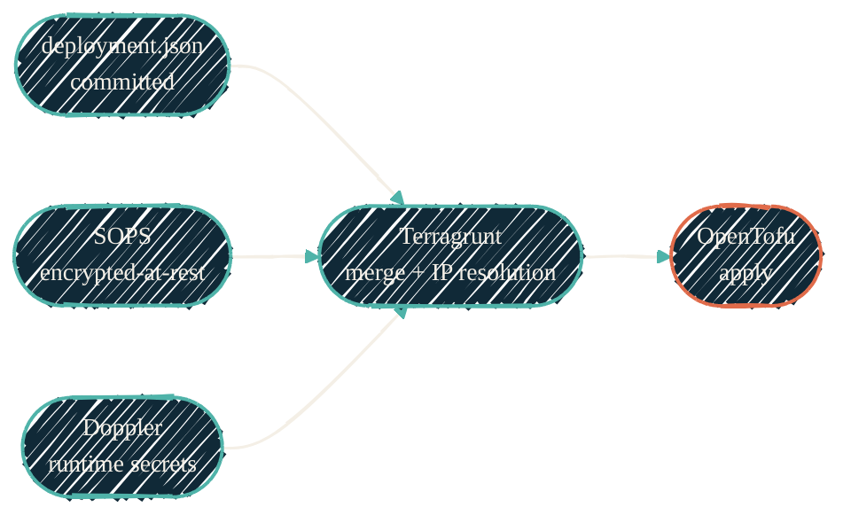

> The engine is OpenTofu. "Terraform" is gone from everything except the repo names — and renaming those would cost more than it's worth.

This page is the decision record for two questions that come up every time someone opens an IaC repo here: *are we on Terraform or OpenTofu?* and *do we actually need Terragrunt?* Short answers: OpenTofu, and only sometimes.

## The engine is OpenTofu

Every active IaC repo in the org already runs OpenTofu, not Terraform. This isn't aspirational — it's the current state:

- CI uses [`opentofu/setup-opentofu`](https://github.com/opentofu/setup-opentofu) and invokes `tofu fmt` / `init` / `validate` / `test`.
- Lockfiles pin `registry.opentofu.org/*` providers, not `registry.terraform.io`.
- The Nix dev shell ships both binaries with the intent spelled out in a comment: `opentofu # canonical binary`, `terraform # shipped for compatibility`.
- `.envrc` files set `TERRAGRUNT_TFPATH=tofu` / `PCT_TFPATH=tofu` so every wrapper dispatches to OpenTofu.

For a homelab and personal org, OpenTofu is the no-regrets default and there is no reason to walk it back:

- **Licensing.** OpenTofu ships under MPL 2.0 (OSI-approved) under the Linux Foundation. Terraform since 1.6 ships under BSL 1.1, which the OSI does not approve, and is now owned by IBM (the HashiCorp acquisition closed December 2024). None of the cases that justify staying on Terraform — HCP Stacks dependencies, IBM Cloud Pak environments, procurement that mandates HashiCorp as a vendor — apply here. ([scalr](https://scalr.com/learning-center/opentofu-vs-terraform), [oneuptime](https://oneuptime.com/blog/post/2026-03-20-opentofu-mpl-terraform-bsl-licensing/view))
- **Native state encryption.** OpenTofu encrypts state (including remote state) natively, without an external KMS workflow.
- **Dynamic config.** OpenTofu 1.8+ allows variables and locals inside `backend` and `provider` blocks — the single biggest reason teams historically reached for a wrapper. ([encore](https://encore.dev/articles/opentofu-vs-terraform-2026))

## "Terraform" is just a legacy prefix

Repos named `terraform-proxmox`, `terraform-unifi`, `terraform-aws`, and friends predate the migration. The prefix is historical; the engine inside is `tofu`. Newer repos already broke the pattern — `.github-tofu` uses the `tofu-*` prefix.

**Convention going forward:** new IaC repos use `tofu-*`. Existing `terraform-*` repos keep their names.

We do **not** mass-rename. A rename would churn module `source` references (`git::https://github.com/dryvist/terraform-aws-template.git?ref=v0.1.0`), GitHub redirect history, CI configuration, and every docs link — for cosmetic gain. This is the same reasoning that keeps `JacobPEvans/*` references in place rather than rewriting them to `dryvist/*`: the redirect holds, and the churn would have to be maintained forever. When a `terraform-*` reference reads as the engine rather than the repo name, fix the word; never rename the repo on sight.

## Where Terragrunt earns its place

Terragrunt is used in most repos, but in this environment it is mostly a *configuration wrapper*, not the multi-module orchestrator it was built to be. It does real work in exactly two repos — `terraform-proxmox` and `terraform-unifi` — where it:

- decrypts SOPS files through the `sops_decrypt_file` data source,
- merges a three-layer input model — committed `deployment.json`, SOPS-encrypted config, and Doppler environment variables,
- resolves IP addressing in `locals` with `cidrhost()`,
- and runs an `after_hook` that syncs OpenTofu output into the downstream Ansible inventory.

OpenTofu has no native `after_hook`, and SOPS decryption needs a provider rather than a built-in function. Until those two patterns have a native replacement (a SOPS provider plus a CI step), Terragrunt stays in these two repos.

{/* Shape: parallel convergence. 5 nodes. Three sources converge into the Terragrunt merge, one edge to the engine. Boundary crossings: 0. Pass. */}

This layered merge is the actual justification for Terragrunt here — not the backend block it also happens to generate.

## What we're phasing out

Everywhere else, Terragrunt only generates a backend and a provider block. OpenTofu 1.8+ does both natively now, and native state encryption removes the KMS rationale — so the wrapper buys nothing. The direction:

| Repo | Engine | Terragrunt today | Direction |
| --- | --- | --- | --- |
| `terraform-proxmox` / `terraform-unifi` | tofu | SOPS + 3-layer merge + `after_hook` | Keep — earns its place |
| `terraform-github` / `terraform-runs-on` / `terraform-aws` (basic) | tofu | Backend + provider generation only | Phase out → native OpenTofu config |
| `tf-splunk-aws` | tofu | Multi-env `include` (dev/stg/prod) | Re-evaluate → native per-env `tfvars` |
| `.github-tofu` | tofu | None | Already native — the target shape |

We lose nothing we actually use: no repo uses `dependency` / `dependencies` cross-module wiring, `run-all`, stacks, or multi-account fan-out. The orchestration features that justify Terragrunt at scale ([terragrunt.com](https://terragrunt.com/), [terramate comparison](https://terramate.io/rethinking-iac/terramate-vs-terragrunt-a-2026-comparison/)) simply aren't in play. The removals themselves are tracked in each affected repo, not here — this page records the *why*, not the migration steps.

## See also

<CardGroup cols={2}>
  <Card title="Check placement" icon="list-check" href="/infrastructure/terraform-check-placement">
    Where IaC checks run — static in pre-commit, credentialed in CI via OIDC. Already mandates deleting Terragrunt hooks.
  </Card>
  <Card title="SOPS for IaC" icon="key" href="/infrastructure/secrets-sops">
    The encrypted-at-rest layer that keeps Terragrunt necessary in the two complex repos.
  </Card>
  <Card title="CI/CD policy" icon="scale-balanced" href="/infrastructure/cicd/policy">
    Marketplace actions, release-please, version pinning, plan/apply via OIDC.
  </Card>
  <Card title="Infrastructure overview" icon="server" href="/infrastructure/overview">
    The provision-then-configure chain this engine sits at the head of.
  </Card>
</CardGroup>
