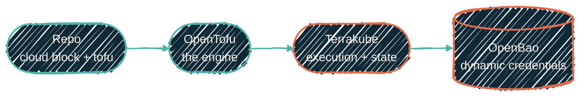

{/* projected from the authoring site; do not edit here */}
> One engine, one control plane, and one native runtime secret path.


{/*Shape: three components, one flow. 4 nodes. Aspect ~3:1 LR.*/}


```mermaid
%%{init:
  {'theme':'base','look':'handDrawn','themeVariables':{'fontFamily':'Geist','fontSize':'14px','primaryColor':'#102937','primaryTextColor':'#F4EFE6','primaryBorderColor':'#4FB3A9','lineColor':'#4FB3A9','secondaryColor':'#0B1D2A','tertiaryColor':'#1A2A38','clusterBkg':'rgba(79,179,169,0.08)','clusterBorder':'#4FB3A9'}}}%%
flowchart LR
  Repo([Repo<br/>cloud block + tofu])
  Engine([OpenTofu<br/>the engine])
  Terrakube([Terrakube<br/>execution + state])
  Bao[(OpenBao<br/>dynamic credentials)]

  Repo --> Engine --> Terrakube --> Bao

  classDef edge    fill:#102937,stroke:#4FB3A9,stroke-width:2px,color:#F4EFE6;
  classDef control fill:#102937,stroke:#E06B4A,stroke-width:2px,color:#F4EFE6;

  class Repo,Engine edge
  class Terrakube,Bao control

  linkStyle default stroke:#4FB3A9,stroke-width:1.5px;
```

## Decision

- **OpenTofu** is the only IaC engine used by active repos.
- **Terrakube** executes plans and applies, stores state versions, and locks one
  run per workspace.
- **OpenBao** supplies dynamic provider credentials and ephemeral KV values
  through native integrations.
- **Homelab mirrors** serve OpenTofu releases, providers, modules, and images so
  normal control-plane operation needs no public internet route.

Repos carry a `cloud {}` block and use plain `tofu` commands. Static checks run
locally and in CI with `tofu init -backend=false`. Credentialed plans and
applies run on the Terrakube executor.

## Why the wrapper was removed

The former wrapper generated backends and providers, merged input files,
decrypted secrets, and ran post-apply hooks. Native components now own each job:

| Former job | Native replacement |
| --- | --- |
| Remote state and locking | Terrakube workspace state and run queue |
| Secret injection | Terrakube OpenBao dynamic credentials and OpenTofu ephemeral resources |
| Desired-state fetch | OpenTofu S3-compatible data source against homelab RustFS |
| Inventory publication | OpenTofu resource plus in-graph schema preconditions |
| IP and input derivation | HCL locals and typed variables |

Removing the wrapper also removes generated files, hidden input precedence, a
second command vocabulary, and shell-level credential injection.

## Normal workflow

```bash
tofu init -backend=false
tofu validate
tofu plan
tofu apply
```

The last two commands submit remote work. The workspace's complete plan stays
inside the homelab control plane and must be reviewed before apply.

## Secrets and offline operation

Terrakube service secrets use native paths under the platform's OpenBao
namespace. Each workspace receives a least-privilege OpenBao identity. Secret
values are never copied into a Terrakube workspace variable, a CI secret, or a
developer keychain for normal runs.

An offline-ready platform mirrors every artifact needed to start the stack and
execute a pinned workspace. External providers such as AWS or GitHub still need
their target API when a plan manages those services. But the Terrakube control
plane itself does not need public package or image downloads.

## State migration rule

Move existing state once with a reviewed `tofu init -migrate-state` procedure.
Preserve a pre-migration snapshot and compare resource addresses before and
after. Never create a second empty workspace and apply into it.
