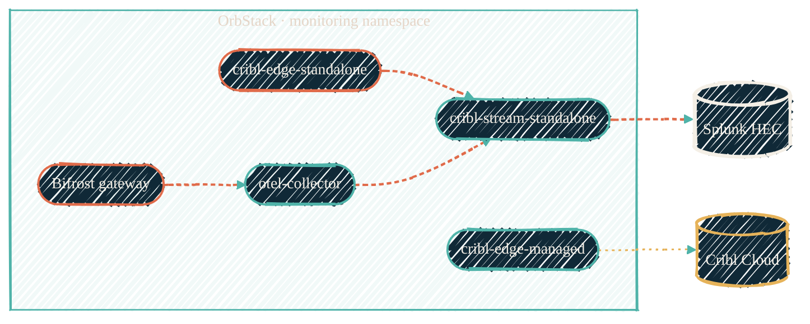

> The Mac runs Kubernetes. The homelab does not. They do the same job, on the platform each host actually supports natively.

[OrbStack](https://orbstack.dev/) provides a Kubernetes cluster on macOS that the [`orbstack-kubernetes`](/infrastructure/repos/orbstack-kubernetes) manifest set deploys workloads into. There is no Kubernetes anywhere else on this stack — the homelab Proxmox cluster runs [LXC + Ansible](/infrastructure/lxc-vs-docker) for the equivalent role. This page explains why the split exists and what runs where.

## Where Kubernetes lives

| Surface | Platform | Why |
| --- | --- | --- |
| macOS workstation | OrbStack K8s | Lowest-overhead path the host OS supports natively; OrbStack runs as a single binary, networks cleanly, doesn't need a full VM |
| Proxmox cluster | LXC + Ansible | Lowest-overhead path the host OS supports natively; LXC is kernel-namespace processes, no virtualization between container and host network |
| AWS | None | AWS workloads run on plain EC2 (with `tofu-runs-on` for CI runners). No EKS — the AWS surface is too small to justify it |

## What runs on the OrbStack cluster

Six StatefulSets in a single `monitoring` namespace:

| StatefulSet | Role |
| --- | --- |
| `otel-collector` | OTLP receiver — forwards to local Cribl Stream |
| `cribl-edge-managed` | Cloud-managed Cribl Edge — forwards to Cribl Cloud |
| `cribl-edge-standalone` | Local Cribl Edge with three packs (`cc-edge-claude-code-otel`, `cc-edge-gemini-antigravity-io`, `cc-edge-vscode-io`); forwards to local Stream |
| `cribl-stream-standalone` | Local Cribl Stream leader, runs the `cc-stream-github-copilot-rest-io` pack, outputs to Splunk HEC |
| `cribl-mcp-server` | Cribl Cloud MCP API surface for Claude Code |
| `bifrost` | [Bifrost](https://github.com/maximhq/bifrost) AI gateway — multi-provider routing (OpenAI, Gemini, OpenRouter, local MLX) via OpenAI-compatible API |

Four healthchecks.io CronJobs ping every five minutes as dead-man switches: `pipeline-heartbeat`, `heartbeat-splunk`, `heartbeat-edge`, `heartbeat-otel`.

{/* Shape: component/hub. The OrbStack monitoring namespace and its two egresses (Splunk HEC, Cribl Cloud). 7 nodes, 5-node subgraph cap respected. */}

`cribl-mcp-server` (Cribl Cloud's MCP API surface) sits alongside but carries no pipeline traffic, so it's off the flow above.

## What does not run on the OrbStack cluster

## What does not run on the OrbStack cluster

- The homelab data plane (HAProxy, the production Cribl Edge tier, Splunk Enterprise) — that's [`ansible-proxmox-apps`](/infrastructure/repos/ansible-proxmox-apps) on LXC.
- The macOS host telemetry pack ([`cc-edge-the-mac-pack`](/observability/repos/cc-edge-the-mac-pack)) — that needs a **native macOS Cribl Edge install**, not a container, because its exec inputs call `powermetrics`, `pmset`, `ioreg`, `memory_pressure`.
- Long-lived stateful workloads (databases, indexers). The cluster is reset more often than it's preserved; nothing of value lives there.

## The Edge → Stream → Splunk invariant

The architecture rule for the cluster is mechanical: `cribl-edge-standalone` sends only to `cribl-stream-standalone` on HEC port 8088. Edge does not talk directly to Splunk. Stream is the sole component with Splunk egress. Network policies in the manifest set enforce this; no one can shortcut it.

The same invariant holds on the homelab side: the production Cribl Edge tier sends to Cribl Stream; Stream is the only component with Splunk egress. Different platform, same shape.

## Secrets, overlays, and deploy

Secrets are pre-injected into the Claude Code session via Nix + direnv (SOPS-decrypted env vars). `secrets.enc.yaml` is the source of truth. Base manifests in `k8s/monitoring/` use the literal `PLACEHOLDER_HOME_DIR` for hostPath volumes — never replaced in the base. The generated `k8s/overlays/local/` is gitignored and produced at deploy time. `make deploy-doppler` does the whole dance; CI enforces the same chain on a self-hosted ARM64 runner.

## When to add a new workload

The choice between K8s, LXC, and Docker comes down to: what platform is the host, and does the vendor leave a native path? On macOS, K8s on OrbStack is the default. On Proxmox, LXC is the default. On either host, Docker is the answer only when the vendor leaves no other option — see the [LXC vs Docker decision tree](/infrastructure/lxc-vs-docker) for the full logic.

## See also

<CardGroup cols={2}>
  <Card title="orbstack-kubernetes" icon="server" href="/infrastructure/repos/orbstack-kubernetes">
    The repo, manifests, Makefile, the self-hosted runner setup.
  </Card>
  <Card title="LXC vs Docker decision tree" icon="cube" href="/infrastructure/lxc-vs-docker">
    Why the homelab is LXC-default and the Mac is K8s-default.
  </Card>
  <Card title="Monitoring agents" icon="chart-line" href="/observability/monitoring-agents">
    Cross-stack view of every collector and where it runs.
  </Card>
  <Card title="Homelab" icon="house" href="/about/homelab">
    The full "what runs where" hardware + workload table.
  </Card>
</CardGroup>
