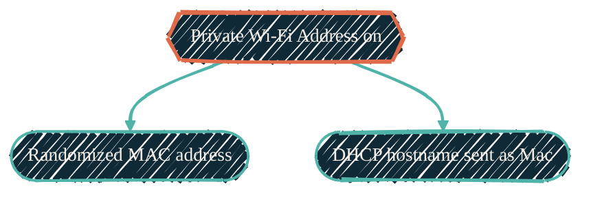

Homelab Macs should announce their real hostname to the router. When they do,
you find each machine by name in the DHCP lease list and reach it over the
network without hunting for an IP. One macOS default quietly breaks that: the
router lists the machine as `Mac`, no matter what you name it.

## The symptom

You set the computer name to something clear, like `mac-studio-01`. Every name
on the Mac agrees. Yet the router's device list still shows `Mac`.

The names on the Mac are not the problem. Each one is already correct:

| Source | Command | Value |
| --- | --- | --- |
| Computer name | `scutil --get ComputerName` | `mac-studio-01` |
| Host name | `scutil --get HostName` | `mac-studio-01` |
| Local (Bonjour) name | `scutil --get LocalHostName` | `mac-studio-01` |
| Kernel hostname | `hostname` | `mac-studio-01` |

None of them say `Mac`. So the `Mac` the router shows comes from somewhere
else.

## The cause: Private Wi-Fi Address

macOS ships a per-network privacy feature called **Private Wi-Fi Address**. It
is on by default for each Wi-Fi network you join. When it is on, macOS does two
things on that network:

1. It sends a **randomized MAC address** instead of the hardware one.
2. It replaces the **DHCP hostname** (DHCP option 12) with a generic `Mac`.

The second effect is the one that surprises people. The privacy feature does
not just hide the MAC address. It also withholds the real hostname. So the
router receives `Mac` on the wire and displays `Mac`, while every name API on
the machine reports the name you set.

{/* Shape: hierarchy. One setting → two effects. Nodes: 3. Boundary crossings: 0. Aspect: ~4:3 TB. Pass. */}



## Confirm it on the wire

Do not trust the name APIs. They report what the Mac knows about itself, not
what it sends. Capture the DHCP request and read option 12 directly.

```bash
# Find your Wi-Fi interface first. It is en0 on a MacBook, but often en1 or
# en2 on a Mac Studio, where en0 is the built-in Ethernet port.
wifi=$(networksetup -listallhardwareports | awk '/Wi-Fi/{getline; print $2}')

# Capture the DHCP request while forcing a renew, then read the hostname option.
sudo tcpdump -i "$wifi" -v -s1500 "udp port 67 or udp port 68" > /tmp/dhcp.txt 2>&1 &
sudo ipconfig set "$wifi" NONE; sudo ipconfig set "$wifi" DHCP; sleep 4
sudo killall tcpdump
grep -i hostname /tmp/dhcp.txt
```

With Private Wi-Fi Address on, the capture shows `Hostname (12): "Mac"`. With it
off, the same capture shows your real name. That single line is ground truth —
it is what the router acts on.

## The fix

Turn off Private Wi-Fi Address for the network. Do it per network, because the
setting is stored per network.

<Steps>
  <Step title="Open the network details">
    Go to **System Settings → Wi-Fi**, then click **Details** next to the
    network you are on.
  </Step>
  <Step title="Set Private Wi-Fi Address to Off">
    Change **Private Wi-Fi Address** to **Off**. This uses the hardware MAC and
    releases the real hostname on that network.
  </Step>
  <Step title="Confirm">
    Re-run the capture above. Option 12 now carries your real hostname, and the
    router lists the machine by name on its next lease.
  </Step>
</Steps>

## The tradeoff

With Private Wi-Fi Address off, the network sees the hardware MAC address. That
is the point of the setting: it trades MAC-address privacy for a real,
discoverable identity. Turn it off only on networks you trust — your own
homelab — and leave it on for public Wi-Fi.

## Why you turn it off by hand

Toggling this on each machine and each network does not scale, so the obvious
next step is to enforce it automatically. On macOS you cannot — not for free,
and not without more machinery than the setting is worth. Three mechanisms
could enforce it, and each one fails for a homelab:

- **Write the setting file directly.** macOS stores it in a Wi-Fi preferences
  file that System Integrity Protection (SIP) guards. Even `root` cannot read
  or write it, so no script or Nix activation step can touch it.
- **Install a configuration profile from the command line.** Since macOS Big
  Sur, macOS refuses to install a profile silently. A person must click
  **Install** in System Settings, so it is not automatic. A hand-installed
  profile also only *sets* the value; it does not lock it.
- **Push the profile from an MDM server.** Mobile Device Management is the only
  method that both sets the value and locks it. It also carries a price tag.

### The MDM price tag

Running your own MDM server is possible, but the push channel is neither free
nor self-contained:

- Every MDM needs an Apple Push Notification service (APNs) certificate. The
  only ways to get one without a third-party signer are the **Apple Developer
  Enterprise Program at about $300 per year**, or an **Apple Business Manager**
  account, which needs a D-U-N-S number and a business registration.
- On top of that you run the MDM server, renew the certificate every year, and
  enroll each Mac.

That is a recurring cost and a standing service, all to lock one Wi-Fi toggle
on a couple of machines. The lock only stops a person from changing the setting
by hand, which is not a threat on your own machines. So the homelab skips MDM.

### Why Nix makes this a non-issue

This is the case for managing Macs with [nix-darwin](/nix/nix-darwin) instead
of MDM. Nix-darwin sets almost all Mac configuration declaratively and for
free, so the homelab never needs a $300-per-year MDM server. This Wi-Fi setting
is the rare exception that neither Nix nor a free profile can reach, because SIP
and MDM gate it. You turn it off once per trusted network by hand, and that one
manual step is acceptable precisely because everything else is already
declarative. One hand-set toggle costs less than an MDM server built to avoid
it.
