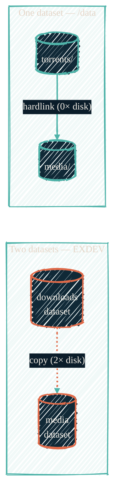

> A torrent that is seeding and a file that is in the library should be **the same file**. The moment they live on two filesystems, they can't be — and everything downstream of that mistake costs double the disk and ends in a full-quota outage.

This page documents a portable storage layout for a download-automation media stack (a torrent client, the `*arr` managers, and a media server). It is the [TRaSH-guides](https://trash-guides.info/File-and-Folder-Structure/) single-filesystem layout, realized on ZFS.

## The two-dataset anti-pattern

The intuitive layout is two datasets: one for downloads, one for the library. Each gets its own quota, each is bind-mounted where its service expects it. It looks tidy and it fails in three compounding stages:

1. **`EXDEV` — hardlinks are impossible.** A hardlink can only exist within one filesystem. Two ZFS datasets are two filesystems, so when the `*arr` import step tries to hardlink a completed download into the library, `link()` fails with `EXDEV` and the importer silently falls back to **copy**.
2. **Every seeded item is duplicated.** The copy means each item now exists twice — once in the download dataset (still seeding) and once in the library. Disk usage for anything you keep seeding is exactly 2×.
3. **The quota death spiral.** The download dataset's quota fills with seed copies that never leave. When it hits 100%, the torrent client can no longer write — active downloads fail, the client errors out or crashes, and the whole ingest pipeline stops until a human intervenes.

None of these are configuration bugs. They are structural consequences of putting a hardlink workflow across a filesystem boundary.

{/* Shape: side-by-side contrast. Two subgraphs, copy vs hardlink. Boundary crossings: 1 (the copy). */}



## The fix: one dataset, one mount, two subtrees

Replace both datasets with **one** ZFS dataset, bind-mounted into every guest at the same path — `/data` — with the download and library trees as plain subdirectories:

```text
/data                      ← ONE ZFS dataset (recordsize=1M)
├── torrents/
│   ├── movies/
│   └── tv/
└── media/
    ├── movies/
    └── tv/
```

- **Import = hardlink.** `torrents/` and `media/` are the same filesystem, so the `*arr` import is an instant, atomic `link()` — no copy window, no partial files.
- **Seeding *is* the library.** The seeded file and the library file are one inode. Keeping a torrent seeding costs **zero** extra bytes, forever.
- **Atomic moves.** Renames and upgrades within `/data` are metadata operations, never data rewrites.
- **One quota.** A single quota on the dataset bounds the whole media footprint. There is no second quota to mis-split, and no way for the download tree to starve while the library tree has headroom.
- **`recordsize=1M`.** Media files are large and sequential; the 1M recordsize cuts metadata overhead and suits both torrent IO and streaming reads.

### Shared group + setgid

Every service in the stack must agree on ownership, or imports fail on permissions instead of `EXDEV`. The portable pattern:

- One shared group (e.g. `media`) containing the torrent client, each `*arr`, and the media server user.
- `chgrp -R media /data` and `chmod 2775` (setgid) on the directories, so everything created under `/data` inherits the group automatically.

## Resilience settings

The layout removes the structural failure; these settings handle the operational ones. Each guards a different link in the chain:

| Setting | Where | What it prevents |
| --- | --- | --- |
| `Restart=on-failure` | torrent client's systemd unit | a client crash silently stopping ingest until someone notices |
| Seed-ratio limit (e.g. **5×**) then pause | torrent client | unbounded seeding obligations; 5× is generous stewardship while still letting torrents finish their lifecycle |
| `minimumFreeSpaceWhenImporting` | each `*arr` | imports writing the disk to 100% — the `*arr` stops importing before the filesystem is full |
| Dataset capacity alert at **>85%** | monitoring | discovering a full pool only when writes start failing |
| Start-on-boot | every guest in the stack | a host reboot leaving one link of the pipeline down |

The seed-ratio choice deserves a note: because seeding shares the library's inodes, a high ratio target like 5× is **free in disk** — the only cost is upload bandwidth. Be a good steward of the swarms you use; this layout makes generosity cheap.

## What this connects to

<CardGroup cols={2}>
  <Card title="Media stack" icon="clapperboard" href="/infrastructure/media-stack">
    The services that sit on top of this layout.
  </Card>
  <Card title="ZFS pool naming" icon="hard-drive" href="/infrastructure/zfs-pool-naming">
    The tier-named pool the dataset lives in.
  </Card>
  <Card title="ZFS backup & replication" icon="clone" href="/infrastructure/zfs-backup-replication">
    Where re-downloadable media sits in the snapshot/replication policy.
  </Card>
  <Card title="LXC vs Docker" icon="boxes-stacked" href="/infrastructure/lxc-vs-docker">
    Why the stack runs as LXCs with bind mounts in the first place.
  </Card>
</CardGroup>
