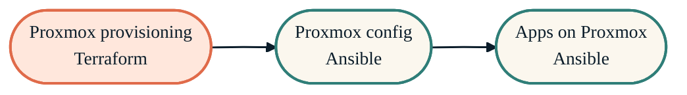

> Provision once with Terraform, configure with Ansible, run forever.

The infrastructure layer is Terraform-managed. Every module is opinionated about deployment shape: LXC for production homelab workloads, Docker on a dedicated VM only when vendor-locked, AWS for disaster recovery and managed services.

## The Proxmox stack

{/* Shape: linear chain. 3 nodes. Boundary crossings: 0. Aspect: ~3:1 LR. Pass. */}

Terraform builds VMs and LXCs (coral). Ansible takes the inventory and configures hosts (green), then deploys the app stack on top.

## AWS module map

| Repo | Purpose |
| --- | --- |
| [`terraform-aws`](https://github.com/JacobPEvans/terraform-aws) | Splunk DR footprint — cold capacity for failover |
| [`terraform-aws-bedrock`](https://github.com/JacobPEvans/terraform-aws-bedrock) | Bedrock agents (public API endpoint, no auth) |
| [`terraform-aws-static-website`](https://github.com/JacobPEvans/terraform-aws-static-website) | Reusable static-site module (S3 + CloudFront + ACM + Route53) |
| [`terraform-runs-on`](https://github.com/JacobPEvans/terraform-runs-on) | Self-hosted GitHub Actions runners on AWS spot instances |
| [`tf-splunk-aws`](https://github.com/JacobPEvans/tf-splunk-aws) | Cost-optimised Splunk deployment on AWS |

## Repos in this section

<CardGroup cols={2}>
  <Card title="terraform-proxmox" icon="server" href="/infrastructure/terraform-proxmox">
    VMs and LXC containers on the Proxmox cluster.
  </Card>
  <Card title="ansible-proxmox" icon="screwdriver-wrench" href="/infrastructure/ansible-proxmox">
    Host config — ZFS, networking, users, hardening.
  </Card>
  <Card title="ansible-proxmox-apps" icon="boxes-stacked" href="/infrastructure/ansible-proxmox-apps">
    App deploy — HAProxy, Cribl Edge, Cribl Stream.
  </Card>
  <Card title="terraform-aws" icon="aws" href="https://github.com/JacobPEvans/terraform-aws">
    AWS DR footprint for Splunk failover. Cold infra, ready to go warm.
  </Card>
  <Card title="terraform-aws-bedrock" icon="brain-circuit" href="https://github.com/JacobPEvans/terraform-aws-bedrock">
    Bedrock agents and supporting resources for the AI assistant API.
  </Card>
  <Card title="tf-splunk-aws" icon="chart-line" href="/observability/tf-splunk-aws">
    Cost-optimized Splunk deployment on AWS.
  </Card>
</CardGroup>

## Deployment philosophy

<Tip>
LXC is the default for production homelab services. Native packages where possible. Docker only when a vendor ships Docker-only images and there's no native path — and only on a dedicated `docker-host` VM so high-volume network traffic never crosses Docker's virtualized network stack.
</Tip>

For configuration of provisioned hosts, see [Configuration](/configuration/overview).
