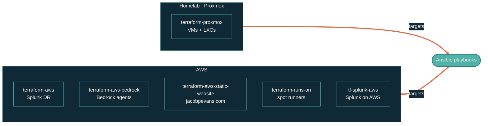

> Provision once with Terraform, configure with Ansible, run forever.

The infrastructure layer is Terraform-managed. Every module is opinionated about deployment shape: LXC for production homelab workloads, Docker on a dedicated VM only when vendor-locked, AWS for disaster recovery and managed services.

## Module map

## Repos in this section

| Repo | What it does |
| --- | --- |
| [terraform-proxmox](https://github.com/JacobPEvans/terraform-proxmox) | Provisions VMs and LXC containers on the Proxmox cluster. The base layer everything sits on. |
| [terraform-aws](https://github.com/JacobPEvans/terraform-aws) | AWS disaster-recovery footprint for Splunk failover. Cold infrastructure ready to go warm. |
| [terraform-aws-bedrock](https://github.com/JacobPEvans/terraform-aws-bedrock) | AWS Bedrock agents and supporting resources. Backend for the AI assistant API. |
| [terraform-aws-static-website](https://github.com/JacobPEvans/terraform-aws-static-website) | CloudFront / S3 / Route 53 stack. Hosts `jacobpevans.com`. |
| [terraform-runs-on](https://github.com/JacobPEvans/terraform-runs-on) | Self-hosted GitHub Actions runners on EC2 spot instances. |
| [tf-splunk-aws](https://github.com/JacobPEvans/tf-splunk-aws) | Cost-optimized Splunk deployment on AWS — smaller indexer tier for the DR scenario. |

## Deployment philosophy

LXC is the default for production homelab services. Native packages where possible. Docker only when a vendor ships Docker-only images and there's no native path — and only on a dedicated `docker-host` VM so high-volume network traffic never crosses Docker's virtualized network stack.

For provisioning details, see [terraform-proxmox](https://github.com/JacobPEvans/terraform-proxmox). For configuration, see [Configuration](/configuration/overview).

## What's next

Phase B will expand each module into its own page with inputs, outputs, and a runbook. For now, each repo's `README.md` covers deployment specifics.
