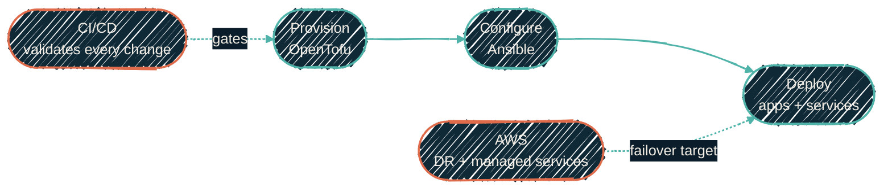

{/* projected from the authoring site; do not edit here */}
> Provision once with OpenTofu, configure with Ansible, run forever.

The infrastructure layer is OpenTofu-managed; the `terraform-*` repo names are legacy, and the
engine inside is `tofu` (see [IaC tooling](/infrastructure/iac-tooling)). Every module is
opinionated about deployment shape. It uses LXC for production homelab workloads, Docker on a
dedicated VM only when vendor-locked, and AWS for disaster recovery and managed services.

## How the pieces fit together

{/*Shape: three-lane pipeline plus two supporting planes. 6 nodes. Aspect ~3:1 LR.*/}

```mermaid
%%{init:
  {'theme':'base','look':'handDrawn','themeVariables':{'fontFamily':'Geist','fontSize':'14px','primaryColor':'#102937','primaryTextColor':'#F4EFE6','primaryBorderColor':'#4FB3A9','lineColor':'#4FB3A9','secondaryColor':'#0B1D2A','tertiaryColor':'#1A2A38','clusterBkg':'rgba(79,179,169,0.08)','clusterBorder':'#4FB3A9'}}}%%
flowchart LR
  Provision([Provision<br/>OpenTofu])
  Configure([Configure<br/>Ansible])
  Deploy([Deploy<br/>apps + services])
  CICD([CI/CD<br/>validates every change])
  AWS([AWS<br/>DR + managed services])

  Provision --> Configure --> Deploy
  CICD -.->|gates| Provision
  AWS -.->|failover target| Deploy

  classDef stage fill:#102937,stroke:#4FB3A9,stroke-width:2px,color:#F4EFE6;
  classDef support fill:#102937,stroke:#E06B4A,stroke-width:2px,color:#F4EFE6;

  class Provision,Configure,Deploy stage
  class CICD,AWS support

  linkStyle default stroke:#4FB3A9,stroke-width:1.5px;
```

Every guest follows the same three-stage pipeline: OpenTofu provisions it, Ansible configures it,
then the app stack deploys on top. CI/CD gates every change before it reaches provisioning, and the
AWS module map exists mainly as a failover target and for managed services the homelab doesn't run
itself.

## The Proxmox stack

{/*Shape: linear chain. 3 nodes. Boundary crossings: 0. Aspect: ~3:1 LR. Pass.*/}

```mermaid
%%{init:
  {'theme':'base','look':'handDrawn','themeVariables':{'fontFamily':'Geist','fontSize':'14px','primaryColor':'#102937','primaryTextColor':'#F4EFE6','primaryBorderColor':'#4FB3A9','lineColor':'#4FB3A9','secondaryColor':'#0B1D2A','tertiaryColor':'#1A2A38','clusterBkg':'rgba(79,179,169,0.08)','clusterBorder':'#4FB3A9'}}}%%
  flowchart LR
  TP([Proxmox provisioning<br/>OpenTofu])
  AP([Proxmox config<br/>Ansible])
  APA([Apps on Proxmox<br/>Ansible])

  TP --> AP --> APA

  classDef provision fill:#102937,stroke:#E06B4A,stroke-width:2px,color:#F4EFE6;
  classDef config    fill:#102937,stroke:#4FB3A9,stroke-width:2px,color:#F4EFE6;

  class TP provision
  class AP,APA config

  linkStyle 0,1 stroke:#F4EFE6,stroke-width:1.5px;
```

OpenTofu builds VMs and LXCs (coral). Ansible takes the inventory and configures hosts (green), then deploys the app stack on top.

## AWS module map

| Repo | Purpose |
| --- | --- |
| `tofu-aws` (private) | Splunk DR footprint: cold capacity for failover |
| [`tofu-runs-on`](https://github.com/dryvist/tofu-runs-on) | Self-hosted GitHub Actions runners on AWS spot instances |
| [`tofu-splunk-aws`](https://github.com/dryvist/tofu-splunk-aws) | Cost-optimised Splunk deployment on AWS |

## Repos in this section

<CardGroup cols={2}>
<Card
  title="tofu-proxmox"
  icon="server"
  href="/infrastructure/repos/tofu-proxmox">
  VMs and LXC containers on the Proxmox cluster.
</Card>
<Card
  title="tofu-unifi"
  icon="network-wired"
  href="/infrastructure/repos/tofu-unifi">
  UniFi networks, VLANs, port profiles, firewall rules — network-as-code.
</Card>
<Card
  title="ansible-proxmox"
  icon="screwdriver-wrench"
  href="/infrastructure/repos/ansible-proxmox">
  Host config — ZFS, networking, users, hardening.
</Card>
<Card
  title="ansible-proxmox-apps"
  icon="boxes-stacked"
  href="/infrastructure/repos/ansible-proxmox-apps">
  App deploy — HAProxy, Cribl Edge, Cribl Stream.
</Card>
  <Card title="tofu-aws (private)" icon="aws">
    AWS DR footprint for Splunk failover. Cold infra, ready to go warm. Private infrastructure, no public source.
  </Card>
<Card
  title="CI/CD"
  icon="play"
  href="/infrastructure/cicd/overview">
  GitHub Actions strategy: self-hosted RunsOn AWS spot, OIDC, plan/apply pattern.
</Card>
<Card
  title="orbstack-kubernetes"
  icon="cube"
  href="/infrastructure/repos/orbstack-kubernetes">
  Local Kubernetes cluster on macOS — monitoring stack + AI gateway.
</Card>
<Card
  title="tofu-splunk-aws"
  icon="chart-line"
  href="/observability/repos/tofu-splunk-aws">
  Cost-optimized Splunk deployment on AWS.
</Card>
</CardGroup>

## Cross-cutting topics

<CardGroup cols={2}>
<Card
  title="OpenTofu on AWS"
  icon="diagram-project"
  href="/infrastructure/tofu-aws/overview">
  Per-project IAM role, GitHub OIDC, S3 native locking, SSE-S3 — the standard for any new AWS-backed Terraform repo.
</Card>
<Card
  title="Kubernetes overview"
  icon="cube"
  href="/infrastructure/kubernetes-overview">
  OrbStack as the local control plane; what runs on K8s vs LXC vs Docker.
</Card>
<Card
  title="LXC vs Docker"
  icon="boxes-stacked"
  href="/infrastructure/lxc-vs-docker">
  The four-question decision tree for every new workload.
</Card>
<Card
  title="SOPS for IaC"
  icon="key"
  href="/security/sops-for-iac">
  Encrypted-at-rest secrets across OpenTofu and Ansible repos.
</Card>
<Card
  title="Self-hosted Netflix"
  icon="film"
  href="/infrastructure/media-stack">
  Media library on a dedicated VLAN.
</Card>
</CardGroup>

## What runs where

| Workload | Where | Why |
| --- | --- | --- |
| Proxmox host | Bare metal | Hypervisor |
| HAProxy | LXC | Lightweight, native systemd unit |
| Cribl Edge | LXC | Native package, network-heavy |
| Splunk Enterprise | Bare-metal-ish VM | Vendor-only Docker option ruled out for network volume |
| Home Assistant | LXC | Native install via supervised path |
| Self-hosted Netflix | LXC chain on a dedicated VLAN | Governed by the same UniFi policy + Proxmox placement patterns as the rest of the homelab |
| docker-host | VM | Isolated landing pad for vendor Docker images |
| GitHub Actions runners | Docker on docker-host VM + dedicated runner on LLM box | Ephemeral container-per-job, isolated `ci_runners` network; the LLM-box runner handles workflows that need live access to homelab infrastructure |
| Qdrant (vector DB) | LXC (nesting) | Vendor Docker image, lightweight, RAG workload |
| Local LLM inference | Bare-metal NixOS | GPU-bound; kept off Proxmox to avoid passthrough overhead and to run whatever OS gives the fastest ROCm path |

## Deployment philosophy

<Tip>
LXC is the default for production homelab services. Native packages where possible. Docker runs
only when a vendor ships Docker-only images and there's no native path. It also runs only on a
dedicated `docker-host` VM, so high-volume network traffic never crosses Docker's virtualized
network stack.
</Tip>

For configuration of provisioned hosts, see [Configuration](/infrastructure/configuration/overview).
